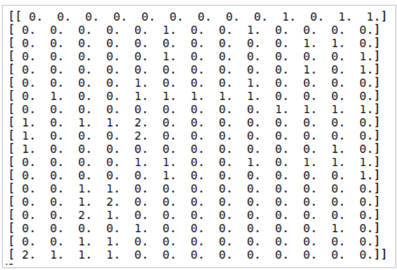
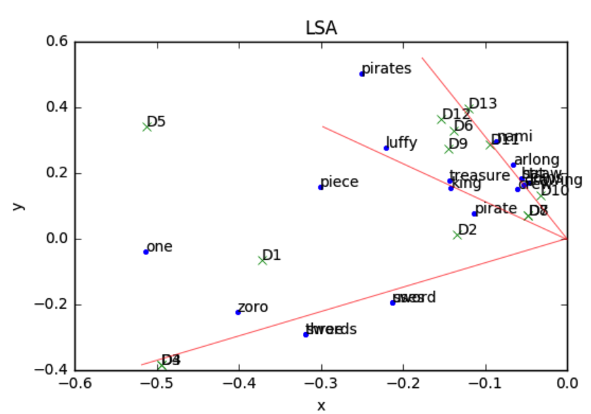
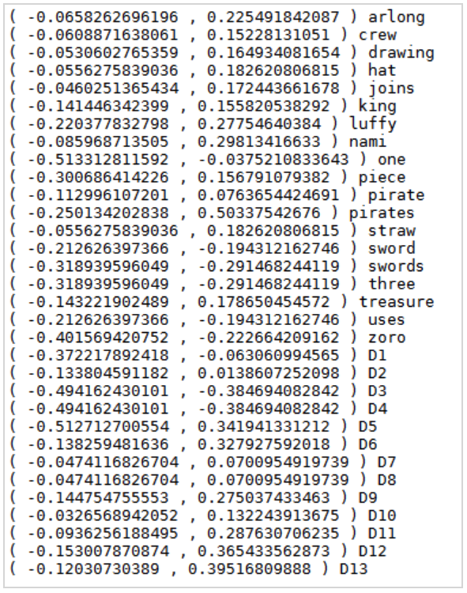

##什么是LSA
LSA(Latent Semantic Analysis)，潜在语义分析。试图利用文档中隐藏的潜在的概念来进行文档分析与检索，能够达到比直接的关键词匹配获得更好的效果。

##关键词匹配进行文档检索有何问题？
现在我们考虑检索问题，我们要从一些文档（可以是一句话、一个段落或一篇文章）中检索出我们想要的文档，可以想到的最简单的方法就是关键词匹配，即哪篇文档包含我们检索使用的关键词，我们就认为该文档是我们想要的。这样做当然可以，但存在如下两个问题。

###问题1
我们知道，**无论是英语还是汉语中，一个词语或者一个单词都存在同义词，比如愉悦和开心，那么通过关键词检索愉悦，就只能找到包含愉悦这两个字的文档，而不能找到包含开心但不包含愉悦的文档。**撇开同义词，当我们检索乔布斯，我们可能也想检索到关于iphone的相关信息，但仅通过关键词匹配，不能检索到。

##问题2
我们知道，无论在英语还是汉语中都存在一词多义的问题，比如"苹果"，到底指的是一种水果还是一种手机品牌，除非给定上下文语境否则我们不得而知。这样仅通过关键词匹配，检索到的含义可能不是我们想要的。撇开一词多义，文档中可能存在很多词语属于拼写打字错误（粗心）、误用等。

**所以，关键词匹配主要有两个问题，一个是同义词问题，一个是一词多义问题。而LSA可以解决检索不到同义词问题，注意LSA对于一词多义问题也不能完全解决。**

##LSA的核心思想
假设你有n篇文档，这些文档中的单词总数为m（可以先进行分词、去词根、去停止词等操作），我们可以用一个m*n的矩阵X来表示这些文档，这个矩阵的每个元素$X_{ij}$表示第i个单词在第j篇文档中出现的次数【也可以用tf-idf值】，下文例子中得到的矩阵见下图。


**LSA试图将原始矩阵降维到一个潜在的概念空间（维度不超过n），然后每个单词或者文档都可以用该空间下的一组权值向量【也可以认为是坐标】来表示，这些权值反应了与对应的潜在概念的关联程度的强弱。**
**这个降维是通过对该矩阵进行奇异值分解SVD（singular value decomposition）做到的，计算其用三个矩阵的乘积表示的等价形式，如下：**
$$X = U \Sigma V^T$$
**其中U为m*n维，$\Sigma$为对角矩阵n*n维，V为n*n维**
**$\Sigma$矩阵中对角线上的每一个值就是SVD过程中得到的奇异值，其大小反映了其对应的潜在概念的重要程度。**
**然后我们可以自行设定降维后的潜在概念的维度k(k<n>，可以得到：)**
$$X_{k} = U_{k} \Sigma_{k}V_{k}^{T} $$
**其中$U_{k}$是将U仅保留前k列的结果，$\Sigma_{k}$是仅保留前k行及前k列的结果，$V_{k}$是将V仅保留前k列的结果。**
**$X_{k}$则是将X降维到k维的近似结果，这个k越接近n，$X_{k}$与X也就越接近，但我们的目标并不是越接近越好，LSA认为k值不宜过大（保留了冗余的潜在概念）也不宜过小。**

##LSA实战
1、下面是一个文档，包含海贼王里的zoro、luffy、nami三个人物的介绍
```
documents = [
    "Roronoa Zoro, nicknamed \"Pirate Hunter\" Zoro, is a fictional character in the One Piece franchise created by Eiichiro Oda.",
    "In the story, Zoro is the first to join Monkey D. Luffy after he is saved from being executed at the Marine Base. ",
    "Zoro is an expert swordsman who uses three swords for his Three Sword Style, but is also capable of the one and two-sword styles. ",
    "Zoro seems to be more comfortable and powerful using three swords, but he also uses one sword or two swords against weaker enemies.",
    "In One Piece, Luffy sails from the East Blue to the Grand Line in search of the legendary treasure One Piece to succeed Gol D. Roger as the King of the Pirates. ",
    "Luffy is the captain of the Straw Hat Pirates and along his journey, he recruits new crew members with unique abilities and personalities. ",
    "Luffy often thinks with his stomach and gorges himself to comical levels. ",
    "However, Luffy is not as naive as many people believe him to be, showing more understanding in situations than people often expect. ",
    "Knowing the dangers ahead, Luffy is willing to risk his life to reach his goal to become the King of the Pirates, and protect his crew.",
    "Adopted and raised by Navy seaman turned tangerine farmer Bellemere, Nami and her older sister Nojiko, have to witness their mother being murdered by the infamous Arlong.",
    "Nami, still a child but already an accomplished cartographer who dreams of drawing a complete map of the world, joins the pirates, hoping to eventually buy freedom for her village. ",
    "Growing up as a pirate-hating pirate, drawing maps for Arlong and stealing treasure from other pirates, Nami becomes an excellent burglar, pickpocket and navigator with an exceptional ability to forecast weather.",
    "After Arlong betrays her, and he and his gang are defeated by the Straw Hat Pirates, Nami joins the latter in pursuit of her dream."
]
```
2、定义停用词、要去除的标点符号、定义词典、定义当前处理的文档编号
```
stopwords = ['a','an', 'after', 'also', 'and', 'as', 'be', 'being', 'but', 'by', 'd', 'for', 'from', 'he', 'her', 'his', 'in', 'is', 'more', 'of', 'often', 'the', 'to', 'who', 'with', 'people']

# 要去除的标点符号的正则表达式
punctuation_regex = '[,.;"]+'

dictionary = {}
# 当前处理的文档编号
currentDocId = 0
```
3、生成词典
```
# 依次处理每篇文档
for d in documents:
    words = d.split();
    for w in words:
        # 去标点
        w = re.sub(punct_regex, '', w.lower())
        if w in stopwords:
            continue
        elif w in dictionary:
            dictionary[w].append(currentDocId)
        else:
            dictionary[w] = [currentDocId]
    currentDocId += 1

# 至少出现在两个文档中的单词选为关键词
keywords = [k for k in dictionary.keys() if len(dictionary[k]) > 1]
keywords.sort()
print("keywords:\n", keywords, "\n")
```
4、生成word-document矩阵,也就是生成上面的矩阵X
```
# 生成word-document矩阵
X = np.zeros([len(keywords), currentDocId])
for i, k in enumerate(keywords):
    for d in dictionary[k]:
        X[i,d] += 1
```
5、奇异值分解,这里svd函数用到的U,V与前述的变量U,V一一对应，sigma是前面的由对角线元素组成的一维矩阵$\Sigma$
```
# 奇异值分解
U,sigma,V = linalg.svd(X, full_matrices=True)
print("U:\n", U, "\n")
print("SIGMA:\n", sigma, "\n")
print("V:\n", V, "\n")
```
6、降维，下面的代码将维度降到了2维
```
# 得到降维(降到targetDimension维)后单词与文档的坐标表示
targetDimension = 2
U2 = U[0:, 0:targetDimension]
V2 = V[0:targetDimension, 0:]
sigma2 = np.diag(sigma[0:targetDimension])
print(U2.shape, sigma2.shape, V2.shape)
```

7、画图
```
# 开始画图
plt.title("LSA")
plt.xlabel(u'x')
plt.ylabel(u'y')

# 绘制单词表示的点
# U2的每一行包含了每个单词的坐标表示(维度是targetDimension)，此处使用前两个维度的坐标画图
for i in range(len(U2)):
    text(U2[i][0], U2[i][1],  keywords[i], fontsize=10)
    print("(", U2[i][0], ",", U2[i][1], ")", keywords[i])
x = U2.T[0]
y = U2.T[1]
plot(x, y, '.')

# 绘制文档表示的点
# V2的每一列包含了每个文档的坐标表示(维度是targetDimension)，此处使用前两个维度的坐标画图
for i in range(len(V2[0])):
    text(V2[0][i], V2[1][i], docText[i], fontsize=10)
    print("(", V2[0][i], ",", V2[1][i], ")", ('D%d' %(i+1)))
x = V[0]
y = V[1]
plot(x, y, 'x')
```
##LSA结果分析
这里我们需要注意的是，我们在衡量单词与单词、文档与文档之间的相似度时，应该看得是两个向量的夹角，而不是点的距离，夹角越小越相关。
最终结果与所有点的下标间下图。红线是额外画的辅助线【注意这里坐标原点在红线的起点处】



我们可以看到D1、D2、D3、D4四篇关于zoro的文档的向量之间的夹角很小，且与关键词zoro、three、swords、sword、uses之间的夹角很小。
**所以，最终我们是将文档和单词都用一个向量来表示，然后计算他们之间的夹角大小，来判定与关键词相关的文档有哪些。**
