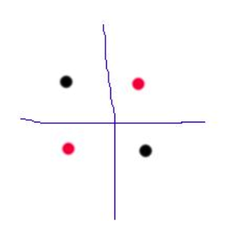
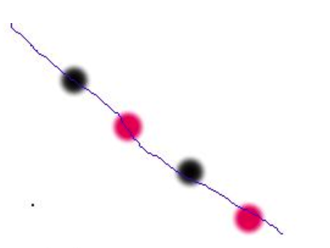

#机器学习中的VC维、shatter和break point
学习VC维要先知道的概念是：**增长函数(growth function)、对分(dichotomy)、打散(shattering)和断点(break point)**

##1 增长函数
**增长函数表示假设空间H对m个示例所能赋予标记的最大可能结果数**
> 比如说现在数据集有两个数据点，考虑一种二分类的情况，可以将其分为A或者B，则可能的值有：AA、AB、BA和BB,所以这里的增长函数的值是4

增长函数值越大则表示假设空间H的表示能力越强，复杂度也就越高，学习任务的适应能力越强。不过尽管H中可以有无穷多的假设h，但是增长函数却不是无穷大的：**对于m个示例的数据集，最多只能有2^m^个标记结果，而且很多情况下也达不到2^m^的情况。**

##2 对分
**对于二分类问题来说，H中的假设对于数据集D中m个示例赋予标记的每种可能结果称为对D的一种对分(dichotomy)。对分也是增长函数的一种上限。**

##3 打散
**打散指的是假设空间H能实现数据集D上全部示例的对分，即增长函数=2^m^。**但是认识到不打散是什么则更加重要。

**有些情况下H的增长函数不可以达到对应的2^m^值，比如说在二维实平面上的线性划分情况中，以下的情况就不可以线性可分（也就是说不能算做赋予标记的结果）：**

或者说是下面的这个

上面的这两张图都是在二维平面上，**线性分类器无法分类的情况**

##4 Vapink-Chervonenkis Dimension
现在可以给出VC维的定义了：
> 假设空间H的VC维是指能被H打散的最大的示例集（数据集）的大小，即有：
> $$VC(H) = argmax{m:\prod{(m)} = 2^m}$$

换句话说：
> **对于一个假设空间H，如果存在m个数据样本能够被假设空间H中的函数按照所有可能的2^h^种形式分开，则称假设空间H能够把m个数据样本打散(shatter)。**
> **假设空间H的VC维就是能打散的最大数据样本数目m。若对任意数目的数据样本都有函数能将他们shatter，则假设空间的VC维无限大。**

##5 break point
在一些教科书中并没有提出break point的概念，这是林轩田《机器学习基石》公开课里的一种辅助概念。现在简单说一下break point的意义：
>我们希望假设空间H的增长函数越小越好（这样子假设空间就比较简单），或者至少不要增长的太快。如果按照2^m^这种趋势增长就过于夸张了。
上面已经说了，随着m的增大，一定会出现一个m使假设空间无法shatter，这种不满足2^m^的情况说明增长函数从这个点开始变缓了，所以我们把第一个不满足shatter的m值称为break point。

**从这个定义上看，某个假设空间H的VC维数就是最大的非break point值，也就是break point-1。**

