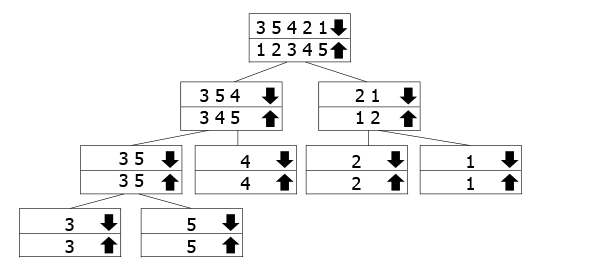

#! https://zhuanlan.zhihu.com/p/165489682
对于经典的十大排序算法做了一个总结，并用java实现。
下面是我们将要实现的排序算法：
- 冒泡排序（Bubble sort）
- 插入排序（insert sort）
- 选择排序（selection sort）
- 希尔排序（Shell sort）
- 归并排序（merge sort）
- 堆排序（Heapsort）
- 快速排序（Quicksort）
- 桶排序（Bucket Sort）
- 计数排序（Count Sort）
- 基数排序（Radix Sort）


## 冒泡排序
冒泡排序的主要实现方法就是交换那些不是按照升序（这里以升序为例进行说明）排列的相邻元素。
这个进程从数组的起始点一直到终止点，不断迭代。
直到某一次迭代没有进行任何交换操作时，排序完成。
java实现：

```
public class BubbleSort {
    public static int[] bubbleSort(int[] nums){
        boolean flag = false;
        int temp;

        while(! flag){
            flag = true;
            for (int i=1; i<nums.length; i++){
                if(nums[i] < nums[i-1]){
                    temp = nums[i];
                    nums[i] = nums[i-1];
                    nums[i-1] = temp;
                    flag = false;
                }
            }

        }
        return nums;
    }


    public static void main(String[] args){
        int[] nums = {5,4,3,2,1};
        int[] res = bubbleSort(nums);
        System.out.println(Arrays.toString(res));

    }

}
```
时间复杂度为$O(n^2)$


## 插入排序
插入排序背后的思想就是把数组分为排好序的和未排序的两部分。
然后不断从未排序的部分选择元素插入到排序部分。

每次选择的元素都是未排序部分的第一个元素。
java代码：
```
public class InsertSort2 {

    public static int[] insertSort(int[] nums){

        if(nums.length == 0 || nums.length == 1){
            return nums;
        }

        for (int i=1; i < nums.length; i++){
            int current = nums[i];
            int j=i-1;
            while(j >=0 && nums[j] > current){
                nums[j+1] = nums[j];
                j--;
            }

            nums[j+1] = current;

        }

        return nums;

    }

    public static void main(String[] args){
        int[] nums = {4,3,1,2,5,7,6};
        int[] res = insertSort(nums);
        System.out.println(Arrays.toString(res));

    }

}
```
时间复杂度为O($n^2$).

## 选择排序
选择排序背后的思想也是把数组分为排好序的和未排序的两部分。
也是每次从未排序的部分选择一个元素添加到排序的部分，只是他每次挑选元素时，都是挑选未排序部分的最小的元素。
因此在每次插入到排序部分时，也是插入到排序部分的最后面。
```
public class SelectSort {

    public static int[] selectSort(int[] nums){
        if(nums.length == 0 || nums.length == 1){
            return nums;
        }

        for(int i=0; i<nums.length; i++){
            int midIndex = i;
            int minValue = nums[i];
            for(int j=i; j< nums.length; j++){
                if(nums[j] < minValue){
                    midIndex = j;
                    minValue = nums[j];
                }
            }
            int temp = nums[i];
            nums[i] = minValue;
            nums[midIndex] = temp;

        }

        return nums;
    }

    public static void main(String[] args){
        int[] nums = {4,3,2,5,7,6};
        int[] res = selectSort(nums);
        System.out.println(Arrays.toString(res));
    }

}
```
时间复杂度为O($n^2$)


## 希尔排序
希尔排序（Shell sort）是把数据按照下标的一定增量进行分组，对每组采用直接插入排序，随着增量的不断减小。每组包含的数据也不断增多，当增量为1时，整个数据就是一组，排序结束。

提出希尔排序的主要原因就是原来的直接插入排序，一一对元素进行比较、移动，消耗较大。
而希尔排序通过使用跳跃分组的方式，然后分组进行插入排序，在缩小增量，直至增量为1，这样的操作会小很多。

代码如下：
```
public class ShellSort {

    public static void shellSort(int[] nums){
        int n=nums.length;
        if(n==0 || n==1){
            return;
        }

        for(int gap=n/2; gap >=1 ; gap =gap/2){

            for(int i=gap; i<n; i++){
                int temp = nums[i];
                int j;
                for( j=i; j>=gap && nums[j-gap]>=nums[j];j=j-gap){
                    nums[j] = nums[j-gap];
                }
                nums[j] = temp;
            }
        }
        return;

    }
    

    public static void main(String[] args){
        int[] nums = {4,7,5,8,2,6,10};
        shellSort(nums);
        System.out.println(Arrays.toString(nums));
    }

}
```

希尔排序的时间复杂度低于插入排序，冒泡排序的$O(n^2)$，又高于快速排序、归并排序的$O(nlogn)$.

## 归并排序

归并排序采取的方法是分治算法，它将整个数组分为两部分，然后进行如下的操作：
- 对数组的左半部分进行排序
- 对数组的右半部分进行排序
- 合并左右数组

下面是归并排序的一个具体例子：


具体的算法实现如下：
```
public class MergeSort {

    public static void mergeSort(int[] nums, int low, int high){
        int mid = low +(high -low)/2;
        if(low < high){
            mergeSort(nums, low, mid);
            mergeSort(nums, mid+1, high);
            merge(nums, low, mid, high);
//            System.out.println(Arrays.toString(nums));
        }
    }


    public static void merge(int[] nums, int low, int mid, int high){
        int[] temp = new int[high-low+1];

        int leftIndex = low;
        int rightIndex = mid +1;
        int k = 0;

        while(leftIndex <= mid && rightIndex <= high){
            if(nums[leftIndex] <= nums[rightIndex]){
                temp[k] = nums[leftIndex];
                leftIndex++;
            }else{
                temp[k] = nums[rightIndex];
                rightIndex++;
            }
            k++;
        }

        while(leftIndex <= mid){
            temp[k] = nums[leftIndex];
            leftIndex++;
            k++;
        }

        while(rightIndex <= high){
            temp[k] = nums[rightIndex];
            rightIndex++;
            k++;
        }

        for(int i=0; i<temp.length; i++){
            nums[low+i] = temp[i];
        }

    }

    public static void main(String[] args){
        int[] nums = {4,3,2,6,5,7,9,8};
        mergeSort(nums,0,nums.length-1);
        System.out.println(Arrays.toString(nums));
    }

}

```
归并排序的时间复杂度为$O(nlogn)$，其具体的推导过程为如下。

我们已知，它的时间复杂度的计算公式为：
$$T(n)=2T(\frac{n}{2}) + cn$$
其中c是一个常数。

那么我们代入可得：
$$T(n) = 4T(\frac{n}{4})+2n = 8T(\frac{n}{8})+3n$$

可以用归纳法证明:
$$T(n) = 2^k T(\frac{n}{2^k})+ckn$$
数学归纳法就是当n=N时成立，推导出n=N+1时也成立，那么就得证；

所以，当$2^k=n$时，可得：
$$\begin{aligned}
    T(n) =& 2^k T(\frac{n}{2^k})+ckn \\
         =& nT(1) + cnlog_2n \\
         =& O(nlogn)
\end{aligned}$$


## 堆排序
堆排序是一个基于二叉堆的排序算法。
那么什么是二叉堆呢？

首先我们来介绍下完全二叉树，完全二叉树是一个除了最后一层外，每层都填满的二叉树，而且最后一层尽可能的填满左子树。

那么二叉堆就是一个完全二叉树的形式，并且以特定的形式排序，也就是父节点的值一定要比两个孩子节点的值都大或者都小。
这种形式的叫做最大堆或者最小堆。堆结构可以用二叉树或者数组的形式表示。

为什么可以用数组表示二叉堆呢？

主要是因为二叉堆是一个完全二叉树的形式，那么如果一个父节点在数组中的index是i，那么它的左孩子的index就是2*i+1，右孩子的index就是2i+2.

堆排序的主要过程：
1. 对于输入的数据建立一个最大堆（这里以最大堆为例，最小堆也可以）
2. 建完堆后，最大的元素就位于整个堆的根节点。用堆的最后一个元素替换它，把根节点的元素输出，并把堆的规模减1，然后对堆在进行堆化的过程（也就是要求父节点的值大于左右孩子节点的值）。
3. 重复上面的第二步，直到最后堆的规模为0.

java代码如下：
```
public class HeapSort {

    public static void heapSort(int[] nums){
        int n = nums.length;


        for(int i =n/2-1; i>=0; i--){
//           对给定的数据进行建堆的过程，根据完全二叉树的特性，index为[n/2, n-1]的节点，都是叶子节点
//            所以建堆的过程要对父节点进行判断，也就是从底向上的过程
            heapify(nums, i,n);
        }

        for (int i=n-1; i>=0; i--){
//            建完堆后，从堆中一个一个的提取元素。
            int t = nums[i];
            nums[i] = nums[0];
            nums[0] = t;

            heapify(nums, 0, i);
//          注意这里传入的是堆的规模，最初传入的应该是n-1，也就是此时已经把根节点的值跑出了，如果传入的是i+1，会造成越界，导致排序失败。
        }

    }

    public static void heapify(int[] nums, int parentIndex, int n){
// 堆化，让堆符合父节点的值均大于左右子节点的值
        int largestIndex = parentIndex;
        int leftIndex = 2*parentIndex + 1;
        int rightIndex = 2*parentIndex + 2;

        if(leftIndex < n && nums[leftIndex] > nums[largestIndex]){
            largestIndex = leftIndex;
        }

        if(rightIndex < n && nums[rightIndex] > nums[largestIndex]){
            largestIndex = rightIndex;
        }

        if(largestIndex != parentIndex) {
            int temp = nums[parentIndex];
            nums[parentIndex] = nums[largestIndex];
            nums[largestIndex] = temp;
            heapify(nums, largestIndex, n );
        }

    }

    public static void main(String[] args){
        int[] nums = {4,3,2,5,7,6,1};
        heapSort(nums);
        System.out.println(Arrays.toString(nums));
    }

}

```

其中建堆的时间复杂度为$O(n)$，进行堆化的过程为$O(logn)$，所以总的时间复杂度为$O(nlogn)$。
堆排序是不稳定的排序算法，主要是因为，他在建堆的时候会破坏数据的排序顺序，并且在最后排序时，元素值来自堆顶的元素，这个过程也会破坏相同元素值的排序。

解决方法就是在最后排序时，用额外$O(n)$的空间存储每个元素在原始数组中的位置值，这会引起额外的空间开销。

## 快速排序
和归并排序一样，快速排序也是分治算法的一种。
快速排序算法的核心是分治的过程，也就是选取一个参考点x，然后把所有小于x的元素放在其左边，把所有大于x的元素放在其右边。

也就是说x此时位于数组中的index，就是其在最后排好序的数组中的index。

这里选取参考点，有几种方法：
1. 总是选取第一个元素作为参考点；
2. 总是选取最后一个元素作为参考点；（本文最后的实现选取这个方法）
3. 随机选取一个元素
4. 选取中间值作为参考点

代码如下：
```
public class QuickSort {

    public static void quickSort(int[] nums,int start, int end){
        int n = nums.length;
        if(n==0 || n==1){
            return;
        }

        if(start >= end){
            return;
        }

        int pivotIndex = partition(nums,start, end);
        quickSort(nums, start, pivotIndex-1);
        quickSort(nums, pivotIndex+1, end);

    }

    public static int partition(int[] nums, int start, int end){
        int pivot = nums[end];
        int current = start;

        for(int i=start; i <end; i++){
            if(nums[i] < pivot){
                int temp = nums[i];
                nums[i] = nums[current];
                nums[current] = temp;
                current++;
            }
        }
        int temp = nums[end];
        nums[end] = nums[current];
        nums[current] = temp;
        return current;

    }

    public static void main(String[] args){
        int[] nums = {4,5,7,6,2,3,1};
        quickSort(nums,0,nums.length-1);
        System.out.println(Arrays.toString(nums));
    }

}
```

时间复杂度为$O(nlogn)$，快排也是一种不稳定排序算法。
$$T(n) = T(k) +T(n-k-1)+O(n)$$

最好的情况，我们选取的参考点刚好平分整个数组，也就是$k=n/2$；所以上式也就是：
$$T(n) = 2T(n/2)+O(n)$$
时间复杂度为$O(nlogn)$.

最坏的情况就是，我们选取的参考点刚好是最小的/最大的，那么其中$k=0 或者n-k-1 =0$，所以上式也就是：
$$T(n) = T(0) +T(n-1) +O(n)$$
时间复杂度为$O(n^2)$.

## 桶排序
桶排序(bucket sort)顾名思义，就是把数据放入几个桶内，然后对桶里面的元素进行排序，最后再依次取出元素就是排好序的元素。

桶排序的使用场景比较严苛，要求数据是均匀分布的。

具体的java实现代码如下：
```
public class BucketSort {

    public static void bucketSort(int[] nums, int bucketNum){
        List<ArrayList<Integer>> buckets = new ArrayList<>();
        for (int i=0; i< bucketNum;i++){
            buckets.add(new ArrayList<>());
        }

        for(int i=0; i<nums.length; i++){
            buckets.get(nums[i]/10).add(nums[i]);
        }

        for(int i=0; i<bucketNum;i++){
            Collections.sort(buckets.get(i));
        }

        int k=0;
        for(int i =0; i<bucketNum;i++){
            for(int j=0; j<buckets.get(i).size();j++){
                if(j==buckets.get(i).size()){
                    break;
                }
                nums[k++] = buckets.get(i).get(j);
            }
        }

    }

    public static void main(String[] args){
        int[] nums = {2,9,7,17,12,46,42,74,75,88,91};
        bucketSort(nums, 10);
        System.out.println(Arrays.toString(nums));
    }

}
```

一般都说桶排序的时间复杂度为$O(n)$,但是我们可以明显的看到上面的过程中每个桶内也用其他的排序算法进行了排序（比如快排），那我们一般的时间复杂度不应该是$O(nlogn)$吗。

现在先假设我们要排序的数据共有n个，我们把他们分在m个桶中，这样每个桶中的数据就是$k=n/m$。每个桶里面的时间复杂度就是$O(klogk)$。
那么m个桶就是$m*O(k*logk)=m*O((n/m)*log(n/m)) = O(blog(n/m))$，**那么当桶的个数m，接近数据个数n时，log(n/m)就是一个较小的常数，所以时间复杂度接近O(n).**

那么既然桶排序的时间复杂度为O(n)，那么他能不能替代快排等O(nlogn)的算法呢。

显然是不能的，因为桶排序的应用场景比较严苛，**要求数据分布比较均匀**。比如如果数据全部分到了一个桶中，那么时间复杂度就退化到了O(nlogn)。

## 计数排序
计数排序(count sort)的前提是数组里的元素都是整数，并且都在一个[min,max]的取值范围内。
他通过统计每个位置的元素的个数，生成一个count数组，然后对count数组里的每个元素都加上前面的元素之和，
那么此时count数组里的值就是它在最后排好序的数组里的位置。

代码如下：
```
public class CountSort {

    public static void countSort(int[] nums){
        int max = Arrays.stream(nums).max().getAsInt();
        int min = Arrays.stream(nums).min().getAsInt();

        int[] count = new int[max-min+1];
        int[] output = new int[nums.length];

        for(int i=0; i<nums.length;i++){
            count[nums[i]-min] += 1;
        }

        for(int i=1; i<count.length;i++){
            count[i] += count[i-1];
        }

        for(int i=nums.length-1; i>=0; i--){
//          这里对nums数组进行递归时，采取从后往前，是为了便于后面的基数排序用到时方便
            output[count[nums[i]-min]-1] = nums[i];
            count[nums[i]-min] -= 1;
        }

        for(int i=0; i<nums.length;i++){
            nums[i] = output[i];
        }


    }

    public static void main(String[] args){
        int[] nums = {2,2,2,2,1,1,1,1,4,4,4,5,5,5,6,6,6,2,5,6,7,7};
        countSort(nums);
        System.out.println(Arrays.toString(nums));
    }

}

```


时间复杂度显然就是$O(n+k)$，其中k=max-min。

## 基数排序
基数排序(Radix sort)是对一组数，先对个位进行排序，再对十位，再对百位数等进行排序，再具体每个位数排序时，用到了计数排序的思想。
也就是说基数排序是基于计数排序的。

代码如下：
```
public class RadixSort {

    public static void radixSort(int[] nums, int exp){
        int n = nums.length;
        if(n==0 || n==1){
            return;
        }
        int max = Arrays.stream(nums).max().getAsInt();

        for(int base=1; max/base >0; base *= exp){
            countSort(nums, base, exp);
            System.out.println(Arrays.toString(nums));
        }

    }

    public static void countSort(int[] nums, int base, int exp){
        int[] count = new int[exp];
        int[] output = new int[nums.length];

        for (int i=0; i<nums.length; i++){
            count[(nums[i]/base)%exp] += 1;
        }

        for(int i=1; i<exp; i++){
            count[i] += count[i-1];
        }

//        for(int i=0; i< nums.length;i++){
        for(int i=nums.length-1; i>=0;i-- ){
//          要对nums数组从后往前进行递归，因为此时的nums已经被排过序了，那么从后往前可以保证在上一阶段的排序结果代入到当前阶段。
//          比如上一阶段是个位数比较，当前是十位比较，那么从后往前可以保证34位于32的后面。
//          如果是从前往后遍历nums，会在最后结果中产生不是顺序的，比如 18，34，32这种。
            output[count[(nums[i]/base)%exp] -1] = nums[i];
            count[(nums[i]/base)%exp]-=1;
        }

        for(int i=0; i<nums.length;i++){
            nums[i] = output[i];
        }
        return;
    }

    public static void main(String[] args){
        int[] nums ={12,4,23,22,14,56,47,87,66,32,34,99};
        radixSort(nums,10);
        System.out.println(Arrays.toString(nums));
    }

}

```

时间复杂度是$O(k*n)$，其中k是数据中最大数的位数，也就是$k=lon_BN$，其中B是基底，N是最大值，这个k值不一定就小于$logn$，所以不能直接说基数排序的时间复杂度低于$O(nlogn)$。

