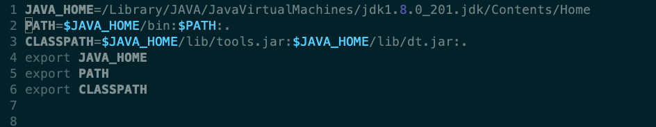
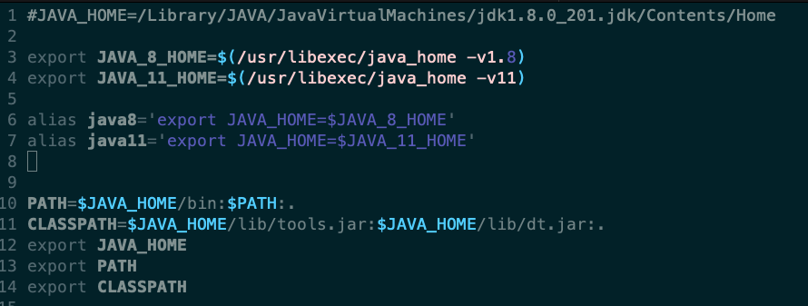

有时有的软件需要jdk8，有的需要jdk11，那么我们可以在本地配置jdk8和jdk11并存的环境的。

首先下载jdk11,下载地址：https://download.java.net/java/GA/jdk11/13/GPL/openjdk-11.0.1_osx-x64_bin.tar.gz

然后解压，解压后默认安装在`/Library/Java/JavaVirtualMachines/`下。

下面就是实现jdk8和jdk11并存的方法，主要是修改~/.bash_profile的配置。

原来的~/.bash_profile文件里关于jdk的配置如下:

然后我们需要将jdk8和jdk11的路径都加进去，其实主要是修改`JAVA_HOME`的值，修改后如下：

然后想要使用jdk8的环境，依次执行下面的命令：

`java8`

`source ~/.bash_profile`

如果想要使用jdk11的环境，依次执行下面的命令:

`java11`

`source ~/.bash_profile`

然后可以使用`java -version`查看本地java版本
