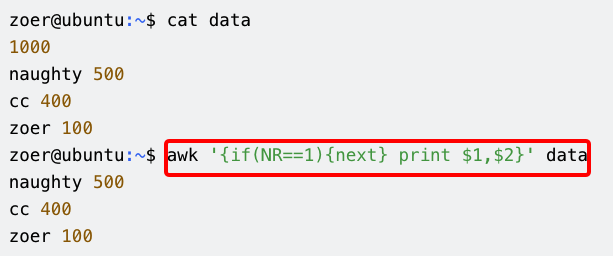

# awk按照列合并两个文件实战

## awk中的一些命令表示的含义
- $0表示一个文本中的一行记录，$1到$N表示一行中的第1...N个字段
- FNR表示当前读入文件的记录数,每打开一个新文件，FNR便从0开始累计，NR表示已经读入的所有文件的总的记录数【这个多用于对多个文件进行处理时，记录处理过的总的记录数】
- 在awk中，如果调用next，那么next之后的命令就不在执行了，这一行文本的处理就到此结束，开始读取下一条记录并操作。
- 在awk中

### next的使用实例
下面这个例子就是，不打印第一行的awk命令。

这个命令经常被用到，比如我们有一个文件，存放了每个人的出差费用，想要打印出来，但是第一行的总费用不要打印，那么我们就可以使用awk的next忽略掉第一行就可以了。

### awk中的数组
awk中的数组有一个特点，**它的下标既可以是数字也可以是字符串,awk中的数组不必提前声明，也不必声明大小，初始化数组元素用0或者空串，这就叫根据上下文来定。**
- 数字下标：array[1]='it', array[2]='homer',array[3]='sunboy'
- 字符下标：array["first"]="yang", array["second"]="gang", array["third"]="sunboy"

## awk处理两个文件
执行的顺序就是：
- 首先，对file1执行"NR=\=FNR{...}"，这第一个循环用来建立哈希数组;
- 第二步，执行"NR>FNR{...}"第二个循环，打印输出命令结果。

执行的awk命令也可以分为两种：
- 一种是 awk 'NR=\=FNR{...}NR>FNR{...}' file1 file2 或者 awk 'NR==FNR{...}NR!=FNR{...}' file1 file2
- 另一种是awk 'NR==FNR{...;next}{...}' file1 file2
  - 这个命令表示只要NR==FNR就执行第一个{}内的命令，并且不会执行第二个{}内的命令，当NR!=FNR时，就会执行第二个{}内的命令。

### awk处理两个文件的实例
比如两个文件的列数相等，将它们按照列进行拼接，就可以执行这个命令：
- awk 'NR==FNR{a[i]=\$0; i++}NR>FNR{print a[j]"\t"$0;j++}' file1 file2 >file3
同时也可以使用paste命令进行合并：
- paste -d '\t' file1 file2

如果过两个文件，有些列的值是一样的，我们希望把他们按照某一相同属性值进行合并时，就可以使用到数组来做了。
比如file1是
1   111 wy
2   222 xlx
3   333 ww
4   444 yyy
file2是
111 a
222 b
333 c

我们希望合并file1和file2，合并后的效果是file3：
1   111 wy  a
2   222 xlx b
3   333 ww  c

那么我们可以用如下的命令来实现这个功能：
- awk 'NR==FNR{a[\$2]=\$0;next}NR>FNR{if(\$1 in a) print a[\$1],$2}' file1 file2 >file3
  - 这个命令执行的时候主要是由如下几步组成：
    - **首先当NR=FNR时，判断当前读入的是file1，然后使用{a[$2]=$0;next}循环将file1的每行记录都存入数组a，并且使用file1的第二列作为下标引用【这里就是用字符串作为数组下标】**
    - **当NR>FNR时，判断此时读入了file2，然后判断file2的第一个字段是否在数组a的下标中，如果在的话执行{print a[$1],$2},打印出数组a和file2的第二个字段，注意此时数组a的下标是$1，因为file2的第一个字段$1与file1中的第二个字段$2是一样的。**
    - **最后将输出写入到文件file3中**
  

awk按\t分隔符取第一列
awk -F '\t' '{print $1}' file.txt

