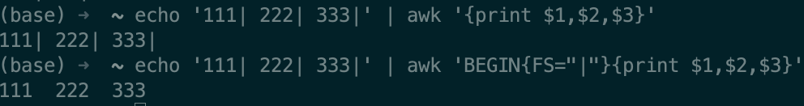
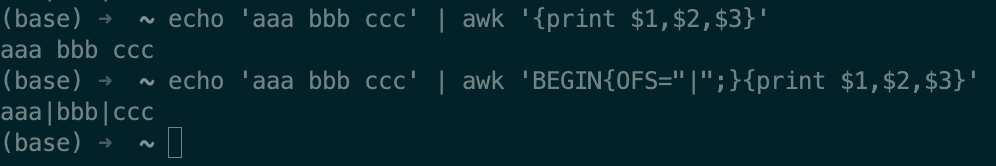
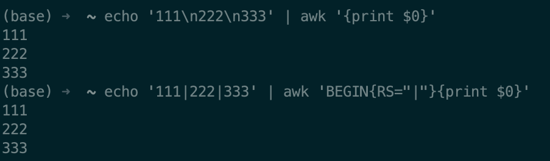

参考网址：https://blog.csdn.net/Cengineering/article/details/78529292

在实现用awk将某一行按照某个分割符进行切割之前，我们需要先了解awk的一些内建变量。
## awk的内建变量FS,OFS,RS,ORS,RT,NF,NR,FNR的作用与区别

- FS与OFS的作用与区别
  - FS(Font Space):指定字段列的分隔符,默认是空格
  
  - OFS(Output Font Space):指定输出字段的列分隔符,默认是空格
  
- RS、ORS、RT的作用与区别
  - RS(Row Space)：指定行分割符，默认是\n
  
  - ORS(Output Row Space)：指定输出行分割符。默认是\n
- 

