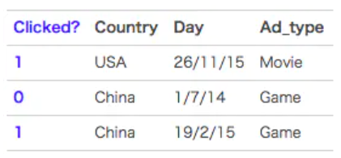
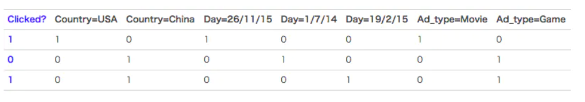

# 1,FM背景
在计算广告和推荐系统中，CTR(Click through rate)是非常重要的一个环节，判断一个商品是否需要推荐，就是根据CTR预估的点击率来进行的。

在进行CTR预估时，除了单特征外，往往要对特征进行组合。

对于特征组合来说，业界现在通用的做法主要有两大类：FM系列与Tree系列。

下面我们主要介绍FM算法。

# 2, one-hot编码带来的问题
FM(Factorization Machine)主要是为了解决数据稀疏的情况下，特征怎样组合的问题。以一个广告分类的问题为例，根据用户与广告位的一些特征，来预测用户是否会点击广告。数据如下：

clicked是分类值，表明用户没有点击该广告。1表示点击，0表示未点击。而country, day, ad_type则是对应的特征。对于这种分类特征，一般都是进行one-hot编码处理。

将上面的数据进行one-hot编码以后，就变成了下面这样：

因为是分类特征，所以经过one-hot编码后，不可避免的样本的数据就变得很稀疏。举个简单的例子，假设淘宝上的item为100万，如果对item这个维度进行one-hot编码，光这一个维度的数据的稀疏度就是百万分之一。由此可见，数据的稀疏性，是我们在实际应用场景中面临的一个非常常见的挑战和问题。

**one-hot编码带来的另一个问题就是特征空间变大。同样以上面淘宝上的item为例，将item进行one-hot编码以后，样本空间有一个类别变成了百万维的数值特征，特征空间一下子暴增一百万。所以大厂动不动就上亿维度，就是这么来的。**

# 3, 对特征进行组合
**普通的线性模型，我们都是将各个特征独立考虑的，并没有考虑到特征与特征之间的联系。**但是实际上，大量的特征之间是有关联的。最简单的以电商为例，一般女性用户看化妆品服装之类的广告比较多，而男性更青睐各种球类装备。那很明显，女性这个特征与化妆品服装类商品有很大的关联性，男性这个特征与球类装备的关联性更为密切。如果我们能将这些关联的特征找出来，也是很有意义的。

一般的线性模型为：
$$y=w_0 + \sum_{i=1}^{n}w_ix_i$$

从上面的式子可以看出，一般的线性模型压根没有考虑特征间的关联。为了表述特征间的相关性，我们采用多项式模型。在多项式模型中，特征$x_i$与$x_j$的组合用$x_ix_j$来表示。为了简单起见，我们讨论二阶多项式模型。具体的模型表达式如下：
$$y = w_0 + \sum_{i=1}^{n}w_ix_i + \sum_{i=1}^{n-1}\sum_{j=i+1}^{n}w_{ij}x_ix_j$$

上式中，n表示样本的特征数量， $x_i$表示第i个特征。

与线性模型相比，FM的模型多了后面的特征组合部分。

# 4, FM求解
从上面的式子可以看出，组合部分的特征相关参数共有n(n-1)/2个。但是如第二部分所分析，在数据很稀疏的情况下，满足$x_i,x_j$都不为0的情况非常少，这样将导致$w_{ij}$无法通过训练得出。

为了求出$w_{ij}$，我们对每一个特征分量$x_i$引入辅助向量$V_i = (v_{i1}, v_{i2},...,v_{ik})$，然后，利用$v_iv_{j}^{T}$对$w_{ij}$进行求解。

$$\left (\begin{matrix}
    &v_{11} \quad &v_{12} \quad &\cdots \quad &v_{1k} \\
    &v_{21} \quad &v_{22} \quad &\cdots \quad &v_{2k} \\
    &\vdots \quad &\vdots \quad &\quad \quad  &\vdots \\
    &v_{n1} \quad &v_{n2} \quad &\cdots \quad &v_{nk}
\end{matrix}\right) = \left ( \begin{matrix}
    &v_1 \\
    &v_2 \\
    &\vdots \\
    &v_n
\end{matrix}\right)$$

那么$w_{ij}$组成的矩阵可以表示成：
$$\hat{W}=VV^T = \left (\begin{matrix}
    &v_1 \\
    &v_2 \\
    &\vdots \\
    &v_n
\end{matrix} \right)(v_1^T \quad v_2^T \quad \cdots v_n^T)$$

这种计算$w_{ij}$的时间复杂度为$O(kn^2)$，其中n为特征的数量，k为每个特征的对应的$v_i$的维度。

这里有一种化简方式，时间复杂度可以从$O(kn^2)$降为$O(kn)$。

具体的化简方式如下：
$$\begin{aligned}
    &\sum_{i=1}^{n-1}\sum_{j=i+1}^{n}<v_i, v_j> x_ix_j = \\
    &= \frac{1}{2} \sum_{i=1}^n\sum_{j=1}^n<v_i, v_j>x_ix_j - \frac{1}{2}\sum_{i=1}^{n}<v_i, v_i>x_ix_i \\
    &= \frac{1}{2}(\sum_{i=1}^{n}\sum_{j=1}^n\sum_{f=1}^{k}v_{i,f}v_{j,f}x_ix_j - \sum_{i=1}^{n}\sum_{f=1}^{k}v_{i,f}v_{i,f}x_ix_i) \\
    &= \frac{1}{2}((\sum_{i=1}^nv_{i,f}x_i)(\sum_{j=1}^nv_{j,f}x_j) - \sum_{i=1}^nv_{i,f}^2x_{i}^2) \\
    &= \frac{1}{2}\sum_{f=1}^{k}((\sum_{i=1}^n v_{i,f}x_i)^2 - \sum_{i=1}^n v_{i,f}^2x_i^2)
\end{aligned}$$

经过这样的分解后，我们可以通过随机梯度下降SGD方法进行参数更新：
$$\frac{\partial}{\partial \theta}y(x) = \begin{cases}
    &1, \qquad &if\quad \theta \quad is \quad w_0 \\
    &x_i, \qquad &if\quad \theta \quad is \quad w_i \\
    &x_i\sum_{j=1}^nv_{j,f}x_j - v_{i,f}x_i^2 &if\quad \theta \quad is \quad v_{i,f}
\end{cases}$$ 