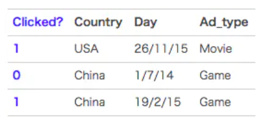
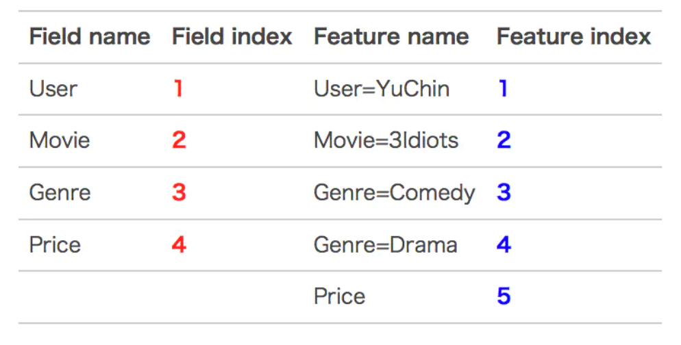
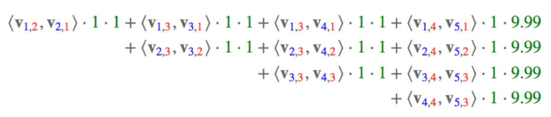

# 1, FMM理论
在CTR预估中。经常会遇到one-hot类型的问题，one-hot类型的变量会导致严重的数据特征稀疏的情况，为了解决这一问题，在上一讲中，我们介绍了FM算法。这里我们介绍另外一种在FM的基础上发展出来的算法FFM(field-aware Factorization Machine)

FFM模型中引入了类别的概念，即field。还是拿上一讲中的数据来说，先看下图：

在上面的广告点击案例中，"Day=26/11/15", "Day=1/7/14", "Day=19/2/15"这三个特征都是代表日期的，可以放到同一个field中。同理, country也可以放到一个field中。简单来说，同一个类别特征经过one-hot编码生成的数值特征都可以放到同一个field，包括用户国籍，广告类型，日期等等。

在FFM中，每一维特征$x_i$，针对其他特征的每一种field $f_j$，都会学习一个隐向量$v_i, f_j$。因此，隐向量不仅与特征有关，也与field有关。

也就是说, "Day=26/11/15"这个特征与Country特征和Ad_type特征进行关联的时候使用不同的隐向量，这与Country和Ad_type的内在差异相符，也是FFM中field-aware的由来。

假设样本的n个特征属于f个field，那么FFM的二次项有nf个隐向量。而在FM模型中，每一维特征的隐向量只有一个。FM可以看作FFM的特例，是把所有特征都归属到一个field时的FFM模型。

根据FFM的field敏感特性，可以导出其模型方程：
$$y(x)=w_0 + \sum_{i=1}^{n}w_ix_i + \sum_{i=1}^{n}\sum_{j=i+1}^{n}<v_{i,f_j},v_{j,f_i}>x_ix_j$$

可以看到，如果隐向量的长度为k，那么FFM的二次参数有nfk个，远多于FM模型的nk个。此外，由于隐向量与field相关，FFM二次项并不能化简，其预测复杂度是$O(kn^2)$。

下面以一个例子简单说明FFM的特征组合方式。输入记录如下：

这条记录可以编码成5个特征，其中"Genre=Comedy"和"Genre=Drama"属于同一个field，"Price"是数值型，不用one-hot编码转换，为了方便说明FFM的样本格式，我们将所有的特征和对应的field映射成整数编号。

**那么FFM的组合特征有10项，如下图所示：**

