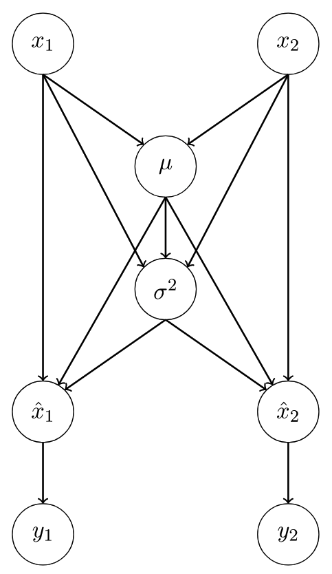

#! https://zhuanlan.zhihu.com/p/161043998
## 在BN层中的反向传播
现在很多的网络都使用了Batch Normalization层。
为了后面计算反向传播时便于理解，假设只有两个输入$x_1,x_2$,它的正向传播计算如下所示：
$$\begin{aligned}
    \mu =& \frac{x_1 + x_2}{2} \\
    \sigma^2 =& \frac{(x_1 -\mu)^2 + (x_2 -\mu)^2}{2} \\
    \hat{x_1} =& \frac{x_1 - \mu}{\sqrt{\sigma^2 +  \epsilon}} \\
    \hat{x_2} =& \frac{x_2 - \mu}{\sqrt{\sigma^2 +  \epsilon}} \\    
    y_1 =& \gamma\hat{x_1} + \beta \\
    y_2 =& \gamma\hat{x_2} + \beta
\end{aligned}$$
当有$N$个输入$x_1,x_2,...,x_N$时，正向传播的计算方式如下:
$$\begin{aligned}
    \mu =& \frac{1}{N}\sum_{i=1}^N x_i \\
    \sigma^2 =& \frac{1}{N} \sum_{i=1}^N (x_i -\mu)^2 \\
    \hat{x_i} =& \frac{x_i - \mu}{\sqrt{\sigma^2 +  \epsilon}} \\
    y_i =& \gamma\hat{x_i} + \beta 
\end{aligned}$$

其中$\mu$是均值，$\sigma^2$是方差，$\gamma$和$\beta$是在BN层中可以学习的变量，$y_i$是输出值。
在理解反向传播时计算图是很有用的，下面是在有两个输入时的计算图，下面在分析反向传播时，也是基于两个输入来进行分析的：

在前向传播中，给与了输入$x_1$和$x_2$，然后我们计算出$y_1$和$y_2$。

在反向传播时，给与了$\frac{\partial L}{\partial y_1}$和$\frac{\partial L}{\partial y_2}$，我们希望计算出$\frac{\partial L}{\partial x_1}, \frac{\partial L}{\partial x_2}, \frac{\partial L}{\partial \gamma}和\frac{\partial L}{\partial \beta}$，其中$L$是神经网络的损失值。在计算过程中，我们将会需要$\frac{\partial L}{\partial \mu}, \frac{\partial L}{\partial \sigma^2}, \frac{\partial L}{\partial \hat{x_1}}和 \frac{\partial L}{\partial \hat{x_2}}$。

在反向传播时，我们从图的底部开始一直到图的顶部，并且可以在计算图中使用链式法则。

首先，我们可以计算$\frac{\partial L}{\partial \beta}$和$\frac{\partial L}{\partial \gamma}$如下：：
$$\begin{aligned}
    \frac{\partial L}{\partial \beta} =& \frac{\partial L}{\partial y_1}\frac{\partial y_1}{\partial \beta} + \frac{\partial L}{\partial y_2}\frac{\partial y_2}{\partial \beta} \\
    =& \frac{\partial L}{\partial y_1} + \frac{\partial L}{\partial y_2} \\
    =& \sum_{i=1}^2 \frac{\partial L}{\partial y_i} \\
    =& \sum_{i=1}^N \frac{\partial L}{\partial y_i} \quad (当有N个输入时) \\
  \\
    \frac{\partial L}{\partial \gamma} =& \frac{\partial L}{\partial y_1}\frac{\partial y_1}{\partial \gamma} + \frac{\partial L}{\partial y_2}\frac{\partial y_2}{\partial \gamma} \\
    =& \frac{\partial L}{\partial y_1}\hat{x_1} + \frac{\partial L}{\partial y_2}\hat{x_2} \\
    =& \sum_{i=1}^2 \frac{\partial L}{\partial y_i}\hat{x_i}\\
    =& \sum_{i=1}^N \frac{\partial L}{\partial y_i} \hat{x_i}\quad (当有N个输入时)
\end{aligned}$$

然后由计算图从底部往上走，我们可以计算出$\frac{\partial L}{\partial \hat{x_1}}和 \frac{\partial L}{\partial \hat{x_2}}$：
$$\begin{aligned}
    \frac{\partial L}{\partial \hat{x_1}}=& \frac{\partial L}{\partial y_1}\frac{\partial y_1}{\partial \hat{x_1}} \\
    =& \frac{\partial L}{\partial y_1} \gamma \\
    \\
    \frac{\partial L}{\partial \hat{x_2}}=& \frac{\partial L}{\partial y_2}\frac{\partial y_2}{\partial \hat{x_2}} \\
    =& \frac{\partial L}{\partial y_2} \gamma \\
\end{aligned}$$

更一般的，当有$N$个输入时：
$$\frac{\partial L}{\partial \hat{x_i}} = \frac{\partial L}{\partial y_i}\gamma$$

接下来，我们可以计算$\frac{\partial L}{\partial \sigma^2}$和$\frac{\partial L}{\partial \mu}$如下：
$$\begin{aligned}
    \frac{\partial L}{\partial \sigma^2} =& \frac{\partial L}{\partial \hat{x_1}}\frac{\partial \hat{x_1}}{\partial \sigma^2} +  \frac{\partial L}{\partial \hat{x_2}}\frac{\partial \hat{x_2}}{\partial \sigma^2} \\
    =& \sum_{i=1}^{2} \frac{\partial L}{\partial \hat{x_i}}\frac{\partial \hat{x_i}}{\partial \sigma^2} \\
    =& \sum_{i=1}^{2}\frac{\partial L}{\partial \hat{x_i}}(x_i - \mu)\frac{-1}{2}(\sigma^2 + \epsilon)^{-3/2} \\
    =& \sum_{i=1}^{N}\frac{\partial L}{\partial \hat{x_i}}(x_i - \mu)\frac{-1}{2}(\sigma^2 + \epsilon)^{-3/2} \quad (当有N个输入时) \\
    \\
    \frac{\partial L}{\partial \mu} =& \frac{\partial L}{\partial \hat{x_1}}\frac{\partial \hat{x_1}}{\partial \mu} + \frac{\partial L}{\partial \hat{x_2}}\frac{\partial \hat{x_2}}{\partial \mu} + \frac{\partial L}{\partial \sigma^2}\frac{\partial \sigma^2}{\partial \mu} \\
    =& \sum_{i=1}^2 \frac{\partial L}{\partial \hat{x_i}}\frac{\partial \hat{x_i}}{\partial \mu} + \frac{\partial L}{\partial \sigma^2}\frac{\partial \sigma^2}{\partial \mu} \\
    =& \sum_{i=1}^2 \frac{\partial L}{\partial \hat{x_i}} \frac{-1}{\sqrt{\sigma^2 + \epsilon}} + \frac{\partial L}{\partial \sigma^2}\frac{-2(x_1 -\mu)-2(x_2-\mu)}{2} \\
    =& \sum_{i=1}^2 \frac{\partial L}{\partial \hat{x_i}} \frac{-1}{\sqrt{\sigma^2 + \epsilon}} + \frac{\partial L}{\partial \sigma^2}\frac{\sum_{i=1}^2 -2(x_i - \mu)}{2} \\
    &(因为对于任意数目的输入，都有\sum_{i=1}^N(x_i - \mu)=0,所以上式第二项必定为0) \\
    =& \sum_{i=1}^2 \frac{\partial L}{\partial \hat{x_i}} \frac{-1}{\sqrt{\sigma^2 + \epsilon}} \\
    =& \sum_{i=1}^N \frac{\partial L}{\partial \hat{x_i}} \frac{-1}{\sqrt{\sigma^2 + \epsilon}}
\end{aligned}$$

接下来我们就可以计算$\frac{\partial L}{\partial x_1}$ ：
$$\begin{aligned}
   \frac{\partial L}{\partial x_1}=& \frac{\partial L}{\partial \hat{x_1}}\frac{\partial \hat{x_1}}{\partial x_1} + \frac{\partial L}{\partial \sigma^2}\frac{\partial \sigma^2}{\partial x_1} + \frac{\partial L}{\partial \mu}\frac{\partial \mu}{\partial x_1}  \\
   =& \frac{\partial L}{\partial \hat{x_1}}\frac{1}{\sqrt{\sigma^2 + \epsilon}} + \frac{\partial L}{\partial \sigma^2}\frac{2(x_1 -\mu)}{2} + \frac{\partial L}{\partial \mu}\frac{1}{2} 
\end{aligned}$$

计算$\frac{\partial L}{\partial x_2}$的方法相似，
同理，当输入的数目为$N$时：
$$\frac{\partial L}{\partial x_i} = \frac{\partial L}{\partial \hat{x_i}}\frac{1}{\sqrt{\sigma^2 + \epsilon}} + \frac{\partial L}{\partial \sigma^2}\frac{2(x_i -\mu)}{N} + \frac{\partial L}{\partial \mu}\frac{1}{N}$$
