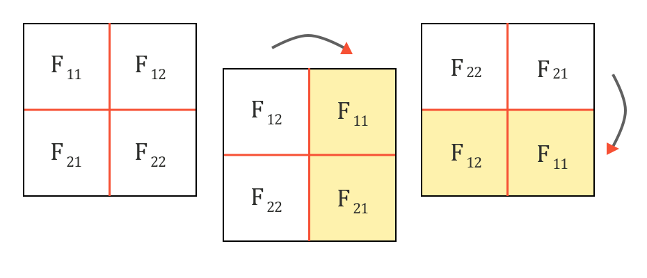

# 在CNN中的反向传播
## 1. 链式法则
先理解一下在反向传播中的链式法则。
假设有下面这个等式：
$$f(x,y,z) = (x+y)z$$
我们可以把它划分成两个等式：
$$\begin{aligned}
    f(x,y,z) = &(x+y)z \\
    q = &x+y \\
    f = &q*z 
\end{aligned}
$$
下面让我们画出关于$x,y,z$的计算图，其中$x=-2,y=5,z=4$：

当我们按照上图从左到右进行计算时（前向传播），可以得到$f=-12$。

现在让我们回到反向传播阶段。我们计算梯度从右往左，因此最后，我们可以得到关于我们的输入$x,y,z$的梯度：$\partial f/\partial x 、 \partial f/\partial y和\partial f/\partial z$。
在从右往左进行计算时，在乘积门，我们可以得到$\partial f/\partial q和\partial f/\partial z$，
在加和门我们可以得到$\partial q/\partial x 和\partial q/\partial y$。

我们希望获得$\partial f/\partial x和\partial f/\partial y$，但是目前我们只获得了$\partial q/\partial x和\partial q/\partial y$，那么我们达到我们的目标呢。
这里就可以使用链式法则来进行推导，通过链式法则，我们可以计算$\partial f/\partial x$：

那么我们可以计算得到$\partial f/\partial x和\partial f/\partial y$如下：

## 2. 在卷积层中的链式法则
如下所示，我们有一个门函数$f$，它的输入是$x和y$，输出是$z$：

我们可以很容易的计算出局部梯度$\partial z/\partial x$ 和$\partial z/\partial y$。
对于前向传播阶段，我们可以通过一个CNN层，然后一直往后传，直到用损失函数计算出它的损失。
然后当我们计算损失反向传播时，一层一层的往前传，我们获得了对于$z$的梯度$\partial L/\partial z$。此时为了继续往前传，我们需要计算出$\partial L/\partial x和\partial L/\partial y$。

此时使用链式法则，我们可以计算出$\partial L/\partial x和\partial L/\partial y$：

那么，具体的对于CNN中的卷积层是如何进行反向传播的呢？
现在，让我们假设$f$是一个卷积函数，对于输入$X$和卷积核$F$进行卷积计算，其中$X$是一个$3\times 3$的矩阵，而$F$是一个$2\times 2$的矩阵:

在$X和F$的卷积操作的输出为$O$，可以被表示为如下：

这就给了我们前向传播的过程，下面让我们来处理反向传播的过程。
正如上面提到的，我们已经获得了对当前输出$O$的梯度$\partial L/\partial O$，那么综合前面的链式法则和反向传播，我们可以得到：

## 3. 具体的计算梯度的方法
下面就让我们来计算$\partial L/\partial X$和$\partial L/\partial F$，
### 3.1  计算$\partial L/\partial F$
计算$\partial L/\partial F$主要通过如下两步：
- 找到局部梯度$\partial O/\partial F$
- 使用链式法则计算$\partial L/\partial F$

#### 3.1.1 计算局部梯度$\partial O/\partial F$
这意味着我们需要计算输出矩阵$O$对于卷积核$F$的偏导，从卷积操作中，我们知道$O^{11}$与$F^{11}、F^{12}、F^{21}、F^{22}$均有关系：

#### 3.1.2 使用链式法则
正如上面所描述的，我们按照下面的方法来计算$\partial L/\partial F$：

其中$O$和$F$都是矩阵，因此对于其中的每一个$F_i$的梯度，我们可以按照下面的方法来计算：

扩展开来，我们可以得到：

将局部梯度$\partial O /\partial F$的结果导入可得：

对于上式，我们可以使用卷积的方式来表示：

### 3.2  计算$\partial L/\partial X$
也是如上分两步走。
#### 3.2.1 计算$\partial O/\partial X$
我们可以通过如下的方式计算得到$\partial O/\partial X$:

#### 3.2.2 使用链式法则

对其进行扩展可得：

现在我们已经有了$\partial L/ \partial X$。
**其中$\partial L/ \partial X$可以看做是将卷积核$F$旋转180度后，与梯度损失$\partial L/ \partial O$的全卷积**。
首先，我们将卷积核$F旋转180度

然后，我们可以在卷积核$F$和$\partial L/ \partial O$之间做全卷积：

具体的数学表达如下：

## 4. 总结
在CNN中的反向传播其实也还是卷积操作：

