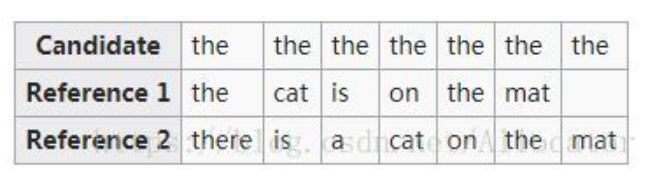
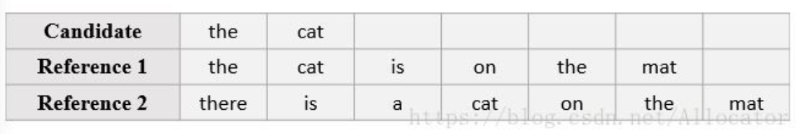

BLEU(Bilingual Evaluation Understudy)，也就是双语互译质量辅助工具。

要计算这个指标，需要使用机器翻译好的文本，也就是candidate docs，以及一些专业翻译人员翻译的文本，也就是reference docs.

本质上来讲，BLEU就是用来衡量机器翻译文本与参考文本之间的相似程度的指标，取值范围在0~1.

然而这个指标也是经过多次的升级更新。

# 最初的BLEU

最初的BLEU计算方法特别简单，通常的将，当我们自己计算两个文本之间的相似程度的时候，我们会考虑单词的频率，最早的BLEU就是采用了这种思想，计算方法是：
- 使用一个累加器表示candidate中的词在reference doc中出现的次数。
- 从candidate doc中的第一个词开始比较，如果在参考文本中出现过，那么计数加1.
- 最后使用这个累加值除以candidate doc中的单词数目即可计算得到文本的BLEU值。
- 我们称之为Precision

具体的一个case如下：

根据这个例子和上述的算法，可以很容易的计算当前文本的precision。整个candidate doc的单词长度为7，而且每一个单词都在reference doc里面出现过了，所以此时的累加值为7,因此准确度为：
$$P=\frac{7}{7}=1$$

但是实际上这个翻译非常不理想，这也是最初的BLEI评估指标不完善的地方。

当遇到较多常见词汇时，翻译质量不高的译文还能够得到较高的precision，因此也诞生了后续的改良型的BLEU计算指标的算法。

# 改良型BLEU(n-gram)
上面提到的计算BLEU的方法是以单个词为基准进行计算的。改良型的BLEU引入将多个词组合在一起形成一个gram的思想。

比如最初版的BLEU的计算可以看做是一个单词构成的gram(这是一种特殊情况)，这种特殊组合被叫做uni-gram，两个单词的组合叫做bi-gram。

以此类推，因此就可以构成一个单词到n个单词长度的多种单词组合（每一种单词长度可能存在不同的组合）。每一种长度的gram都可以计算出一个相应的precision $P_n$。对于该种长度的gram的precision我们还需要把它们整合起来，一般使用加权平均的方法将n个计算出的precision整合成一个precision。因此BLEU指标，公式的推导过程如下：
- 假设参考文献的数量为M，假设长度为n的gram中的一个组合为$W_{n_i}$（某一个长度的gram具有多种可能的组合），
- 将当前组合$W_{n_i}$在candidate doc中出现的次数记作$Count_{w_{n_i}}$。
- 同时计算出这个单词在第j个参考文档中出现的次数，用符号$Ref_{w_{n_i}}^{j}$，其中$j=0,1,2,...,M$，由于参考文献有M个，选择这M个参考文献取值中的最大值进行下一步计算。记这个最大值为$Ref_{w_{n_i}}^{max}$，即是：
$$Ref_{w_{n_i}}^{max} = Max(Ref_{w_{n_i}}^j), \quad j=0,1,2...,M-1$$

现在已经获取到了某一个长度中的一种gram的$Count_{w_{n_i}}$和$Ref_{w_{n_i}}^{max}$，选择这两个计算值中的最小值进行下一步计算，这个值记作$Count_{w_{n_i}}^{res}$:
$$Count_{w_{n_i}}^{res} = Min(Count_{w_{n_i}}, Ref_{w_{n_i}}^{max})$$

长度为n的gram类型有多种，定义类型数为K，那么长度为n的gram的最终precision计算公式如下：
$$P_n = \frac{\sum_{i=0}^{K-1} Count_{w_{n_i}}^{res}}{\sum_{i=0}^{K-1} Count_{w_{n_i}}}$$

以上公式是长度为n的所有gram的Precision的计算公式，由于这个n的取值可以1到candidate doc长度，假设candidate doc总的单词长度为N，需要将最终得到的这N个precision进行整合，此处可以使用加权求和的方法对这N个Precision求出平均精度。

在做加权集合平均之前，可以对公式进行一定的变形，假设权值序列为$W_n, n=0,1,2,...,N-1$可以求得集合加权平均的precision公式如下：
$$\begin{aligned}
P_{avg}=&\sqrt[\sum_{n=0}^{N-1}w_n]{\prod P_n^{W_n}} \\
       =&e^{ln^{\sqrt[\sum_{n=0}^{N-1}w_n]{\prod P_n^{W_n}}}} \\
       =& e^{\frac{\sum_{n=0}^{N-1}W_n*ln^{Pn}}{\sum_{n=0}^{N-1}W_n}}
\end{aligned}$$

一般情况下权值全部取1，因此可以得到简化的几何平均精度：
$$P_{avg}=e^{\frac{\sum_{n=0}^{N-1}ln^{P_n}}{N}}$$

# 短译句的惩罚因子
如上的改良型BLEU的计算公式基本可以解决翻译中的常见的词汇对翻译结果评估的影响。

但是上诉方法针对翻译结果为断句依然会得到不准确的评估，例如下面的这个例子：

根据上面的计算平均精度的公式，可以计算出：
$$P_{avg}=1$$

因此，在这个基础上引入了对于短翻译句子的惩罚因子。

此处定义一个概念，当candidate doc的长度等于任何一个reference doc的长度的时候，我们称此时为最佳匹配。此时不需要对翻译的结果进行惩罚。

当candidate doc的长度不等于任何reference doc的长度的时候，需要引入一个参考长度,记作$Ref_{len}$, 同时定义candidate doc的长度为c, 那么惩罚因子计算公式如下：
$$\theta=\begin{cases}
    &1, \qquad c \geq Ref_{len} \\
    &e^{1-\frac{Ref_{len}}{c}}, \qquad c < Ref_{lef}
\end{cases}$$

综上所述，含有惩罚因子的BLEU的计算公式如下：
$$P_{avg}=\theta * e^{\frac{\sum_{n=0}^{N-1}ln^{P_n}}{N}}$$

关于参考长度的选择其实没有固定的准则，如果是比较严格的情况下可以选择将最长的reference doc的长度作为参考长度，一旦翻译文档不是最佳匹配的情况都会受到短句惩罚因子的影响。

