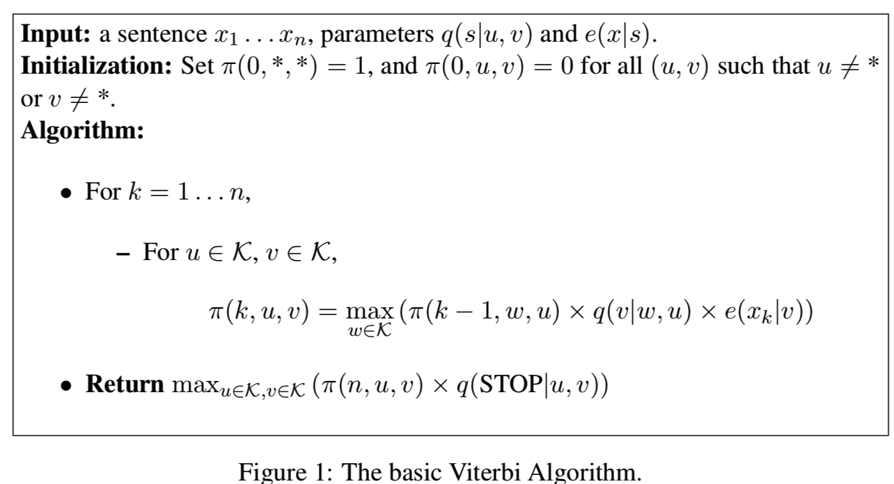
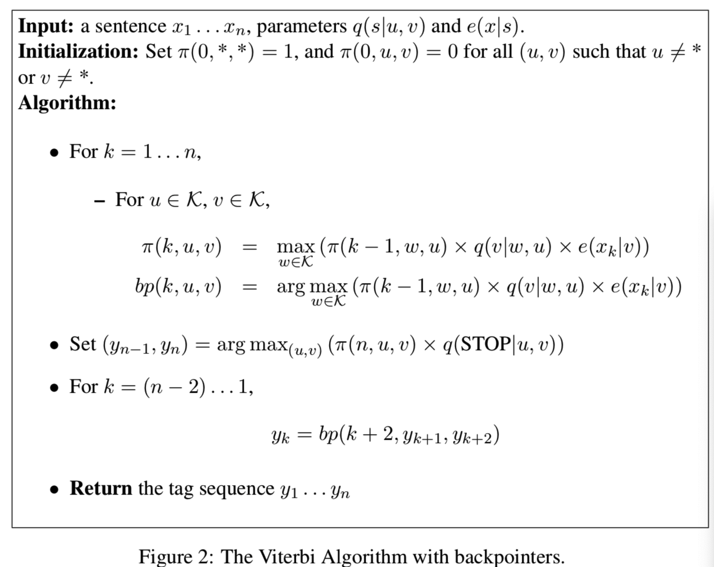

# Hidden Markov Models

HMM常用于处理一些序列问题，比如给句子$x_1,x_2,...,x_n$打上标签$y_1,y_2,...,y_n$，这通常就是叫做sequence labeling problem或者是tagging problem。

现在我们有一个训练集$(x^i,y^i),i=1,...,m$，其中每一个$x^i是一个句子序列x^i_1,x^i_2,...,x^i_n$，每一个$y^i是一个标注序列，y^i_1,y^i_2,...,y^i_n$。

其中x是输入,y是标签，我们的目标就是学习一个函数$f:x -> y$，将每个输入x，对应到它的标签y上。

一种定义函数f(x)的方法就是通过条件模型，我们首先定义一个条件概率：
$$p(y|x)$$
对于任意的一个输入x，模型的输出就是：
$$f(x) = \mathop{\arg \max}_{y \in \mathrm{y}} p(y|x) $$

而我们常用的则是一个**生成模型**，而不是直接使用一个条件分布$p(y|x)$，在生成模型中，我们使用联合概率：
$$p(x,y) $$
$p(x,y)$可以通过如下方式计算得到：
$$p(x,y) = p(y)p(x|y) $$
其中：
 - $p(y)$是对于标签y的一个先验概率
 - $p(x|y)$是在给与标签y的条件下，生成输入x的概率
  
**这个y的概率分布已知，我们可以称其为先验概率，其中p(x|y)叫做似然估计，而对于p(y|x)，它是在获得观察时间x之后得到的，所以我们可以称它为后验概率。**

由贝叶斯公式可得：
$$ p(y|x) = \frac{p(y)p(x|y)}{p(x)} $$

其中
$$p(x) = \sum_{y\in \mathrm{y}}p(x,y) = \sum_{y\in \mathrm{y}}p(y)p(x|y) $$

**所以对于一个数据集来说，可以把p(x)看做一个定值。**

所以我们可以将f(x)定义如下：
$$\begin{aligned}
    f(x) &= \mathop{\arg\max}_{y} p(y|x) \\
        &=\mathop{\arg\max}_{y}\frac{p(y)p(x|y)}{p(x)} \\
        &=\mathop{\arg\max}_{y}p(y)p(x|y)
\end{aligned}
$$

总结：

- 我们的任务就是学习一个函数f(x)，对于给与我们一个x，我们需要找到一个最可能的标签y=f(x)
- 我们需要使用训练集去评估p(y)和p(x|y),这个模型定义了一个生成模型：
  $$p(x,y) = p(y)p(x|y) $$
- 对于给与的一个测试样例x，我们预测它的标签：
- $$f(x) = \mathop{\arg\max}_{y \in \mathrm{y}}p(y)p(x|y) $$
给与输入x，找到它们的输出f(x)，往往被定义为一个解码问题。

## Generative Tagging Models
定义Generative Tagging Models：假设我们有一个有限的词集合$V$，和一个有限的标签集合$K$，定义$S$是sequence/tag-sequence的集合对$<x_1,..,x_n,y_1,...,y_n>$，其中$n \geq0,x_i \in V,并且y_i \in K$，那么一个生成模型$p$可以定义如下：
- 对于任意的$<x_1,...,x_n,y_1,...,y_n> \in S$
 $$ p(x_1,...,x_n,y_1,...,y_n) \geq 0$$
- 此外：
  $$\sum_{<x_1,...,x_n,y_1,...,y_n> \in S} p(x_1,...,x_n,y_1,...,y_n)=1 $$

  那么对于一个生成模型，函数f可以定义如下：
  $$f(x_1,...,x_n) = \mathop{\arg\max}_{y_1,...,y_n}p(x_1,...,x_n,y_1,...,y_n) $$

  那么接下来就有三个很重要的问题：
  - 我们如何定义一个生成模型$p(x_1,...,x_n,y_1,...,y_n)$
  - 我们如何从训练集中学习到模型参数
  - 对于任意的输入$x_1,...,x_n$，我们如何找到
  $$ \mathop{\arg\max}_{y_1,...,y_n}p(x_1,...,x_n,y_1,...,y_n)$$

## Trigram HMM
  下面我们以Trigram HMM为例，来整体介绍HMM算法的整个流程。

  首先我们对于Trigram HMM模型的定义如下：
  - 一个trigram HMM模型包括一个有限的词表集合$V$，一个有限的标签集合$K$，然后总共有以下的一些参数。
  - 参数1： $q(s|u,v)$，对于任何的三元组$(u,v,s)$，其中$s \in K \bigcup {STOP}$, 而$u,v \in V \bigcup {*}$，其中的{Stop}和{*}可以看做是截止符。$q(s|u,v)$的含义就是看见了二元词组$(u,v)$然后生成标签$s$的概率。
  - 参数2：$e(x|s)$,其中$x \in V, s \in K$。 $e(x|s)$可以被理解为在状态$s$，也就是标签$s$，的情况下生成词$x$的概率。
  

那么我们定义$S$是所有可能的sequence/tag-sequence对$<x_1, x_2,...,x_n,y_1,...,y_{n+1}>$，其中$n \geq 0, x_i \in V,而y_i \in K， 其中i=1,...,n, 并且y_{n+1} = STOP$。

**那么我们可以将任意的$<x_1, x_2,...,x_n,y_1,...,y_{n+1}> \in S$出现的概率写成如下形式：**
$$p(x_1, x_2,...,x_n,y_1,...,y_{n+1}) = \prod_{i=1}^{n+1} q(y_i|y_{i-2},y_{i-1})\prod_{i=1}^{n}e(x_i|y_i)$$

我们可以假设其中的$y_0=y_{-1}=*$.

比如一个例子,我们有一个句子**the  dog laughs**，然后它们的标签$y_1,...,y_4$为**D N V STOP**,那么我们可以进行如下的计算：

$$\begin{aligned}
p(x_1,...,x_n,y_1,...,y_{n+1}) = &q(D|*,*) \times q(N|*,D) \times q(V|D,N) \times q(STOP|N,V)  \\
                                 &\times e(the|D) \times e(dog|N) \times e(laughs|V)
\end{aligned}$$

下面这个连乘序列：
$$q(D|*,*) \times q(N|*,D) \times q(V|D,N) \times q(STOP|N,V)$$
是看见一个标签序列为D N V STOP的先验概率。

连乘序列：
$$e(the|D) \times e(dog|N) \times e(laughs|V)$$
可以被理解为是一个条件概率$p(the\quad dog\quad laughs|D \quad N \quad V \quad STOP)$,也就是将通俗的条件概率$p(x|y)$中的x看做the dog laughs, 把y看做D N V STOP.

### 在Trigram HMM中的独立假设

假设一个sequence/tag-sequence对$X_1,...,X_n和Y_1,...,Y_n$其中n是句子的长度。$X_i$可以取词表$V$中的任意词，
假设$V={the,dog,saw,cat,laughs,...}$。$Y_i$可以取标签集$K$中的任意一个，假设$K={D,N,V,...}$

我们接下来的任务就是对下面的联合概率进行建模：
$$P(X_1=x_1,...,X_n=x_n,Y_1=y_1,...,Y_n=y_n)$$
我们可以在整个序列后面加入一个截止符$Y_{n+1}=STOP$，那么上式可以改为：
$$\begin{aligned}
  &P(X_1=x_1,...,X_n=x_n,Y_1=y_1,...,Y_n=y_n,Y_{n+1}=y_{n+1}) \\
  &= \prod_{i=1}^{n+1}P(Y_i=y_i|Y_{i-2}=y_{i-2},Y_{i-1}=y_{i-1}) \prod_{i=1}^{n}P(X_i=x_i|Y_i=y_i)
\end{aligned}$$
我们可以假设$y_0=y_{-1}=*$，其中$*$可以看做一个特殊的起始符。

我们可以用下面两个式子来简写：
$$\begin{aligned}
  &P(Y_i=y_i|Y_{i-2}=y_{i-2},Y_{i-1}=y_{i-1})=q(y_i|y_{i-2},y_{i-1}) \\
  &P(X_i=x_i|Y_i=y_i) = e(x_i|y_i)
\end{aligned}$$

其中，对于上式可以改写为条件概率的形式：
$$\begin{aligned}
  &P(X_1=x_1,...,X_n=x_n,Y_1=y_1,...,Y_n=y_n,Y_{n+1}=y_{n+1}) \\
 =&P(Y_1=y_1,....,Y_{n+1}=y_{n+1})P(X_1=x_1,...,X_n=x_n|Y_1=y_1,...,Y_{n+1}=y_{n+1})
\end{aligned}$$

接下来,**我们可以对tag-sequence做一个独立假设，也就是对于一个标签序列$y_1,...,y_{n+1}$，我们假设：**
$$P(Y_1=y_1,...,Y_n=y_n) = \prod_{i=1}^{n+1}P(Y_i=y_i|Y_{i-2}=y_{i-2}, Y_{i-1}=y_{i-1})$$
也就是说，我们假设$Y_i,...,Y_{n+1}$是一个二阶的马尔可夫链，即每个状态只和它前面的两个状态有关。

**再接下来对词序列$x_1,...,x_n$，做如下假设：**
$$\begin{aligned}
  &P(X_1=x_1, ...,X_n=x_n|Y_1=y_1,...,Y_{n+1}=y_{n+1}) \\
  &= \prod_{i=1}^n P(X_i=x_i|X_1=x_1,...,X_{i-1}=x_{i-1}, Y_1=y_1,...,Y_{n+1}=y_{n+1}) \\
  &= \prod_{i=1}^n P(X_i=x_i|Y_i=y_i)
\end{aligned}$$

上式的第一步推导是根据链式法则直接推导出来的，第二步推导涉及到了一个独立性假设，即：
$$P(X_i=x_i|X_1=x_1,...,X_{i-1}=x_{i-1}, Y_1=y_1,...,Y_{n+1}=y_{n+1})=P(X_i=x_i|Y_i=y_i)$$

这里我们假设变量$X_i$只依赖于$Y_i$的值，也就是说变量$X_i$条件独立于$X_1,...,X_{i-1}和Y_1,...,Y_{i-1},Y_{i+1},...,Y_{n+1}$。

因此上述的整个过程去生成$y_1,...,y_{n+1},x_1,...,x_n$，可以整理为：
1. 初始化 $i=1$和$y_0=y_{-1}=*$
2. 用下面的式子生成$y_i$：
$$q(y_i|y_{i-2},y_{i-1})$$
3. 如果$y_i=STOP$，就可以直接输出$y_1,...,y_i,x_1,...,x_{i-1}$，否则从下式生成$x_i$:
$$e(x_i|y_i)$$
然后将$i=i+1$，返回第二步

### 评估trigramm HMM的参数
假设我们已经有了一些训练数据，这些训练数据是一系列的句子对，句子$x_1,...,x_n$以及他们对应的标注序列$y_1,...,y_n$。

假设$c(u,v,s)$是训练数据中连续三个状态为$(u,v,s)$的数目，并且$c(s \rightarrow x)$是状态$s$和单词$x$一对的数目，比如$c(N \rightarrow dog)$就是状态$N$和单词dog一起出现的次数。

有了上面的定义，那么根据极大似然估计就可以得到：
$$\begin{aligned}
  q(s|u,v) &= \frac{c(u,v,s)}{c(u,v)}\\
  e(x|s)   &= \frac{c(s \rightarrow x)}{c(s)}
\end{aligned}$$

这个参数评估非常简单，就是直接从训练数据中统计数目，然后用极大似然进行估计。

### HMM的解码：Viterbi Algorithm(维特比算法)
接下来我们来探讨对于一个输入句子$x_1,...,x_n$找到他最可能的标注序列，这个问题可以被简写为下面的形式：
$$arg \quad \max_{y_1,...,y_{n+1}} p(x_1,...,x_n,y_1,...,y_{n+1})$$

我们可以假设：
$$p(x_1,...,x_n,y_1,...,y_{n+1})=\prod_{i=1}^{n+1} q(y_i|y_{i-2},y_{i-1}) \prod_{i=1}^n e(x_i|y_i)$$
其中$y_0=y_{-1}=*, y_{n+1}=STOP$

最简单也是最暴力的解法就是直接计算所有可能的$y_1,...,y_{n+1}$，然后用函数$p$计算他们的概率值，最后取值最大的。
这时的时间复杂度显然是$|k|^n$，其中$k$是所有标签的数目，$n$是句子的长度。

#### 基础的维特比算法
我们可以假设对于任意的标记序列$y_1,...,y_k$，其中$k \in {1,...,n}, n为句子的长度$，我们有如下的定义：
$$r(y_1,...,y_k) = \prod_{i=1}^k q(y_i|y_{i-2},y_{i-1})\prod_{i=1}^ke(x_i|y_i)$$

所以我们可以对上面的$p$公式进行改写：
$$\begin{aligned}
  p(x_1,...,x_n,y_1,...,y_{n+1}) &= r(y_1,...,y_n) \times q(y_{n+1}|y_{n-1},y_n) \\
                                 &= r(y_1,...,y_n) \times q(STOP|y_{n-1},y_n)
\end{aligned}$$

接着我们可以定义$S(k,u,v)$是一个长度为$k$的标注序列，并且其中$y_{k-1}=u, y_k=v$，也就是说$S(k,u,v)$是一个以标注序列以$(u,v)$结尾的并且长度为$k$的标注序列的合集。

接着定义：
$$\pi(k,u,v) = \max_{<y_1,...,y_k>\in S(k,u,v)} r(y_1,...,y_k)$$

也就是说$\pi(k,u,v)$是集合$S(k,u,v)$中的所有句子经过函数$r()$后的概率最大的那个。

初始条件可以定义为：
$$\begin{aligned}
  &\pi(0,*,*) = 1 \\
  &\pi(0,u,v) = 0
\end{aligned}$$

**推理1：对于任意的$k \in {1,...,n}$，并且对于任意的$u \in K 和 v \in K$，我们可以得到如下的递归式：**
$$\pi(k,u,v) = \max_{w \in K}(\pi(k-1,w,u) \times q(v|w,u) \times e(x_k|v))$$
这个式子对于整个维特比动态规划算法来说至关重要。

**推理2：**
$$\max_{y_1,...,y_{n+1}}p(x_1,...,x_n,y_1,...,y_{n+1}) = \max_{u\in K, v\in K}(\pi(n,u,v) \times q(STOP|u,v))$$

根据这两个推理，我们就可以实现输入$x_1,...,x_n$然后输出标注序列$y_1,...,y_{n+1}$使得$\max_{y_1,...,y_{n+1}}p(x_1,...,x_n,y_1,...,y_{n+1})$最大。

整个流程如下：

#### 使用backpointer的维特比算法
我们上面描述的基本的维特比算法已经实现了输入词序列$x_1,...,x_n$，然后输出:
$$\max_{y_1,...,y_{n+1}}p(x_1,...,x_n,y_1,...,y_{n+1})$$

这里输出的是最大的$p(x_1,...,x_n,y_1,...,y_{n+1})$的概率值，而我们想要输出的是使这个概率值最大的的标注序列$y_1,...,y_n$，所以我们这里可以对上诉算法进行一个改进来达到这个目的。

我们可以加入一个$bp(k,u,v)$来存储得到$\pi(k,u,v)$时的$k-2$位的标注$w$的结果，注意这里的$u$是第$k-1$位的标注结果，$v$是第k位的标注结果。

那么这整个流程如下：

这整个流程的时间复杂度为$O(n|K|^3)$，这里的$K^3$主要是因为这是一个三元HMM，每次确定$(u,v)$时，还有对第$k-2$位的标注结果进行遍历，但是与$|k|^n$的时间复杂度相比已经有了很大的改进。

## linear-CRF vs HMM
linear-CRF模型和HMM模型有很多相似之处，尤其是其三个典型问题非常类似，除了模型参数学习的问题求解方法不同以外，概率估计问题和解码问题使用的算法思想基本也是相同的。同时，两者都可以用于序列模型，因此都广泛用于自然语言处理的各个方面。

现在再来看看两者的不同：
- 1：最大的不同点是linear-CRF是判别模型，而HMM是生成模型，即linear-CRF模型要优化求解的是条件概率$P(y|x)$，而HMM要求解的是联合分布$P(x,y)$
- 2：linear-CRF是利用最大熵模型的思路去建立条件概率模型，对于观测序列并没有做马尔可夫假设【linear-CRF是由条件随机场转换成了线性链条件随机场，整个随机场的流畅转换是：随机场-> 马尔可夫随机场 -> 条件随机场 -> 线性链条件随机场，其中在马尔可夫随机场中已经定义了**随机场中某一个位置的赋值仅仅与它相邻的位置的赋值有关，和其不相邻的位置的赋值无关。**】，而HMM是对观测序列做了马尔可夫假设的前提下建立联合分布的模型

参考资料：

Michael Collins：Tagging with Hidden Markov Models