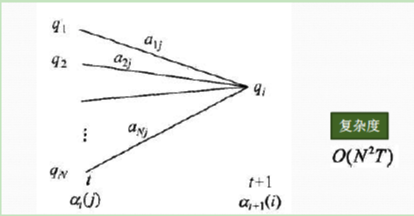
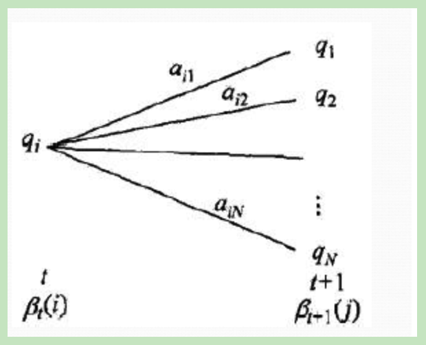

HMM模型主要有三个经典的问题需要去解决：
- 1. 评估观测序列概率。 即给定模型$\lambda = (A,B, \prod)$，其中$A$指隐藏状态间的转移概率矩阵， $B$指发射概率矩阵，$\prod$指隐藏状态的初始概率分布，计算模型$\lambda$在观测序列$O$出现的概率$P(O|\lambda)$。这个问题的求解需要永达前向后向算法。
- 2. 模型参数学习问题。即给定观测序列$O={o_1,o_2,...,o_T}$，估计模型$\lambda=(A,B,\prod)$的参数，使该模型下观测序列的条件概率$P(O|\lambda)$最大，这个问题的求解需要用到基于EM算法的鲍姆-韦尔奇算法，这是这三个问题中最复杂的。
- 3. 预测问题，也被称作解码问题。即给定模型$\lambda=(A,B,\prod)$和观测序列$O={o_1,o_2,...,o_T}$,求给定观测序列条件下，最可能出现的对应的状态序列，这个问题的求解需要用到基于动态规划的维特比算法。

本文主要关注用前向后向算法来评估观测序列出现的概率问题。

## 1,用HMM求观测序列的概率问题
这个问题的描述是，我们已知了HMM模型的参数$\lambda=(A,B,\prod)$，其中A是隐藏状态转移概率矩阵，B是观测状态生成概率的矩阵，$\prod$是隐藏状态的初始概率分布。同时我们也已经得到了观测序列$O={o_1,o_2,...,o_T}$，现在我们要求观测序列$O$在模型$\lambda$下出现的条件概率$P(O|\lambda)$.

乍一看，这个问题很简单，因为知道所有的隐藏状态之间的转移概率矩阵和所有从隐藏状态到观测状态的生成概率，因此我们可以暴力求解。

我们可以列举出所有可能出现的长度为$T$的隐藏序列$I={i_1,i_2,...,i_T}$,然后再分别求出这些隐藏序列和观测序列$O={o_1,o_2,...,o_T}$的联合概率分布，这样我们就可以很容易的求出边缘分布$P(O|\lambda)$。

具体的暴力求解的方法是这样的：首先，任意一个隐藏序列$I={i_1,i_2,...,i_T}$出现的概率是：
$$P(I|\lambda) = \pi_{i_1}a_{i_1i_2}a_{i_2i_3}...a_{i_{T-1}i_T}$$

对于固定的状态序列$I={i_1,i_2,...,i_T}$，我们要求的观察序列$O={o_1,o_2,...,o_T}$出现的概率是：
$$P(O|I,\lambda)=b_{i_1}(o_1)b_{i_2}(o_2)...b_{i_T}(o_T)$$

则$O$和$I$联合出现的概率是：
$$P(O,I|\lambda) = P(I|\lambda)P(O|I,\lambda) = \pi_{i_1}b_{i_1}(o_1)a_{i_1i_2}b_{i_2}(o_2)...a_{i_{T-1}i_T}b_{i_T}(o_T)$$

然后求边缘概率分布，即可得到观测序列$O$在模型$\lambda$下出现的条件概率$P(O|\lambda)$:
$$P(O|\lambda) = \sum_{I}P(O,I|\lambda)=\sum_{i_1,i_2,...,i_T}\pi_{i_1}b_{i_1}(o_1)a_{i_1i_2}b_{i_2}(o_2)...a_{i_{T-1}i_T}b_{i_T}(o_T)$$

虽然上面的方法很有效，但是如果我们的隐藏状态数N非常多的话就麻烦了，此时我们的预测状态有$N^T$种组合，算法的时间复杂度是$O(TN^T)$阶的，因此对于一些隐藏状态数极少的模型，我们可以使用暴力求解法来得到观测序列出现的概率，但是如果隐藏状态多，则上述算法就太过于耗时。

**前向后向算法就是来帮助我们在较低的时间复杂度情况下求解这个问题。**

## 2,用前向算法求HMM观测序列的概率
前向后向算法是前向算法和后向算法的统称，这两个算法都可以用来求HMM观测序列的概率，我们先来看看前向算法是如何求解这个问题的。

**前向算法本质上也属于动态规划算法，也就是我们要通过找到局部状态递推的公式，这样一步步的从子问题的最优解拓展到整个问题的最优解。**

在前向算法中，通过定义"前向概率"来定义动态规划的这个局部状态。什么是前向概率呢，其实定义很简单：定义时刻$t$时的隐藏状态为$q_i$，观测状态的序列为$o_1,o_2,...,o_t$的概率为前向概率，记为：
$$a_t(i)=P(o_1,o_2,...,o_t,i_t=q_i|\lambda)$$

既然是动态规划，我么就要递推了，现在我们假设我们已经找到了在时刻$t$的各个隐藏状态的前向概率，现在我们需要递推出时刻$t+1$时各个隐藏状态的前向概率。

从下图我们可以看出，我们可以基于时刻$t$时的各个隐藏状态的前向概率，在乘以对应的状态转移概率矩阵，即$a_t(i)a_{ij}$就是在时刻$t$观测到$o_1,o_2,...,o_t$，并且时刻$t$的隐藏状态为$q_i$,$t+1$时刻的隐藏状态为$q_j$。

如果将下面所有的线对应的概率求和，即$\sum_{i=1}^Na_t(i)a_{ij}$就是在时刻$t$观测到$o_1,o_2,...,o_t$，并且$t+1$时刻隐藏状态为$q_j$的概率。

继续一步，由于观测状态$o_{t+1}$只依赖于$t+1$时刻的隐藏状态$q_j$，所以$[\sum_{i=1}^Na_t(i)a_{ij}]b_j(o_{t+1})$就是在$t+1$时刻观测到$o_1,o_2,...,o_t,o_{t+1}$，并且$t+1$时刻的隐藏状态为$q_j$的概率。而这个概率恰恰就是$t+1$时刻对应的隐藏状态$i$的前向概率，这样我们就得到了前向概率的递推关系式如下：
$$a_{t+1}(j) = [\sum_{i=1}^Na_t(i)a_{ij}]b_j(o_{t+1})$$

我们的动态规划从时刻1开始，一直到时刻$T$结束，由于$a_T(i)$表示时刻T在观测序列为$o_1,o_2,...,o_T$，并且时刻T隐藏状态为$q_i$的概率，所以我们只需要将所有的隐藏状态对应的概率相加即可，即$\sum_{i=1}^Na_T(i)$就得到了在时刻$T$观测序列为$o_1,o_2,...,o_T$的概率。

下面总结前向算法：

- 输入: HMM模型$\lambda=(A,B,\prod)$，观测序列$O=(o_1,o_2,...,o_T)$
- 输出： 观测序列概率为$P(O|\lambda)$
- 1) 计算时刻1的各个隐藏状态的前向概率：
$$a_1(i) = \pi_{i}b_i(o_1), i=1,2,...,N$$
- 2) 递推时刻2，3，...,T的前向概率：
$$a_{t+1}(j) = [\sum_{i=1}^Na_t(i)a_{ij}]b_j(o_{t+1})$$
- 3)计算最终结果：
$$P(O|\lambda)=\sum_{j=1}^Na_T(j)$$

从递推公式，我们可以看出，此时的时间复杂度为$O(TN^2)$，比暴力解法的时间复杂度$O(TN^T)$少了好几个量级。

## 3，HMM用后向算法求观测序列的概率
熟悉了用前向算法求HMM观测序列的概率，现在我们再来看看怎么用后向算法求HMM观测序列的概率。

前向算法和后向算法非常类似，都是用的动态规划算法，唯一的区别就是选取的局部状态不同，后向算法用的是"后向概率"，那么后向概率如何定义呢。

定义时刻$t$时的隐藏状态为$q_i$，从$t+1$时刻一直到最后时刻$T$的观测状态的序列为$o_{t+1},o_{t+2},...,o_T$的概率为后向概率，记为：
$$\beta_t(i) = P(o_{t+1},...,o_T|i_t=q_i,\lambda)$$

后向概率的动态规划递推公式和前向概率是相反的。现在我们假设已经找到了在时刻$t+1$时各个隐藏状态的后向概率$\beta_{t+1}(j)$，现在我们需要递推出时刻$t$时各个隐藏状态的后向概率。

如下图，**我们可以计算出观测状态的序列为$o_{t+2},o_{t+3},...,o_T$，$t$时的隐藏状态为$q_i$，时刻$t+1$的隐藏状态为$q_j$的概率为$a_{ij}\beta_{t+1}(j)$【此时的状态可以理解为，t时刻隐藏状态为$q_i$,t+1时刻的隐藏状态为$q_{j}$，而观测序列却只是$o_{t+2},o_{t+3},...,o_T$】，接着可以得到观测状态的序列为$o_{t+1},o_{t+2},...,o_T$，t时刻隐藏状态为$q_i$,t+1时刻的隐藏状态为$q_{j}$的概率为：$a_{ij}b_j(o_{t+1})\beta_{t+1}(j)$，那么把下面所有线对应的概率加起来，我们可以得到观测状态的序列为$o_{t+1},o_{t+2},...,o_T$, t时刻的隐藏状态为$q_i$的概率为$\sum_{j=1}^Na_{ij}b_j(o_{t+1})\beta_{t+1}(j)$，这个概率即为时刻t的后向概率。**

这样我们就得到了后向概率的递推关系式如下：
$$\beta_t(i) = \sum_{j=1}^N a_{ij}b_j(o_{t+1})\beta_{t+1}(j)$$

下面我们总结下后向算法的整个流程：
- 输入：HMM模型$\lambda = (A,B,\prod)$，观测序列$O=(o_1,o_2,...,o_T)$
- 输出： 观测序列概率$P(O|\lambda)$
- 1)初始化时刻T的各个隐藏状态后向概率：
$$\beta_T(i) = 1, i=1,..,N$$
- 2)递推时刻$T-1, T-2,...,1$的后向概率：
$$\beta_t(i) = \sum_{j=1}^N a_{ij}b_j(o_{t+1})\beta_{t+1}(j), i=1,2,...,N$$
- 3)计算最终结果：
$$ P(O|\lambda) = \sum_{i=1}^N \pi_{i}b_i(o_1)\beta_1(i)$$

此时算法的时间复杂度仍然是$O(TN^2)$

## 3, HMM常用的概率计算

利用前向概率和后向概率，我们可以计算出$HMM$中单个状态和两个状态的概率公式。

1. 给定模型$\lambda$和观测序列$O$，在时刻$t$处于状态$q_i$的概率记为：
$$\gamma_t(i)= P(i_t=q_i|O,\lambda) = \frac{P(i_t=q_i,O|\lambda)}{P(O|\lambda)}$$

利用前向概率和后向概率的定义可知：
$$P(i_t=q_i,O|\lambda) = a_t(i)\beta_t(i)$$
于是我们得到：
$$\gamma_t(i)=\frac{a_t(i)\beta_t(i)}{\sum_{j=1}^Na_t(j)\beta_t(j)}$$

2. 给定模型$\lambda$和观测序列$O$，在时刻$t$处于状态$q_i$，且时刻$t+1$处于状态$q_j$的状态记为：
$$\zeta_t(i,j)=P(i_t=q_i, i_{t+1}=q_j|o,\lambda) = \frac{P(i_t=q_i,i_{t+1}=q_j,O|\lambda)}{P(O|\lambda)}$$

而$P(i_t=q_i, i_{t+1}=q_j,O|\lambda)$可以由前向后向概率来表示：
$$P(i_t=q_i,i_{t+1}=q_j,O|\lambda) = a_t(i)a_{ij}b_j(o_{t+1})\beta_{t+1}(j)$$

从而最终我们得到$\zeta_t(i,j)$的表达式如下：
$$\zeta_t(i,j)=\frac{a_t(i)a_{ij}b_j(o_{t+1})\beta_{t+1}(j)}{\sum_{r=1}^N\sum_{s=1}^Na_t(r)a_{rs}b_s(o_{t+1})\beta_{t+1}(s)}$$

3. 将$\gamma_t(i)$和$\zeta_t(i,j)$在各个时刻t进行求和，可以得到：
    - 在观测序列$O$下状态$i$出现的期望值是$\sum_{t=1}^T\gamma_t(i)$
    - 在观测序列$O$下由状态$i$转移的期望值是$\sum_{t=1}^{T-1}\gamma_t(i)$
    - 在观测序列$O$下由状态$i$转移到状态$j$的期望值$\sum_{t=1}^{T-1}\zeta_t(i,j)$
    - 上面这些常用的概率值在求解HMM问题2时，经常可以用到。