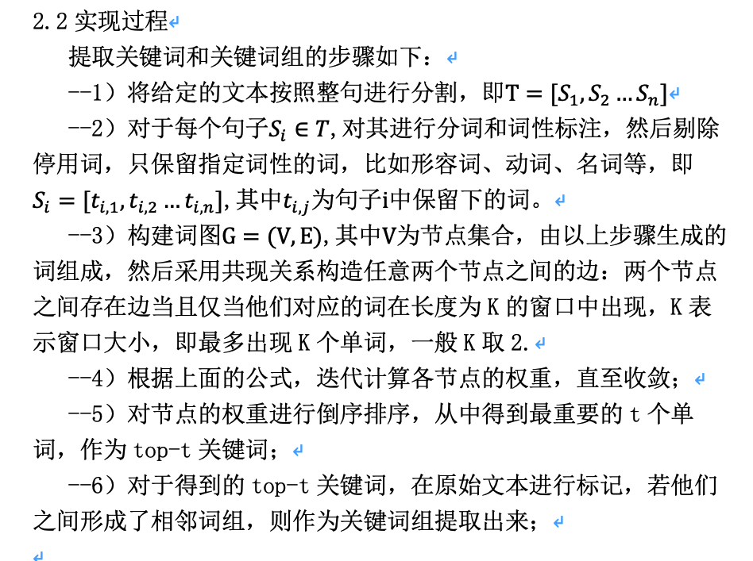
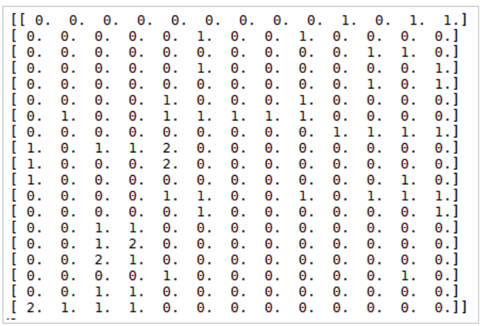

# NLP中的词向量总结

## 1.常用的文本表示方法
- 基于one-hot、tf-idf、textrank的bag-of-words方法
- 主题模型：LSA(SVD)、pLSA、LDA
- 基于词向量的固态表示：word2vec、fastText、glove
- 基于词向量的动态表示：elmo、GPT、bert

## 2. 基于one-hot、tf-idf、textrank的bag-of-word的表示方法
bag-of-word表示方法就是常用的将词放在一个袋子中，我们只考虑词有没有出现，并不会考虑词之间的顺序，
比如由这句话"John likes to watch movies. Mary likes too.",和"John also likes to watch football games."
那么根据这两句话中出现的单词，我们就可以构建一个字典:
- {"John": 1, "likes": 2, "to": 3, "watch": 4, "movies": 5, "also": 6, "football": 7, "games": 8, "Mary": 9, "too": 10}
该字典中有10个单词，每个单词有一个索引，所以我们可以把上面这两句话表示成下面的两个向量：
- [1, 2, 1, 1, 1, 0, 0, 0, 1, 1]
- [1, 1, 1, 1, 0, 1, 1, 1, 0, 0]

可以看到，构造这两个句子的向量表示时，我们并没有考虑到原来单词在句子中出现的次序，这也就是bag-of-words的缺点。

### 2.1 one-hot
one-hot独热编码，也就是用[0,0,...,1,...0]来表示一个单词，其维度是词表大小。
### 2.2 tf-idf
词频tf = $\frac{count(word)}{文档D_i中词的总量}$  
逆文档频率 idf = $log\frac{文档总数}{1+包含词w的文档的数目}$，

tf-idf = tf * idf
### 2.3 textrank
textrank是由pagerank演化而来，可以用来提取关键词等，区别就是pagerank中的是有向无权边，而textrank中是无向有权边：
$$WS(V_i) = (1-d) + d*\sum_{V_j\in In(V_i)}\frac{W_{ij}}{\sum_{V_k \in In(V_j)} W_{ji} }WS(V_j)  $$
具体更新步骤如下：

其中第5步得到的每个词节点的权重就可以理解为与用tf-idf算的词权重是一样的，也可以作为词的一个表示。

## 3. 主题模型
### LSA(Latent Semantic Analysis)
LSA 潜在语义分析，假设你有n篇文档，这些文档中的单词总数为m（可以先进行分词、去词根、去停止词等操作），我们可以用一个m*n的矩阵X来表示这些文档，这个矩阵的每个元素$X_{ij}$表示第i个单词在第j篇文档中出现的次数【也可以用tf-idf值】，下文例子中得到的矩阵见下图。

LSA试图将原始矩阵降维到一个潜在的概念空间（维度不超过n），然后每个单词或者文档都可以用该空间下的一组权值向量【也可以认为是坐标】来表示，这些权值反应了与对应的潜在概念的关联程度的强弱。
**这个降维是通过对该矩阵进行奇异值分解SVD（singular value decomposition）做到的，计算其用三个矩阵的乘积表示的等价形式，如下：**
$$X = U \Sigma V^T$$
**其中U为m*n维，$\Sigma$为对角矩阵n*n维，V为n*n维。其中矩阵U就可以当做词向量矩阵**

$\Sigma$矩阵中对角线上的每一个值就是SVD过程中得到的奇异值，其大小反映了其对应的潜在概念的重要程度。
然后我们可以自行设定降维后的潜在概念的维度k(k<n>，可以得到：)
$$X_{k} = U_{k} \Sigma_{k}V_{k}^{T} $$
**其中$U_{k}$是将U仅保留前k列的结果，$\Sigma_{k}$是仅保留前k行及前k列的结果，$V_{k}$是将V仅保留前k列的结果。**
**$X_{k}$则是将X降维到k维的近似结果，这个k越接近n，$X_{k}$与X也就越接近，但我们的目标并不是越接近越好，LSA认为k值不宜过大（保留了冗余的潜在概念）也不宜过小。**

### pLSA
pLSA在文档和单词之间引入了主题的概念。先以一定的概率生成文档，然后在文档的基础上以一定的概率生成主题，然后再在主题的基础上以一定的概率生成单词。
这个怎么用词向量表示，暂时还不是很清楚。

### LDA(Latent Dirichlet Allocation）
LDA
参考地址:https://zhuanlan.zhihu.com/p/31470216
还要LDA数学八卦，暂时没法写这个的总结

## 3.基于词向量的表示
### 3.1 word2vec