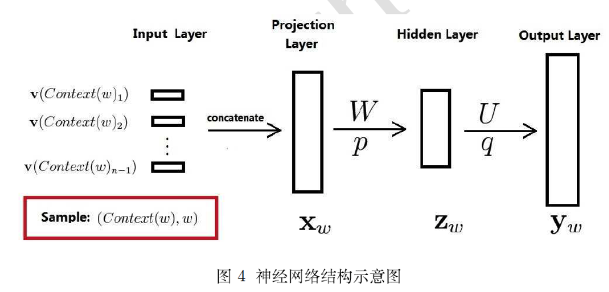

# word2vec的总结

## 传统的神经网络词向量模型
传统的神经网络词向量语言模型，一般都有三层，输入层(一般可以认为是一个N*V的矩阵，也就是最后训练想要得到的词向量矩阵)、隐藏层和输出层(softmax层)，但是这种模式存在一个问题，就是从隐藏层到softmax层的计算量过大，因为对于每一个词都要计算一个词表V大小的概率，然后再找概率最大的值，整个过程如下：

word2vec的提出主要有以下两点改进：
 1. 第一个改进是：从输入层到隐藏层的映射，没有采取神经网络的线性变换再加激活函数的方式(也就是第一层是一个dense层)，而是直接使用简单的将所有输入的词向量加和取平均的方法。
 2. 第二个改进是：从隐藏层到输出的softmax层这里的计算量的改进。以前对于每个词都要计算词表V大小的概率分布，计算量大小是V，现在采用了哈夫曼树，计算量大小就变为了$log_2V$

## cbow模型
cbow(continuous bag-of model)，是利用中心词上下文窗口c大小范围内的词来预测中心词的方法。
主要分为了两种，一种是上下文大小只为1(one-word context)，这种特指只给一个词然后预测下一个词，有点像2-gram模型；另一种则是上下文大小不止1(multi-word context).
### One-word context
one-word context的整个训练过程就是，现在我们有一个one-hot表示的输入词，大小为$V \times 1$,然后和输入层到隐藏层之间的权值矩阵W（其大小为$V\times N$）相乘，得到一个新的表示$h,其大小为N\times 1$，然后在和隐藏层到输出层的权值矩阵$W'(其大小也为V\times N)$，得到一个大小为$V\times 1$的向量$u$，最后就可以对这个$u$做