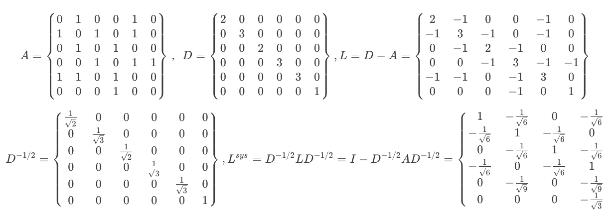

# 傅里叶变换与拉普拉斯矩阵

## 1.什么是拉普拉斯矩阵
拉普拉斯矩阵主要应用在图论中，作为一个图的矩阵表示。
对于图$G=(V,E)$，其拉普拉斯矩阵定义为$L=D-A$，其中$L$是拉普拉斯矩阵， $D=diag(d)$是顶点的度矩阵（对角矩阵），d=rowSum(A)，对角线上元素依次为各个顶点的度，$A$是图的邻接矩阵。

其中，几种常见的拉普拉斯矩阵如下,
最常见的$L=D-A$，其计算如下：
$$
L_{ij} = 
\begin{cases}
    d(v_i) &if \quad i=j, \\
    -1     &if \quad \{v_i, v_j \} \in E \quad i \neq j, \\
    0      &otherwise.
\end{cases}
$$
Symmetric normalized Laplacian(对称的归一化的拉普拉斯矩阵)定义如下：
  $$
    \begin{aligned}
        L^{sym} &= D^{-\frac{1}{2}} L D^{-\frac{1}{2}} \\
                &= I - D^{-\frac{1}{2}} A D^{-\frac{1}{2}}
    \end{aligned}
  $$
具体元素值计算如下：
$$L_{ij}^{sym}=
\begin{cases}
   1  &if \quad i=j \quad and \quad d(v_i) \neq 0, \\
   -\frac{1}{\sqrt{d(v_i)d(v_j)}} &if \quad \{v_i,v_j\} \in E \quad and \quad i \neq j, \\ 
   0  &otherwise.
\end{cases}
$$

Random walk normalized Laplacian(归一化的拉普拉斯矩阵）如下：
  $$L^{rw} = D^{-1}L = I - D^{-1}A $$
    它的具体元素值计算如下：
  $$
  L^{rw}_{ij} = 
  \begin{cases}
      1 &if \quad i=j \quad d(v_i) \neq 0, \\
      -\frac{1}{d(v_i)} &if \{v_i, v_j\} \in E \quad i \neq j, \\
      0 &otherwise.
  \end{cases} 
  $$

一个拉普拉斯矩阵的计算例子：

可以看出，标准归一化的拉普拉斯矩阵还是对称的，并且符合前面公式的定义。

## 2.无向图的拉普拉斯矩阵有什么性质
1. 拉普拉斯矩阵是半正定的。（也就是说，它所有的特征值都大于等于0）.【正定矩阵，意味着所有的特征值大于0，半正定矩阵意味着所有的特征值大于等于0.】
2. 特征值中0出现的次数就是图连通区域的个数。
3. 最小特征值是0。因为拉普拉斯矩阵(L=D-A)的每一行的和均为0，并且最小特征值对应的特征向量是每个值全为1的向量。

**证明拉普拉斯矩阵是半正定的：**
 - 因为$L=D-A$,那么$x^{T}Lx$有：
  $$x^TLx = x^T(D-A)x = x^TDx - x^TAx $$
  其中由计算特征值的方程$Lx=\lambda x$推出$\lambda = x^TDx$.
  A是一个对称矩阵，将A的各元素累加得到了D，由于D是对角矩阵，所以可得$x^TDx = \sum_{i=1}^{n}d_ix_i^2$
  $$
  \begin{aligned}
    x^TLx=& \sum_{i=1}^{n} d_ix_i^2 - \sum_{i=1}^{n}\sum_{j=1}^{n}w_{ij}x_ix_j \\
         =& \frac{1}{2}(\sum_{i=1}^{n}d_ix_i^2 - 2\sum_{i=1}^n\sum_{j=1}^nw_{ij}x_ix_j + \sum_{j=1}^{n}d_jx_{j}^2) \\
         =& \frac{1}{2}\sum_{i=1}^{n}\sum_{j=1}^{n}(w_{ij}x_i^{2} -2w_{ij}x_ix_j + w_{ji}x_i^2) \\
         =& \frac{1}{2}\sum_{i=1}^{n}\sum_{j=1}^nw_{ij}(x_i-x_j)^2 \geq 0 
  \end{aligned}
  $$
所以可以得到$\lambda \geq 0$，所以$L=D-A$是半正定矩阵。

### 2.1 为什么GCN要用拉普拉斯矩阵
- 拉普拉斯矩阵是对称矩阵，可以进行特征分解。
- 由于卷积在傅里叶域的计算相对简单，为了在图上做傅里叶变换，需要找到图的连续正交基对应于傅里叶变换的基，因此要使用拉普拉斯矩阵的特征向量作为正交基。

- ps：矩阵的特征分解只能用于方阵，也就是行和列相等。而奇异值分解则可以用于任何的$n*m$矩阵，因为奇异值分解后（$A=U\sum V^T$）的左奇异向量$U$是$AA^T$的特征向量，它的右奇异向量$V$是$A^TA$的特征向量。

### 2.2 拉普拉斯矩阵的特征分解
特征分解是将矩阵分解为由其特征值和特征向量表示的矩阵之积的方法。**只有对可对角化矩阵或有n个线性无关的特征向量的矩阵才能施以特征分解。**
不是所有的矩阵都可以特征分解，其充要条件是**n阶方阵存在n个线性无关的特征向量。**
但是拉普拉斯矩阵是半正定矩阵，并且是对称矩阵，有如下三个性质：
- 对称矩阵一定有n个线性无关的特征向量。
- 半正定矩阵的特征值一定非负。
- 对称矩阵的不同特征值对应的特征向量相互正交。这些正交的特征向量构成的矩阵为正交矩阵。（也就是说，对称矩阵的特征分解得到的特征向量构成的矩阵，它的逆矩阵就是它的转置矩阵，因为$UU^T=E$，所以可以得到$U^{-1} = U^T$）

由$Lu_1=\lambda_1 u_1$，其中$\lambda_1$为特征值，$u_1$为特征向量，因为$L$有n个特征向量$\{u_1,u_2,...,u_n\}$，相应的有n个特征值$\{ \lambda_1, \lambda_2,...,\lambda_n\}$，所以可以推得：
$$L[u_1,u_2,...,u_n] = [u_1,u_2,...,u_n]
\left [ \begin{matrix}
    \lambda_{1} & \quad  &\quad \\
    \quad       & \ddots &\quad \\
    \quad       & \quad  &\lambda_{n}
\end{matrix} \right] 
$$
我们用$U=[u_1,u_2,...,u_n]$来表示特征向量构成的矩阵，其中$u_i$都是列向量，且为单位特征向量。
所以拉普拉斯矩阵的特征分解为：
$$L=U\Lambda U^{-1} = U \left [ \begin{matrix}
    \lambda_{1} & \quad  &\quad \\
    \quad       & \ddots &\quad \\
    \quad       & \quad  &\lambda_{n}
\end{matrix} \right] U^{-1}
$$

因为$U$是正交矩阵，也就是说$UU^T=E$，所以可以得到$U^{-1} = U^T$,所以上诉特征分解又可以写成：
$$ L=U\Lambda U^T$$
**注意，特征分解最右边的是特征矩阵的逆，只有拉普拉斯矩阵是对称矩阵才可以写成特征矩阵的转置。这个就可以看做是无向图的拉普拉斯矩阵的一个性质之一**

## 3.由傅里叶级数推出傅里叶变换

任何一个周期性函数都可以写成由若干个正交函数(由sin,cos构成)的线性组合构成，写成傅里叶级数的形式如下：
$$f(x) = a_0 + \sum_{n=1}^{\infty}(a_ncos(\frac{2\pi n}{T}x)+ b_nsin(\frac{2\pi n}{T}x) )  $$

利用欧拉公式$e^{ix} = cosx + isinx$可以得到：
$$f(x) = a_0 + \sum_{n=1}^{\infty}(\frac{a_n - b_ni}{2}e^{i\frac{2n\pi}{T}x} + \frac{a_n+b_ni}{2}e^{-i\frac{2n\pi}{T}x}) $$
我们可以把$e^{i\frac{2n\pi}{T}x}$与$e^{-i\frac{2n\pi}{T}x}$是对称的，所以把求和扩大到$-\infty$到$\infty$，并且把$a_0$当成$n=0$的情况，所以我们可以得出一个式子：
$$ f(x) = \sum_{n=-\infty}^{\infty}c_ne^{i\frac{2n\pi}{T}x} $$
其中$c_n = \frac{1}{T} \int_{-\frac{T}{2}}^{\frac{T}{2}} f(x)e^{-i\frac{2\pi n}{T}x}dx $
具体证明$c_n$的过程可以参考https://zhuanlan.zhihu.com/p/76437744和https://blog.csdn.net/yyl424525/article/details/98765291

推导过程：
 - 首先我们需要知道：
  $$\begin{aligned}
      &\int_{-\pi}^{\pi}cosmxcosnxdx = 0(m \neq n) \\
      &\int_{-\pi}^{\pi}sinmxsinnxdx = 0(m \neq n) \\
      &\int_{-\pi}^{\pi}cosmxsinnxdx = 0 \\
  \end{aligned}
  $$

这个的证明也很简单，
$$\begin{aligned}
    \int_{-\pi}^{\pi}cosmxcosnx =& \frac{1}{2}\int_{-\pi}^{\pi}[cos(m+n)x + cos(m-n)x]dx \\
     =& 0 
\end{aligned}$$

同理其他的两个也用三角函数公式进行转换，其值也为0。
那么我们对$f(x)=\frac{a_0}{2} + \sum_{n=1}^{\infty}(a_ncosnx + b_nsinnx)$两边对dx在$[-\pi,\pi]$上积分，可以得到：
$$\begin{aligned}
    \int_{-\pi}^{\pi}f(x)dx =& a_0\pi +0 \\
                            =& a_0\pi
    \end{aligned}
    $$
所以$a_0 = \frac{1}{\pi}\int_{-\pi}^{\pi}f(x)dx$
同理可以对$f(x)=\frac{a_0}{2} + \sum_{n=1}^{\infty}(a_ncosnx + b_nsinnx)$两边成上$coskx$并对dx在$[-\pi,\pi]$上积分，可以得到：
$$\begin{aligned}
        \int_{-\pi}^{\pi}coskxf(x)dx = &\frac{a_0}{2}\int_{-\pi}^{\pi}coskxdx + \int_{-\pi}^{\pi}\sum_{n=1}^{\infty}(a_ncoskxcosnx + b_ncoskxsinnx)dx \\
        =& 0 + a_k\int_{-\pi}^{\pi}cos^{2}kxdx  \\
        =& 0 +a_k\int_{-\pi}^{\pi}\frac{cos2kx+1}{2}dx \\
        =& a_k\pi \quad(k=1,2,3..)
\end{aligned}$$
    
也就可以得到：
$$a_k = \frac{1}{\pi}\int_{-\pi}^{\pi}coskxf(x)dx \qquad (k=1,2,3...) $$
同理可以对$f(x)=\frac{a_0}{2} + \sum_{n=1}^{\infty}(a_ncosnx + b_nsinnx)$两边成上$sinkx$并对dx在$[-\pi,\pi]$上积分，可以得到：
$$b_k = \frac{1}{\pi}\int_{-\pi}^{\pi}sinkxf(x)dx \qquad (k=1,2,3...) $$

那么对于$f(x) = a_0 + \sum_{n=1}^{\infty}(a_ncos(\frac{2n\pi}{T}x)+b_nsin(\frac{2n\pi}{T}x))$，周期为T时，我们可以推得：
$$\begin{aligned}
        a_n =& \frac{2}{T}\int_{-\frac{T}{2}}^{\frac{T}{2}}f(x)cos(\frac{2n\pi}{T}x)dx \\
        b_n =& \frac{2}{T}\int_{-\frac{T}{2}}^{\frac{T}{2}}f(x)sin(\frac{2n\pi}{T}x)dx \\
\end{aligned}$$
根据欧拉公式，可以算得：
$$cosx = \frac{e^{ix}+e^{-ix}}{2}, \quad sinx = \frac{e^{ix}-e^{-ix}}{2} $$
代入上式可得：
$$\begin{aligned}
        a_ncos(\frac{2n\pi}{T}x)+b_nsin(\frac{2n\pi}{T}x) =& (\frac{a_n - ib_n}{2})e^{i\frac{2n\pi}{T}x} +(\frac{a_n + ib_n}{2})e^{-i\frac{2n\pi}{T}x} \\
        =&c_n e^{i\frac{2n\pi}{T}x} + c_{-n}e^{-i\frac{2n\pi}{T}x}
\end{aligned}$$
其中：
$$\begin{aligned}
    c_{-n} =& \frac{a_{-n} - ib_{-n}}{2} = \frac{a_n + ib_n}{2} \\
    c_n = &\frac{a_n -ib_n}{2} 
\end{aligned}$$
我们可以把$e^{i\frac{2n\pi}{T}x}$与$e^{-i\frac{2n\pi}{T}x}$是对称的，所以把求和扩大到$-\infty$到$\infty$，并且把$a_0$当成$n=0$的情况，所以我们可以得出一个式子：
$$ f(x) = \sum_{n=-\infty}^{\infty}c_ne^{i\frac{2n\pi}{T}x} $$

然后我们把$a_n,b_n$的表达式代入$c_n$可以得到：
$$c_n = \frac{1}{T} \int_{-\frac{T}{2}}^{\frac{T}{2}} f(x)e^{-i\frac{2\pi n}{T}x}dx$$

代入上式得：
$$
\begin{aligned}
    f(x) =& \sum_{n=-\infty}^{\infty}c_ne^{i\frac{2n\pi}{T}x}  \\
         =& \sum_{n=-\infty}^{\infty}\frac{1}{T}\int_{-\frac{T}{2}}^{\frac{T}{2}} f(x)e^{-i\frac{2\pi n}{T}x}dx\cdot e^{i\frac{2n\pi}{T}x} \\
\end{aligned}
$$
所以任意的周期函数都可以表示成上式。
但是对于非周期函数，并不能用如上的傅里叶级数的形式表示，但是我们可以使用当$T \rightarrow \infty$来逼近它。
所以我们令$T \rightarrow \infty$,此时令$  w_0 = \frac{2\pi}{T},w= nw_0$，因为$w=nw_0$，每次w的增量$dw$都是由于n变成n+1导致的，所以：
$$dw = (n+1)w_0 -nw_0 = w_0$$
同时因为$nw_0$连续变化，原来离散意义下的求和就可以变成连续状态下的求积分，所以代入上式可以改写为：
$$
\begin{aligned}
    f(x) =& \sum_{n=-\infty}^{\infty}\frac{w_0}{2\pi}\int_{-\frac{T}{2}}^{\frac{T}{2}} f(x)e^{-iwx}dx\cdot e^{iwx} \\
         =& \frac{1}{2\pi} \int_{-\infty}^{\infty}\int_{-\infty}^{\infty}f(x)e^{-iwx}dx\cdot e^{iwx}dw \\
\end{aligned}
$$
我们令$F(w) =\int_{-\infty}^{\infty}f(x)e^{-iwx}dx $上式就变成了：
$$
\begin{aligned}
 f(x) =& \frac{1}{2\pi}\int_{-\infty}^{\infty}F(w)\cdot e^{iwx}dw    \\
\end{aligned}$$
其中$F(w) =\int_{-\infty}^{\infty}f(x)e^{-iwx}dx$就是傅里叶变换。$f(x) = F^{-1}[F(w)]=\frac{1}{2\pi}\int_{-\infty}^{\infty}F(w)\cdot e^{iwx}dw  $就是傅里叶的逆变换。
**其实可以发现这个对信号f(x)的傅里叶变换F(w)，形式上就是f(x)与基函数$e^{-iwx}$的积分，本质上就是将函数f(x)映射到了以$e^{-iwx}$为基向量的空间中。**
那么为什么要找$e^{-iwt}$作为基函数呢，从数学上看，$e^{-iwt}$是拉普拉斯算子的特征函数。
(什么是拉普拉斯算子：如果f是欧式空间的二阶可微函数，那么$\Delta f$就是在欧式空间中求其二阶微分，$\Delta$就是拉普拉斯算子。)

## 4.图上的傅里叶变换与卷积
**把传统的傅里叶变换以及卷积迁移到Graph上来，核心工作就是把拉普拉斯算子的特征函数$e^{-iwt}$变成图对应的拉普拉斯矩阵的特征向量。**
离散积分就是一种内积的形式，所以图上的傅里叶变换就是：
$$F(\lambda_l) = \hat{f}(\lambda_l) = \sum_{i=1}^{N}f(i)u_l(i) $$
 - f是图上的N维向量，可以表示某个节点的特征向量，$f(i)$表示第i个特征。
 - $u_l(i)$表示第l个特征向量的第i个分量；
 - f的图傅里叶变换就是与$\lambda_l$对应的特征向量$u_l$进行内积运算；
 - $\lambda$就对应于前面傅里叶变换F(w)中的w，标志着对应的特征值
 - $\hat{f}$表示f的傅里叶变换。

### 4.1图的傅里叶变换的矩阵形式
利用矩阵乘法，将图的傅里叶变换推广到矩阵形式（加入多个特征向量）：

$$
\left ( \begin{matrix}
    \hat{f}(\lambda_1) \\
    \hat{f}(\lambda_2) \\
    \vdots \\
    \hat{f}(\lambda_N) \\
\end{matrix} \right) = 
\left ( \begin{matrix}
    u_1(1) & u_1(2) &\cdots &u_1(N) \\
    u_2(1) & u_2(2) &\cdots &u_2(N) \\
    \vdots & \vdots &\ddots &\vdots \\
    u_N(1) & u_N(2) &\cdots &u_N(N) \\
\end{matrix} \right) \left ( \begin{matrix}
    f(\lambda_1) \\
    f(\lambda_2)  \\
    \vdots \\
    f(\lambda_N)  \\
\end{matrix} \right)
$$
那么f在图上的傅里叶变换的矩阵形式也就是：
$$ \hat{f} = U^{T}f$$

### 4.2图的傅里叶逆变换
类似的，传统的傅里叶逆变换是对频率$w$求积分：
$$ f(x) = F^{-1}(F(w)) = \frac{1}{2\pi}\int_{-\infty}^{\infty}F(w)\cdot e^{iwx}dw  $$
迁移到图上，就变成了对特征值$\lambda_l$求和：
$$f(i) = \sum_{i=1}^{N}\hat{f}(\lambda_l)u_l(i) $$
利用矩阵乘法，在图上将傅里叶逆变换推广到矩阵形式：
$$
\left ( \begin{matrix}
    f(1) \\
    f(2) \\
    \vdots \\
    f(N) \\
\end{matrix} \right) = 
\left ( \begin{matrix}
    u_1(1) & u_2(1) &\cdots &u_N(1) \\
    u_1(2) & u_2(2) &\cdots &u_N(2) \\
    \vdots & \vdots &\ddots &\vdots \\
    u_1(N) & u_2(N) &\cdots &u_N(N) \\
\end{matrix} \right) \left ( \begin{matrix}
    \hat{f}(\lambda_1) \\
    \hat{f}(\lambda_2) \\
    \vdots \\
    \hat{f}(\lambda_N) \\
\end{matrix} \right)
$$
也就是说，在图上的傅里叶逆变换的矩阵形式为：
$$ f = U\hat{f}$$

### 4.3图上的傅里叶变换推广到图卷积
根据卷积定理：两个函数f和g两者的卷积，就是他们傅里叶变换的乘积的逆变换，写成公式就是：
$$f*g = F^{-1}\{F\{f\} \cdot F\{g\}\} = F^{-1}\{\hat{f}\cdot \hat{g} \} $$
证明如下：
 - 设$f*g = h(z) = \int_{\mathbb{R}} f(x)g(z-x)dx$
  则可得：
  $$\begin{aligned}
      F\{f*g\} =& F\{h(v)\} \\
               =& \int_{\mathbb{R}} h(z)e^{-iwz}dz \\
               =& \int_{\mathbb{R}}\int_{\mathbb{R}}f(x)g(z-x)e^{-iwz}dxdz \\
               =& \int_{\mathbb{R}}f(x)(\int_{\mathbb{R}}g(z-x)e^{-iwz}dz)dx
  \end{aligned} $$

    代入$y=z-x, dy=dz$可以得到：
$$\begin{aligned}
    F\{f*g\} =& \int_{\mathbb{R}}f(x)(\int_{\mathbb{R}}g(z-x)e^{-iwz}dz)dx \\
         =& \int_{\mathbb{R}}f(x)(\int_{\mathbb{R}}g(z-x)e^{-iw(x+y)}dy)dx \\
         =& \int_{\mathbb{R}}f(x)e^{-iwx}dx \int_{\mathbb{R}}g(y)e^{-iwy}dy \\
         =& F\{f\} \cdot F\{g\}
\end{aligned}$$
最后两边同时作用$F^{-1}$，可以得到：
$$f*g = F^{-1}\{ F\{f\} \cdot F\{g\}\} $$

所以，对图上f和g的卷积可以写成：
$$(f*g)_{G} = U((U^Tg)\cdot (U^Tf)) $$

从上面可以看出，对卷积核g和f进行傅里叶变换的结果$U^Tg和U^Tf$都是一个列向量：
$$
\left ( \begin{matrix}
    \hat{f}(\lambda_1) \\
    \hat{f}(\lambda_2) \\
    \vdots \\
    \hat{f}(\lambda_N) \\
\end{matrix} \right),\left ( \begin{matrix}
    f(1) \\
    f(2) \\
    \vdots \\
    f(N) \\
\end{matrix} \right)
$$

所以很多论文中的图卷积也写作：
$$(f*g)_G = U((U^Tg) \odot (U^Tf)) $$

如果把$U^Tg$整体看做可学习的卷积核，这里我们把它写作$g_{\theta}$，最终图上的卷积公式为：
$$ (f*g)_G = Ug_{\theta}U^Tf$$

有的地方，还把$g_{\theta}=U^Tg$写成对角矩阵的形式，即定义一个滤波$g_{\theta}=diag(U^Tg)$，则：
$$f*g_{\theta} = Ug_{\theta}U^Tf = U \left [ \begin{matrix}
    \hat{g}(\lambda_{1}) & \quad  &\quad \\
    \quad       & \ddots &\quad \\
    \quad       & \quad  &\hat{g}(\lambda_{n})
\end{matrix} \right] U^Tf
$$

后面要介绍的频域卷积，基本都是在$g_\theta$上做了一些工作。
