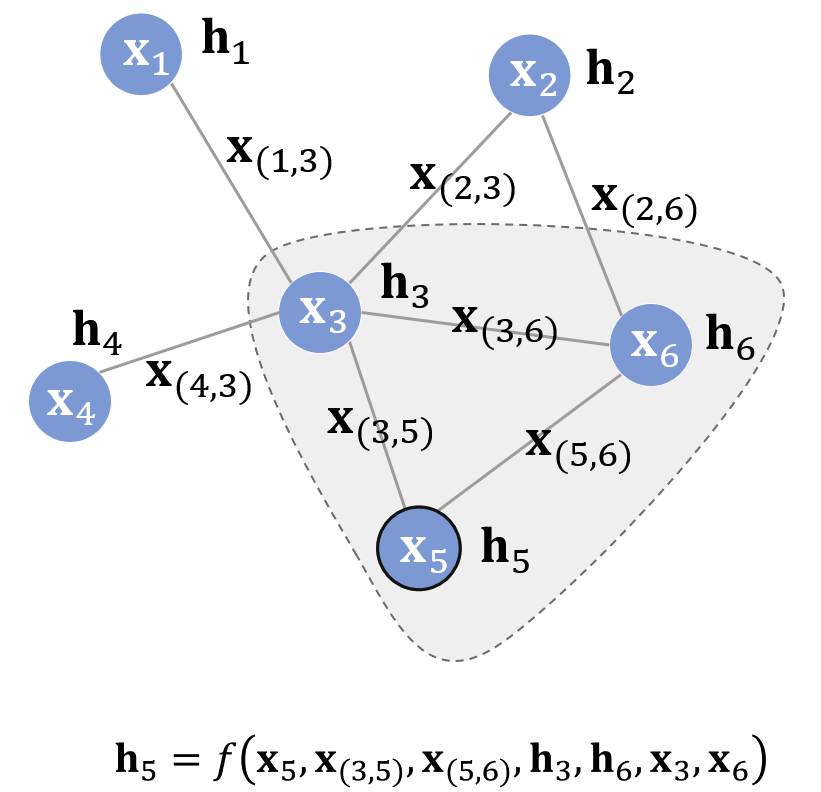
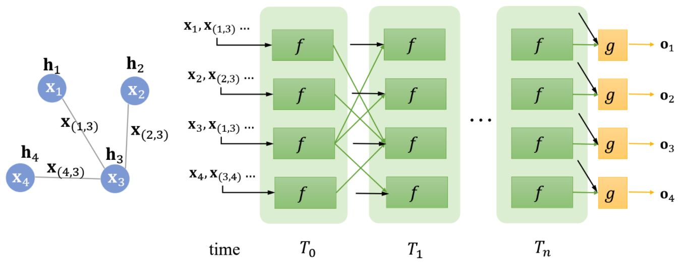
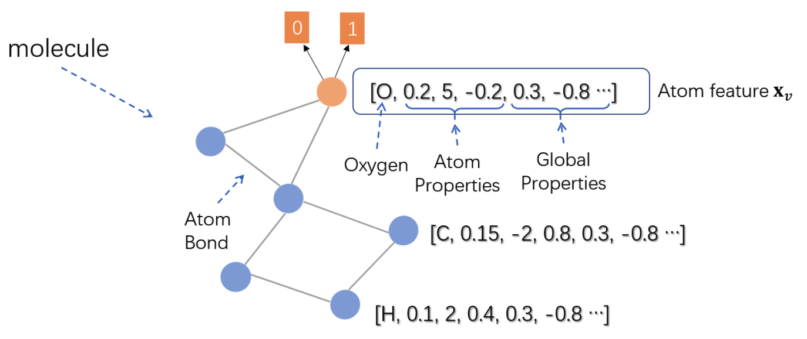
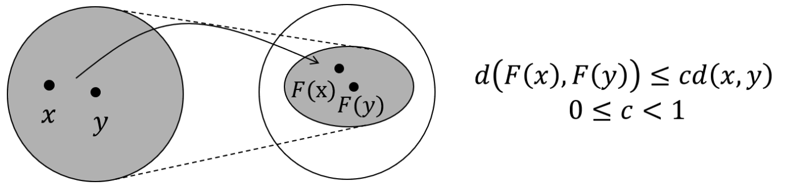

<link rel="stylesheet" type="text/css" href="auto-number-title.css" />

## 1.什么是图神经网络
在过去的几年中，神经网络的兴起与应用推动了模式识别和数据挖掘的研究。
许多曾经严重依赖手工提取特征的机器学习任务（目标识别、机器翻译和语音识别），
如今均采用端到端的深度学习方法（卷积神经网络、长短期记忆网络、transformer等）。

尽管传统的深度学习方法在从欧式空间提取特征方面取得了巨大的成功，
但是许多实际应用场景中的数据是从非欧式空间生成的，
传统的深度学习方法在处理非欧式空间数据上的表现始终难以令人满意。
例如，在电子商务中，一个基于图的学习系统能够利用用户与产品之间的交互来做准确的推荐。

### 1.1什么是欧式数据和非欧式数据
欧式数据的最明显特征就是他们具有规则的空间结构，如图片是规则的正方形，语音是规则的一维序列，这些特征都可以用一维或二维的矩阵表示。
生活中也存在很多不具备规则的空间结构，如推荐系统、电子交易、分子结构等抽象出来的图谱。
这些图谱中的每个节点的连接都不相同，有的节点有三个连接，有的节点有一个连接，是不规则的结构。
这些不具备规则结构的数据就是非欧式数据。

对于不规则的非欧式数据，研究者们引入了图论中的图来表示。

### 1.2图的一些知识
图经常用$G=(V,E)$来表示，其中$V$是顶点的集合，$E$是边的集合，一个边$e$有两个顶点$u,v$。
图也可以分为有向图和无向图，图神经网络中处理的通常都是无向图。
其中图的顶点$v$的度，用$d(v)$表示，是和顶点v相连的边的数目。

- Adjacency matrix
  对于一个简单的图$G=(V,E)$，有n个顶点，可以被描述为如下的邻接矩阵$A \in \mathbb{R}^{n\times n}$,其中：
  $$ A_{ij} =  
  \begin{cases}
      1  &if\{v_i, v_j\} \in E \quad and \quad i \neq j, \\
      0  & otherwise
  \end{cases}
  $$

- Degree matrix
  对于一个图$G=(V,E)$有n个顶点，它的度矩阵$D \in \mathbb{R}^{n\times n}$是一个对角矩阵，
  $$ D_{ii} = d(v_i) $$
- Laplacian matrix
  对于一个图$G=(V,E)$有n个顶点，如果图$G$中所有的边都是无向的，那么它的拉普拉斯矩阵$L \in \mathbb{R}^{n\times n}$可以被定义为：
  $$ L = D-A $$

    因此，我们可以得出：
$$
L_{ij} = 
\begin{cases}
    d(v_i) &if \quad i=j, \\
    -1     &if \quad \{v_i, v_j \} \in E \quad i \neq j, \\
    0      &otherwise.
\end{cases}

$$
 - Symmetric normalized Laplacian
  对称的归一化的拉普拉斯矩阵定义如下：
  $$
    \begin{aligned}
        L^{sym} &= D^{-\frac{1}{2}} L D^{-\frac{1}{2}} \\
                &= I - D^{-\frac{1}{2}} A D^{-\frac{1}{2}}
    \end{aligned}
  $$
具体元素值计算如下：
$$L_{ij}^{sym}=
\begin{cases}
   1  &if \quad i=j \quad and \quad d(v_i) \neq 0, \\
   -\frac{1}{\sqrt{d(v_i)d(v_j)}} &if \quad \{v_i,v_j\} \in E \quad and \quad i \neq j, \\ 
   0  &otherwise.
\end{cases}
$$

- Random walk normalized Laplacian
  另一种归一化的拉普拉斯矩阵归一化如下：
  $$L^{rw} = D^{-1}L = I - D^{-1}A $$
    它的具体元素值计算如下：
  $$
  L^{rw}_{ij} = 
  \begin{cases}
      1 &if \quad i=j \quad d(v_i) \neq 0, \\
      -\frac{1}{d(v_i)} &if \{v_i, v_j\} \in E \quad i \neq j, \\
      0 &otherwise.
  \end{cases} 
  $$

### 1.3状态更新与输出
最早的图神经网络的提出是2009年的Franco,理论基础是不动点理论。

给定一张图$G$，每个节点都有其自己的特征，本文中用$x_v$来表示节点v的特征；连接两个节点的边也有自己的特征，本文用$x_{v,u}$来表示节点$v$和节点$u$之间边的特征。
GNN的学习目标是获得每个节点的图感知隐藏状态$h_v$，这就意味着对于每个节点，它的隐藏状态包含了来自邻居节点的信息。那么如何让每个节点都感知图上的其他节点呢？
GNN通过迭代式更新所有节点的隐藏状态来实现，在t+1时刻，节点$v$的隐藏状态按照如下方式更新：
$$h_{v}^{t+1} = f(x_v, x_{c}o[v],h^{t}_{n}e[v], x_{n}e[v]) $$
上面这个式子中的$f$就是隐藏状态的更新函数，在论文中也被称为**局部转移函数**，其中$x_{c}o[v]$指的是与节点$v$相邻的边的特征，$x_{n}e[v]$指的是节点$v$的邻居节点的特征，$h^{t}_{n}e[v]$则指邻居节点在t时刻的隐藏状态。
注意f是对所有节点都成立的，是一个全局共享函数。
那么怎么把它跟深度学习结合起来呢，那就是利用神经网络来拟合这个复杂函数$f$。
**值得一提的是，虽然看起来f的输入是不定长的参数（每个节点的邻居节点数目不一样），但是在f内部我们可以先将不定长的参数通过一定的操作变成一个固定的参数，比如用所有隐藏状态的加和来代表所有隐藏状态。**

比如下面这个例子：

假设节点5为中心节点，其状态更新公式就如图所示。
这个公式表达的思想主要是：不断地利用当前时刻邻居节点的隐藏状态作为部分输入来生成下一时刻中心节点的隐藏状态，直到每个节点的隐藏状态变化幅度很小，整个图的信息流动趋于平稳。
状态更新公式仅描述了如何获取每个节点的隐藏状态，除此之外我们还需要另外一个函数$g$来描述如何适应下游任务。
举个例子，给定一个社交网络，判定各个节点是否为水军账号。
$$o_v = g(h_v, x_v) $$
在原文中，$g$又被称为局部输出函数，与f类似，g也可以用一个神经网络来表达，它也可以是一个全局共享的函数，
整个流程如下：

仔细观察两个时刻之间的连线，它与图的连线密切相关。比如说在$T_1$时刻，节点1的状态接收来自节点3的上一时刻的隐藏状态，因为节点1与节点3相邻。直到$T_n$时刻，各个节点的隐藏状态收敛，每个节点后面接一个g即可得到该节点的输出$o$。
对于不同的图来说，收敛的时刻可能不同，因为收敛是通过两个时刻$p$范数的差值是否小于某个阈值$\epsilon$来判定的，比如：
$$|| H^{t+1}||_{2} - ||H^{t}||_2 \lt \epsilon $$

下面我们用个实例来说明图神经网络是如何应用的。假设我们现在有这样的一个任务，给定一个环烃化合物的分子结构，
模型学习的目标是判断其是否有害。这是一个典型的二分类问题

由于化合物的分类实际上需要对整个图进行分类，在论文中，作者将化合物的**根节点**的表示作为整张图的表示，如上面的红色的节点所示。
Atom feature中包括了每个原子的类型、原子自身的属性、化合物的一些特征等。
在不断地迭代根节点氧原子收敛到隐藏状态后，在上面接一个前馈神经网络作为输出层（即g函数），就可以对整个化合物二分类了。

### 1.4 不动点理论
GNN的理论基础是**不动点理论**，这里的不动点理论专指**巴拿赫不动点理论**。
首先我们用$F$表示若干个$f$堆叠得到的一个函数，也称为全局更新函数，那么图上的所有节点的状态更新公式可以写成：
$$H^{t+1} = F(H^{t},X) $$
不动点理论指的是，不论$H^0$是什么，只要$F$是个压缩映射，$H^0$经过不断迭代都会收敛到某一个固定的点，我们称之为**不动点**，那么压缩映射是什么呢，具体情况如下：

也就是说，对于任何的$x,y$，经过$F$变换到新空间后，它们的距离都要比在原空间中小，原先的空间被压缩了。
压缩映射就是指：
$$d(F(x),F(y)) \neq cd(x,y), 0 \neq c \lq 1 $$

#### 1.4.1具体实现
在具体实现中，$f$其实通过一个简单的前馈神经网络就可以实现，比如说一种简单的实现方法就是把每个邻居节点的特征、隐藏状态、每条边的特征以及节点本身的特征结合在一起，在经过前馈神经网络后再做一次加和。
$$
\begin{aligned}
 h_{v}^{t+1}   = &f(x_v,x_{c}o[v], h_{n}^{t}e[v],x_{n}e[v]) \\
    = & \sum_{u\in ne[v]} FNN([x_v;x_{(u,v)};h_{u}^{t};x_u])
\end{aligned}
$$

那么我们如何保证$f$是一个压缩映射呢，其实就是通过限制$f$对$H$的偏导数矩阵的大小，这是通过一个对**雅克比矩阵的惩罚项**来实现的。
**在代数里面，有一个定理是：$f$为压缩映射的等价条件就是$f$的梯度/导数要小于1.**这个等价定理可以从压缩映射的形式化定义导出，根据压缩映射的定义，可以导出：
$$
\begin{aligned}
    ||F(x) - F(y)|| \neq c||x-y||, 0\leq c \lt 1 \\
    \frac{||F(x)-F(y)||}{||x-y||} \neq c \\
    \frac{||F(x)-F(x-\Delta x)||}{||\Delta x||} \neq c \\
    ||F'(x)|| = || \frac{\alpha F(x)}{\alpha x}|| \neq c 
\end{aligned}
$$
也就是说，压缩映射等价于雅克比矩阵小于等于c。根据拉格朗日乘子法，可以将有约束问题转换为带惩罚项的无约束问题：
$$ J = Loss + \lambda \cdot max(\frac{||\alpha FNN||}{\alpha h}-c,0), c\in (0,1)$$
其中$\lambda$是超参数，与其相乘的项就是雅克比矩阵的罚项。

#### 1.4.2模型学习
上面我们花了一定的篇幅搞懂了如何让$f$接近压缩映射，下面我们来叙述一下图神经网络中的损失是如何定义的，以及模型是如何学习的。
仍然以社交网络为例，虽然每个节点都会有隐藏状态以及输出，但并不是每个节点都会有监督信号，比如说，社交网络中只有部分用户被明确标记了是否为水军账号，这就构成了一个典型的节点二分类问题。
那么很自然的，模型的损失就可以通过这些有监督信号的节点得到。假设监督节点一共有$p$个，模型损失可以形式化为：
$$Loss = \sum_{i=1}^{p} (t_i - o_i) $$

**那么，模型如何学习呢？根据前向传播计算损失的过程，不难推导出反向传播计算梯度的过程，在前向传播中，模型：**
 1. 调用$f$若干次，比如$T_n$次，直到$h_{v}^{T_n}$收敛。
 2. 此时每个节点的隐藏状态接近不动点的解。
 3. 对于有监督信号的节点，将其隐藏状态通过$g$输出，进而算出模型的损失。
根据上面的过程，在反向传播时，我们可以直接求出$f$和$g$对最终的隐藏状态$h_{v}^{T_n}$的梯度。
然而因为模型递归调用了$f$若干次，为计算f和g对最初的隐藏状态$h_v^0$的梯度，我们需要同样的递归式/迭代式的计算$T_n$次梯度，最终得到的梯度即为f和g对$h_v^0$的梯度，然后该梯度用于更新模型的参数，这个算法就是Almeida-Pineda算法。

## 2.图循环神经网络
可以发现图神经网络与RNN/GRU/LSTM等循环神经网络很相似，但其中也有些不同，具体差异如下：

假设GNN中存在三个节点$x_1, x_2, x_3$，相应的，在RNN中有一个序列$(x_1,x_2,x_3)$，那么$GNN$与$RNN$的区别主要是以下四点：
- GNN的基础理论是不动点理论，这就意味着GNN沿时间展开的长度是动态的，是根据收敛条件确定的，而RNN沿时间展开的长度就等于序列本身的长度。
- GNN每次时间步的输入都是所有节点$v$的特征，而RNN每次时间步的输入是该时刻对应的输入，同时，时间步之间的信息流也不相同，前者由边决定，后者则由序列的读入顺序决定。
- GNN采用AP算法反向传播优化，而RNN使用BPTT进行优化，前者对收敛性有要求，而后者对收敛性没有要求。
- GNN循环调用$f$的目标是得到每个节点稳定的隐藏状态，所以只有在隐藏状态收敛后才能输出，而RNN的每个时间步上都可以输出，比如语言模型。

### 2.1 门控图神经网络(Gated Graph Neural network)
门控图神经网络是直接用类似RNN的方法来定义GNN，门控图神经网络最大的特点就是**不再以不动点理论为基础。**
这就意味着$f$不在需要是一个压缩映射，那么迭代不需要收敛才能输出，可以迭代固定步长，优化算法也从AP算法转向了BPTT。
#### 状态更新

## 3. 图卷积神经网络
图卷积神经网络的目的就是将卷积操作应用于图领域，主要分为两大类：
 - 基于空间域的卷积（spatial domain）
 - 基于频域的卷积(spectral domain)
空间域的卷积相当于在图片的像素点上进行卷积，而频域则相当于对图片进行傅里叶变换后，再进行卷积。

