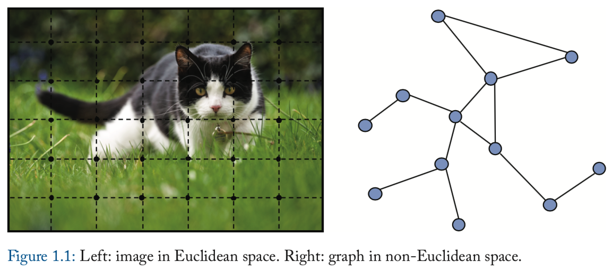
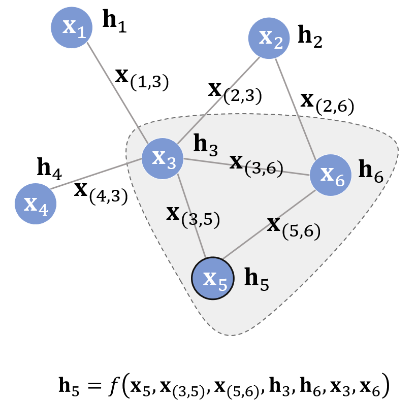
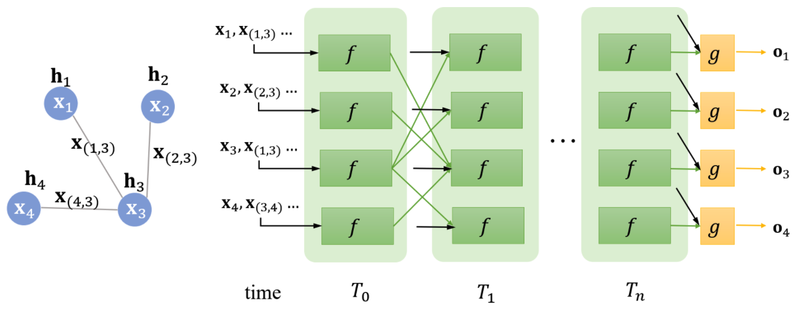
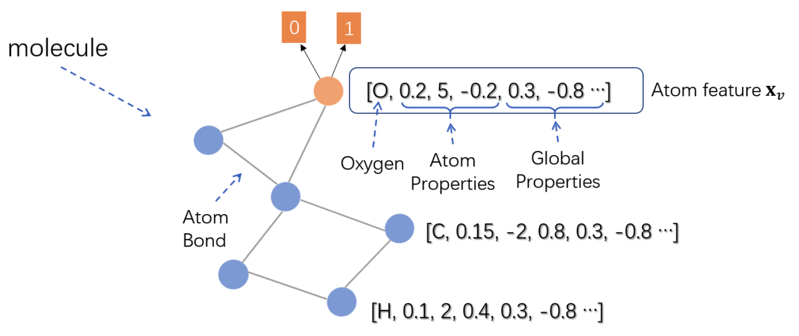
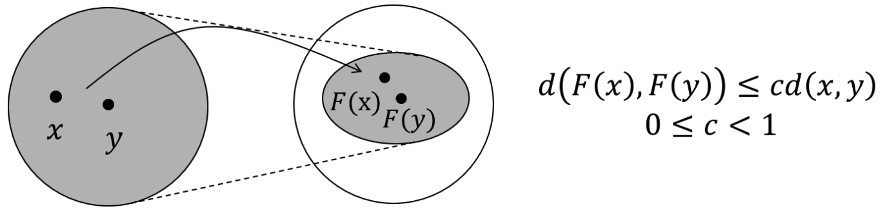
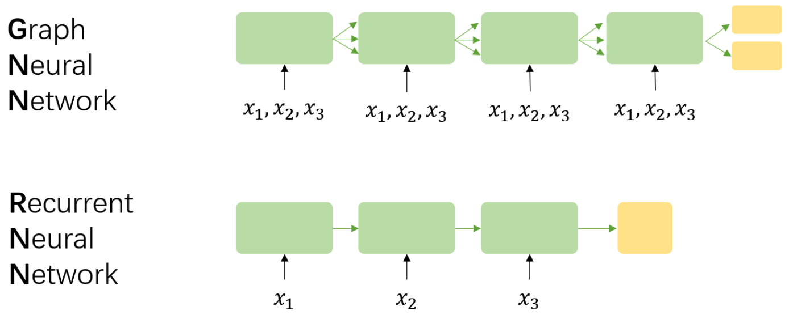
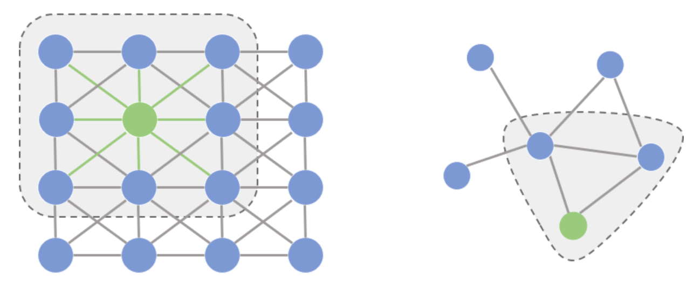
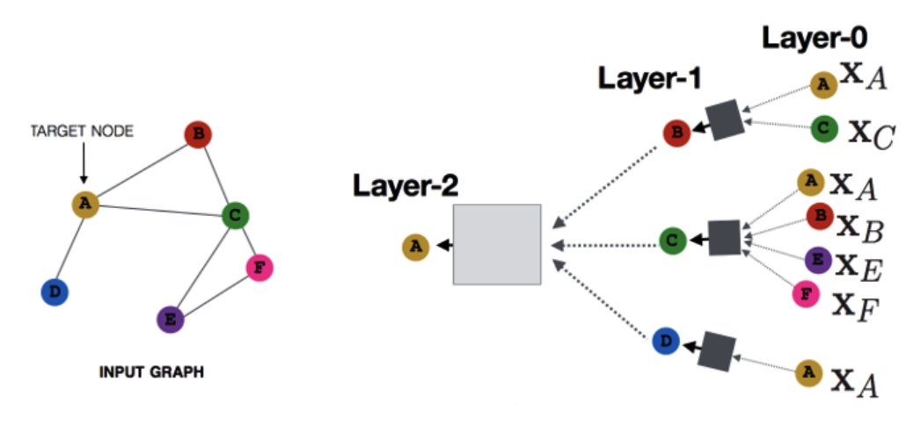

<link rel="stylesheet" type="text/css" href="auto-number-title.css" />

## 1.什么是图神经网络
在过去的几年中，神经网络的兴起与应用推动了模式识别和数据挖掘的研究。
许多曾经严重依赖手工提取特征的机器学习任务（目标识别、机器翻译和语音识别），
如今均采用端到端的深度学习方法（卷积神经网络、长短期记忆网络、transformer等）。

尽管传统的深度学习方法在从欧式空间提取特征方面取得了巨大的成功，
但是许多实际应用场景中的数据是从非欧式空间生成的，
传统的深度学习方法在处理非欧式空间数据上的表现始终难以令人满意。
例如，在电子商务中，一个基于图的学习系统能够利用用户与产品之间的交互来做准确的推荐。

### 1.1什么是欧式数据和非欧式数据
欧式数据的最明显特征就是他们具有规则的空间结构，如图片是规则的正方形，语音是规则的一维序列，这些特征都可以用一维或二维的矩阵表示。
生活中也存在很多不具备规则的空间结构，如推荐系统、电子交易、分子结构等抽象出来的图谱。
这些图谱中的每个节点的连接都不相同，有的节点有三个连接，有的节点有一个连接，是不规则的结构。
这些不具备规则结构的数据就是非欧式数据。

对于不规则的非欧式数据，研究者们引入了图论中的图来表示。

### 1.2图的一些知识
图经常用$G=(V,E)$来表示，其中$V$是顶点的集合，$E$是边的集合，一个边$e$有两个顶点$u,v$。
图也可以分为有向图和无向图，图神经网络中处理的通常都是无向图。
其中图的顶点$v$的度，用$d(v)$表示，是和顶点v相连的边的数目。

- Adjacency matrix
  对于一个简单的图$G=(V,E)$，有n个顶点，可以被描述为如下的邻接矩阵$A \in \mathbb{R}^{n\times n}$,其中：
  $$ A_{ij} =  
  \begin{cases}
      1  &if\{v_i, v_j\} \in E \quad and \quad i \neq j, \\
      0  & otherwise
  \end{cases}
  $$

- Degree matrix
  对于一个图$G=(V,E)$有n个顶点，它的度矩阵$D \in \mathbb{R}^{n\times n}$是一个对角矩阵，
  $$ D_{ii} = d(v_i) $$
- Laplacian matrix
  对于一个图$G=(V,E)$有n个顶点，如果图$G$中所有的边都是无向的，那么它的拉普拉斯矩阵$L \in \mathbb{R}^{n\times n}$可以被定义为：
  $$ L = D-A $$

    因此，我们可以得出：
    $$
    L_{ij} = 
    \begin{cases}
    d(v_i) &if \quad i=j, \\
    -1     &if \quad \{v_i, v_j \} \in E \quad i \neq j, \\
    0      &otherwise.
    \end{cases}
    $$
 - Symmetric normalized Laplacian
  对称的归一化的拉普拉斯矩阵定义如下：
  $$
    \begin{aligned}
        L^{sym} &= D^{-\frac{1}{2}} L D^{-\frac{1}{2}} \\
                &= I - D^{-\frac{1}{2}} A D^{-\frac{1}{2}}
    \end{aligned}
  $$
具体元素值计算如下：
$$L_{ij}^{sym}=
\begin{cases}
   1  &if \quad i=j \quad and \quad d(v_i) \neq 0, \\
   -\frac{1}{\sqrt{d(v_i)d(v_j)}} &if \quad \{v_i,v_j\} \in E \quad and \quad i \neq j, \\ 
   0  &otherwise.
\end{cases}
$$

- Random walk normalized Laplacian
  另一种归一化的拉普拉斯矩阵归一化如下：
  $$L^{rw} = D^{-1}L = I - D^{-1}A $$
    它的具体元素值计算如下：
  $$
  L^{rw}_{ij} = 
  \begin{cases}
      1 &if \quad i=j \quad d(v_i) \neq 0, \\
      -\frac{1}{d(v_i)} &if \{v_i, v_j\} \in E \quad i \neq j, \\
      0 &otherwise.
  \end{cases} 
  $$

### 1.3状态更新与输出
最早的图神经网络的提出是2009年的Franco,理论基础是不动点理论。

给定一张图$G$，每个节点都有其自己的特征，本文中用$x_v$来表示节点v的特征；连接两个节点的边也有自己的特征，本文用$x_{v,u}$来表示节点$v$和节点$u$之间边的特征。
GNN的学习目标是获得每个节点的图感知隐藏状态$h_v$，这就意味着对于每个节点，它的隐藏状态包含了来自邻居节点的信息。那么如何让每个节点都感知图上的其他节点呢？
GNN通过迭代式更新所有节点的隐藏状态来实现，在t+1时刻，节点$v$的隐藏状态按照如下方式更新：
$$h_{v}^{t+1} = f(x_v, x_{c}o[v],h^{t}_{n}e[v], x_{n}e[v]) $$
上面这个式子中的$f$就是隐藏状态的更新函数，在论文中也被称为**局部转移函数**，其中$x_{c}o[v]$指的是与节点$v$相邻的边的特征，$x_{n}e[v]$指的是节点$v$的邻居节点的特征，$h^{t}_{n}e[v]$则指邻居节点在t时刻的隐藏状态。
注意f是对所有节点都成立的，是一个全局共享函数。
那么怎么把它跟深度学习结合起来呢，那就是利用神经网络来拟合这个复杂函数$f$。
**值得一提的是，虽然看起来f的输入是不定长的参数（每个节点的邻居节点数目不一样），但是在f内部我们可以先将不定长的参数通过一定的操作变成一个固定的参数，比如用所有隐藏状态的加和来代表所有隐藏状态。**

比如下面这个例子：

假设节点5为中心节点，其状态更新公式就如图所示。
这个公式表达的思想主要是：不断地利用当前时刻邻居节点的隐藏状态作为部分输入来生成下一时刻中心节点的隐藏状态，直到每个节点的隐藏状态变化幅度很小，整个图的信息流动趋于平稳。
状态更新公式仅描述了如何获取每个节点的隐藏状态，除此之外我们还需要另外一个函数$g$来描述如何适应下游任务。
举个例子，给定一个社交网络，判定各个节点是否为水军账号。
$$o_v = g(h_v, x_v) $$
在原文中，$g$又被称为局部输出函数，与f类似，g也可以用一个神经网络来表达，它也可以是一个全局共享的函数，
整个流程如下：

仔细观察两个时刻之间的连线，它与图的连线密切相关。比如说在$T_1$时刻，节点1的状态接收来自节点3的上一时刻的隐藏状态，因为节点1与节点3相邻。直到$T_n$时刻，各个节点的隐藏状态收敛，每个节点后面接一个g即可得到该节点的输出$o$。
对于不同的图来说，收敛的时刻可能不同，因为收敛是通过两个时刻$p$范数的差值是否小于某个阈值$\epsilon$来判定的，比如：
$$|| H^{t+1}||_{2} - ||H^{t}||_2 \lt \epsilon $$

下面我们用个实例来说明图神经网络是如何应用的。假设我们现在有这样的一个任务，给定一个环烃化合物的分子结构，
模型学习的目标是判断其是否有害。这是一个典型的二分类问题

由于化合物的分类实际上需要对整个图进行分类，在论文中，作者将化合物的**根节点**的表示作为整张图的表示，如上面的红色的节点所示。
Atom feature中包括了每个原子的类型、原子自身的属性、化合物的一些特征等。
在不断地迭代根节点氧原子收敛到隐藏状态后，在上面接一个前馈神经网络作为输出层（即g函数），就可以对整个化合物二分类了。

### 1.4 不动点理论
GNN的理论基础是**不动点理论**，这里的不动点理论专指**巴拿赫不动点理论**。
首先我们用$F$表示若干个$f$堆叠得到的一个函数，也称为全局更新函数，那么图上的所有节点的状态更新公式可以写成：
$$H^{t+1} = F(H^{t},X) $$
不动点理论指的是，不论$H^0$是什么，只要$F$是个压缩映射，$H^0$经过不断迭代都会收敛到某一个固定的点，我们称之为**不动点**，那么压缩映射是什么呢，具体情况如下：

也就是说，对于任何的$x,y$，经过$F$变换到新空间后，它们的距离都要比在原空间中小，原先的空间被压缩了。
压缩映射就是指：
$$d(F(x),F(y)) \neq cd(x,y), 0 \neq c \lq 1 $$

#### 1.4.1具体实现
在具体实现中，$f$其实通过一个简单的前馈神经网络就可以实现，比如说一种简单的实现方法就是把每个邻居节点的特征、隐藏状态、每条边的特征以及节点本身的特征结合在一起，在经过前馈神经网络后再做一次加和。
$$
\begin{aligned}
 h_{v}^{t+1}   = &f(x_v,x_{c}o[v], h_{n}^{t}e[v],x_{n}e[v]) \\
    = & \sum_{u\in ne[v]} FNN([x_v;x_{(u,v)};h_{u}^{t};x_u])
\end{aligned}
$$

那么我们如何保证$f$是一个压缩映射呢，其实就是通过限制$f$对$H$的偏导数矩阵的大小，这是通过一个对**雅克比矩阵的惩罚项**来实现的。
**在代数里面，有一个定理是：$f$为压缩映射的等价条件就是$f$的梯度/导数要小于1.**这个等价定理可以从压缩映射的形式化定义导出，根据压缩映射的定义，可以导出：
$$
\begin{aligned}
    ||F(x) - F(y)|| \neq c||x-y||, 0\leq c \lt 1 \\
    \frac{||F(x)-F(y)||}{||x-y||} \neq c \\
    \frac{||F(x)-F(x-\Delta x)||}{||\Delta x||} \neq c \\
    ||F'(x)|| = || \frac{\alpha F(x)}{\alpha x}|| \neq c 
\end{aligned}
$$
也就是说，压缩映射等价于雅克比矩阵小于等于c。根据拉格朗日乘子法，可以将有约束问题转换为带惩罚项的无约束问题：
$$ J = Loss + \lambda \cdot max(\frac{||\alpha FNN||}{\alpha h}-c,0), c\in (0,1)$$
其中$\lambda$是超参数，与其相乘的项就是雅克比矩阵的罚项。

#### 1.4.2模型学习
上面我们花了一定的篇幅搞懂了如何让$f$接近压缩映射，下面我们来叙述一下图神经网络中的损失是如何定义的，以及模型是如何学习的。
仍然以社交网络为例，虽然每个节点都会有隐藏状态以及输出，但并不是每个节点都会有监督信号，比如说，社交网络中只有部分用户被明确标记了是否为水军账号，这就构成了一个典型的节点二分类问题。
那么很自然的，模型的损失就可以通过这些有监督信号的节点得到。假设监督节点一共有$p$个，模型损失可以形式化为：
$$Loss = \sum_{i=1}^{p} (t_i - o_i) $$

**那么，模型如何学习呢？根据前向传播计算损失的过程，不难推导出反向传播计算梯度的过程，在前向传播中，模型：**
 1. 调用$f$若干次，比如$T_n$次，直到$h_{v}^{T_n}$收敛。
 2. 此时每个节点的隐藏状态接近不动点的解。
 3. 对于有监督信号的节点，将其隐藏状态通过$g$输出，进而算出模型的损失。
根据上面的过程，在反向传播时，我们可以直接求出$f$和$g$对最终的隐藏状态$h_{v}^{T_n}$的梯度。
然而因为模型递归调用了$f$若干次，为计算f和g对最初的隐藏状态$h_v^0$的梯度，我们需要同样的递归式/迭代式的计算$T_n$次梯度，最终得到的梯度即为f和g对$h_v^0$的梯度，然后该梯度用于更新模型的参数，这个算法就是Almeida-Pineda算法。

## 2.图循环神经网络
可以发现图神经网络与RNN/GRU/LSTM等循环神经网络很相似，但其中也有些不同，具体差异如下：

假设GNN中存在三个节点$x_1, x_2, x_3$，相应的，在RNN中有一个序列$(x_1,x_2,x_3)$，那么$GNN$与$RNN$的区别主要是以下四点：
- GNN的基础理论是不动点理论，这就意味着GNN沿时间展开的长度是动态的，是根据收敛条件确定的，而RNN沿时间展开的长度就等于序列本身的长度。
- GNN每次时间步的输入都是所有节点$v$的特征，而RNN每次时间步的输入是该时刻对应的输入，同时，时间步之间的信息流也不相同，前者由边决定，后者则由序列的读入顺序决定。
- GNN采用AP算法反向传播优化，而RNN使用BPTT进行优化，前者对收敛性有要求，而后者对收敛性没有要求。
- GNN循环调用$f$的目标是得到每个节点稳定的隐藏状态，所以只有在隐藏状态收敛后才能输出，而RNN的每个时间步上都可以输出，比如语言模型。

### 2.1 门控图神经网络(Gated Graph Neural network)
门控图神经网络是直接用类似RNN的方法来定义GNN，门控图神经网络最大的特点就是**不再以不动点理论为基础。**
这就意味着$f$不在需要是一个压缩映射，那么迭代不需要收敛才能输出，可以迭代固定步长，优化算法也从AP算法转向了BPTT。
#### 状态更新
与图神经网络定义的范式一致，GGNN也有两个过程：状态更新与输出.
相比GNN而言，它主要的区别来源于状态更新阶段，具体的，GGNN参考了GRU的设计，把邻居节点的信息视作输入，节点本身的状态视作隐藏状态，其状态更新函数如下：
$$h_{v}^{t+1} = GRU(h_v^t, \sum_{u\in ne[v]}W_{edge}h^t_u) $$
上面的公式，除了GRU式的设计之外.GGNN还针对不同类型的边引入了可学习的参数$W$。每一种edge对应一个$W_{edge}$，这样他就可以处理异构图。
GGNN的整体流程如下：
- 用节点特征初始化各个节点的隐藏状态；
- 对整张图，按照上述状态更新公式固定迭代若干步
- 对部分有监督信号的节点求的模型损失，利用BPTT算法反向传播求得$W_{edge}$和GRU参数的梯度。

GGNN的输出也分为两种，一种是直接每个节点都有一个输出，一个是整张图输出一个值（通过对图中所有节点求attention分布，再求得一个均值表示）。

## 3. 图卷积神经网络

### 3.1图卷积的缘起
我们先探讨一个问题，为什么研究者们要设计图卷积操作，传统的卷积为什么不能直接作用于图上。
这就涉及到图像(欧式空间)和图（非欧式空间）的区别。

如上所示，他们的区别主要是：
- 在图像为代表的欧式空间中，节点的邻居数目时固定的；而非欧式空间的节点的邻居数目是不固定的；
- 欧式空间中的卷积操作实际上是用固定大小可学习的卷积核来抽取像素的特征，但是因为图里的邻居节点数目不固定，所以传统的卷积核不能直接用于抽取图上节点的特征。

那么对于邻居节点数目不固定这件事，怎么解决呢，主要有以下两个思路：
- 提出一种方式把非欧式空间的图转换为欧式空间
- 找出一种可处理变长邻居节点的卷积核在图上抽取特征

图卷积的本质是要找到适用于图的可学习卷积核。

图卷积神经网络的目的就是将卷积操作应用于图领域，主要分为两大类：
 - 基于空间域的卷积（spatial domain）
 - 基于频域的卷积(spectral domain)
空间域的卷积相当于在图片的像素点上进行卷积，而频域则相当于对图片进行傅里叶变换后，再进行卷积。
基于空域的卷积方法直接将卷积操作定义在每个节点的连接关系上，他跟传统的卷积神经网络中的卷积更相似一些。在这个类别中比较有代表性的方法有：MPNN(Message Passing Neural Networks),GraphSage,DCNN,PATCH-SAN等；
基于频域卷积的方法从图信号处理起家，包括Spectral CNN、ChebNet和1stChebNet等；

### 3.2卷积的基本概念
卷积是通过两个函数f(x)和g(x)生成第三个函数的一种算子，那么f和g的卷积就可以写成：
$$f(x)*g(x) =  \int_{-\infty}^{\infty}f(x-\tau)g(\tau) \quad (连续形式) $$
$$f(x)*g(x) = \sum_{\tau=-\infty}^{\infty}f(x-\tau)g(\tau) \quad (离散形式) $$

**所谓卷积，就是把一个函数卷（翻过来），然后与另一个函数求内积。**
对应到不同的方面，卷积可以有不同的解释：g可以看做我们深度学习里面的卷积核，也可以对应到信号与处理里面的滤波器。而f可以认为是机器学习里面的特征，也可以是信号与处理里面的信号。f和g的卷积就可以看做是对f的加权求和。

### 3.3空域卷积
空域卷积与深度学习中的卷积的应用方式类似，其核心在于**聚合邻居节点的信息。**比如说，一种最简单的无参数卷积方式可以是：将所有直连邻居节点的隐藏状态加和，来更新当前节点的隐藏状态。
#### 3.3.1 MPNN（Message Passing Neural Network，消息传递网络）
MPNN是由google的科学家提出的一种模型，严格意义上来讲，MPNN不是一种具体的模型，而是一种空域卷积的形式化框架。
它将卷积分解为两个过程：**消息传递**与**状态更新**，分别由$M_{l}(\cdot)$和$U_{l}(\cdot)$函数完成。
将节点$v$的特征作为其隐藏状态的初始态$h_{v}^{0}$后，空域卷积对隐藏状态的更新由以下公式表示：
$$h_{v}^{l+1} = U_{l+1}(h_v, \sum_{u\in ne[v]}M_{l+1}(h_v^l, h_u^l,x_{uv})) $$
其中$l$代表图卷积的第$l$层，上式的物理意义是：收到来自每个邻居的消息$M_{l+1}$后，每个节点如何更新自己的状态。
初一看，它和GGNN的公式很像，但实际上，他们是截然不同的两种方式：
- MPNN中（也可以是GCN共有的特性）通过级联的层捕捉邻居的信息，GGNN通过级联的时间来捕捉邻居的消息；
- MPNN（GCN）中层与层之间的参数不同，而GGNN可以视作层与层之间共享参数。

MPNN的示意图如下：

#### 3.3.2 GraphSage（Graph Sample And Aggregate）
MPNN很好的概括了空域卷积的过程，但定义在这个框架下的所有模型都有一个共同的缺陷：卷积操作针对的对象是整张图，也就意味着要将所有节点放入内存/显存中，才能进行卷积操作。但是针对实际场景中的大规模图而言，整个图上的卷积操作并不现实。
GraphSage提出的动机就是解决这个问题，从名字就可以看出，区别于传统的全图卷积。GraphSage利用采样部分节点的方式进行学习

具体的，GraphSage中的采样过程分为三步：
1. 在图中随机采样若干个节点，节点数为传统任务中的$batch size$。对于每个节点，随机选择固定数目的邻居节点（这里的邻居不一定是一阶邻居，也可以是二阶邻居）构成进行卷积操作的图。
2. 将邻居节点的信息通过aggregate函数聚合起来更新刚才采样的节点。
3. 计算采样节点处的损失，如果是监督任务，就可以根据节点的任务标签计算损失。

最终，GraphSage的状态更新公式如下：
$$h_v^{l+1} = \sigma (W^{l+1}\cdot aggregate(h_v^l,\{h^l_u\}), \forall u\in ne[v]) $$

**GraphSage的设计重点放在了aggregate函数的设计上了，它可以是不带参数的max、mean等函数，也可以是带参数的如$LSTM$等神经网络。核心的原则是，它可以处理变长的数据。**

## 3.4频域卷积
空域卷积非常直观的借鉴了图像里的卷积操作，但是他缺乏一定的理论基础，而频域卷积则不同，它主要利用了**图傅里叶变换**实现卷积。具体来讲就是利用图的**拉普拉斯矩阵**导出其在频域上的拉普拉斯算子，在类比到频域上的欧式空间中的卷积，导出其图卷积的公式。
其中主要涉及到的数学知识是**傅里叶变换和拉普拉斯算子。**

最终经过变换后的卷积公式为：
$$f*g_{\theta} = Ug_{\theta}U^Tf = U \left [ \begin{matrix}
    \hat{g}(\lambda_{1}) & \quad  &\quad \\
    \quad       & \ddots &\quad \\
    \quad       & \quad  &\hat{g}(\lambda_{n})
\end{matrix} \right] U^Tf
$$

上式的计算量很大，因为特征向量矩阵$U$的复杂度是$O(N^2)$。此外，对于大型图来说，L特征分解的计算量也很大。

### 3.4.1 Spectral CNN
上面的这个$g_{\theta}$就是第一个提出的频域卷积神经网络的卷积核。假设l层的隐藏状态为$h^l \in R^{N\times d_l}$，第l+1层为$h^{l+1} \in R^{N\times d_{l+1}}$，那么频域卷积的更新公式如下：
$$h^{l+1}_{:,j} = \sigma (U\sum_{i=1}^{d_l}\Theta_{i,j}^{l}U^Th_{:,i}^l) $$
$$ \Theta_{i,j}^{l} = g_{\theta} = \left [ \begin{matrix}
    \theta_1 & \quad  &\quad \\
    \quad       & \ddots &\quad \\
    \quad       & \quad  &\theta_N
\end{matrix} \right]$$
通过上式可以发现，一层卷积层的参数有$N\times d_l \times d_{l+1}$个，其中$d_l$是输入通道数，$d_{l+1}$是输出通道数,$N$是节点数目，$\Theta_{i,j}^{l}$是一个可学习参数的对角矩阵。

第一代的参数方法存在的弊端如下：
 - 计算复杂：如果一个样本一个图，那么每个样本都需要进行图的拉普拉斯矩阵的特征分解求U矩阵计算复杂；每一次前向传播，都要计算$U,diag(\theta_l)及U^T$三者的乘积，特别是对于大规模的图，计算代价较高，时间复杂度为$O(N^2)$
 - 卷积核需要N个参数，当图中节点很大时是不可取的。

### 3.4.2 ChebNet
Defferrard(2016)等人提出了ChebNet，利用切比雪夫多项式来拟合卷积核的方法，来降低复杂度：
$$g_{\theta} = g_{\theta}(\Lambda) \approx \sum_{i=0}^{K-1}\theta_{i}T_{k}(\hat\Lambda) $$
也就是卷积计算时，只和前$K$个特征值有关了。

推导过程如下：
 - 对于特征$x\in \mathbb{R}^N$和以参数为$\theta \in \mathbb{R}^N$的卷积核$g_{\theta}=diag(\theta)$在傅里叶域的卷积为：
 $$g_{\theta} * x = Ug_{\theta}U^Tx $$
其中$U$是对称归一化的拉普拉斯矩阵$L=I_N -D^{-1/2}AD^{-1/2} = U\Lambda U^T$的特征向量矩阵，$\Lambda$是由L的特征值构成的对角矩阵。
其中由于矩阵L是实对称矩阵，因此其特征向量矩阵$U$是正交矩阵，即$UU^T=I_N$.并且$g_{\theta}$是由参数$\theta$构成的对角矩阵$diag(\theta)$。并且参数$\theta$的确定与L的特征值有关，所以可以将$g_{\theta}$看做是特征值$\Lambda$的一个函数，即$g_{\theta} = g_{\theta}(\Lambda)$.

- 上式$g_{\theta} * x = Ug_{\theta}U^Tx $的计算量很大，主要是因为特征向量矩阵$U$的复杂度是$O(N^2)$的。此外，对于大型图来说，L的特征分解的计算量也很大。
所以Hammond(2011)指出$g_{\theta}(\Lambda)$可以很好的通过切比雪夫多项式$T_k(x)$的$kth$展开来拟合，并且对$\Lambda$进行缩放使其元素位于[-1,1]：
$$g_{\theta}(\Lambda) \approx \sum_{k=0}^K \theta_{k}T_{K}(\hat\Lambda) $$
其中：
  - $\hat\Lambda = 2\Lambda/\lambda_{max} - I_N$，缩放后特征向量矩阵的取值范围为[-1,1],缩放的目的是为了满足切比雪夫多项式的$T_k(x)$的$kth$展开的条件，即要求自变量的取值范围为[-1,1]
  - $\lambda_{max}$是L的最大特征值。
  
  
下面来证明$(U\Lambda U^T)^k = U\Lambda^kU^T$:
 - 切比雪夫多项式的定义为：$T_k(x)=2xT_{k-1}(x)-T_{k-2}(x),其中T_0(x)=1,T_1(x)=x$。
 - 我们使用数学归纳法来证明$(U\Lambda U^T)^k = U\Lambda^kU^T$。也就是当n=1成立时，假设n=k时也成立，只需要证明n=k+1时也成立就可以了：
 - 证明：
  根据切比雪夫多项式的定义，已知：
  $$UT_0(\hat{\Lambda})U^T = UU^T=1=T_0(U\hat{\Lambda}U^T) $$
  $$UT_1(\hat{\Lambda})U^T = U\hat{\Lambda}U^T = T_1(U\hat{\Lambda}U^T) $$
  假设对于任意的$k>1$，满足：
  $$UT_{k-2}(\hat{\Lambda})U^T = T_{k-2}(U\hat{\Lambda}U^T) $$
  与
   $$UT_{k-1}(\hat{\Lambda})U^T = T_{k-1}(U\hat{\Lambda}U^T) $$
  那么可以推导出：
  $$\begin{aligned}
     UT_k(\hat{\Lambda})U^T = & 2U\hat{\Lambda}T_{k-1}(\hat{\Lambda})U^T - UT_{k-2}(\hat{\Lambda})U^T \\
     =&2(U\hat{\Lambda}U^T)[UT_{k-1}(\hat{\Lambda})U^T] - UT_{k-2}(\hat{\Lambda})U^T \\
     =&2(U\hat{\Lambda}U^T) T_{k-1}(U\hat{\Lambda}U^T) - T_{k-2}(U\hat{\Lambda}U^T) \\
     =&T_k(U\hat{\Lambda}U^T)
  \end{aligned} 
  $$

那么进而可以推导出，输入特征x与卷积核$g_{\theta}$的卷积的定义为：
  $$ g_{\theta} * x = \sum_{k=0}^K\theta_k T_K(\hat{L})x $$
其中：
- $\hat{L} = 2L/\lambda_{max} -I_N = U\hat{\Lambda}U^T$

具体的推导过程为：
$$\begin{aligned}
    g_{\theta} * x =& Ug_\theta U^T x \\
                   =&Ug_{\theta}(\Lambda)U^Tx \\
                   =&U(\sum_{k=0}^{K}\theta_{k}T_{K}(\hat{\Lambda}))U^Tx \\
                   =&\sum_{k=0}^K \theta_{k}T_{K}(\hat{L})x
\end{aligned}
$$

现在相比于第一种Spectral CNN，ChebNet CNN的优势有：
- 这个表达式具有k阶局部连接性，因为它仅取决于离中央节点(kth阶领域)最大K步的节点。
- $T_K(\hat{L})x$的复杂度是$O(|E|)$的，即与边数E呈线性关系，整个运算的复杂度是$O(K|E|)$，当图是稀疏图时，计算加速比较明显，这个时候复杂度远低于$O(n^2)$.

### 3.4.3 GCN:一阶ChebNet
基于前面的工作Kipf(2017)提出了一阶ChebNet，正式成为GCN的开山之作，后面的很多变种，都是基于这篇文章的：
Kipf等人引入了一种一阶近似ChebNet，假设K=1,$\Lambda_{max}=2$，则ChebNet的卷积公式可以简化为：
$$ g_{\theta} * x = \theta_{0}x - \theta_{1}D^{-1/2}AD^{-1/2}x$$
为了抑制参数数量防止过拟合，1stChebNet假设$\theta = \theta_0 = -\theta_1$，那么图卷积就近似为：
$$g_{\theta} * x = \theta(I_N + D^{-1/2}AD^{-1/2})x $$
其中：
- $I_N + D^{-1/2}AD^{-1/2}$是取值范围为[0,2]之间的，为了防止在神经网络训练的时候引起梯度爆炸/梯度消失，所以引入了一个归一化技巧：
  $$I_N + D^{-1/2}AD^{-1/2} \stackrel{\hat{A}=A+I_N}{\longrightarrow} \hat{D}^{-1/2}\hat{A}\hat{D}^{-1/2} $$
  其中：$\hat{A} = A+I_N, \hat{D}_{ij}=\sum_{j}\hat{A}_{ij}$，也就是在图上加了一个自环。

再加上一个激活函数，最后就可以得到论文中的快速卷积的公式：
$$H^{l+1} = f(H^l,A) = \sigma(\hat{D}^{-1/2}\hat{A}\hat{D}^{-1/2}H^{l}W^{l}) $$
其中$W就是参数$\theta$的参数矩阵。

GCN的优点：
- 权值共享，参数共享，从$AXW$可以看出每一个节点的参数矩阵都是W，权值共享的；
- 具有局部性，也就是局部连接的，因为每次聚合的只是一阶邻居；
- 感受野正比于卷积层数，第一层的节点只包含与直接相邻节点的有关信息，第二层以后，每个节点还包含了相邻接点的信息，这样的话，参与运算的信息就会变多。层数越多，感受野越大，参与运算的信息量也就越充分，也就是说随着卷积层数的增加，从远处邻居的信息也会逐渐聚集过来。
- 复杂度大大降低，不用再计算拉普拉斯矩阵，特征分解等；

GCN的不足：
- 扩展性差：由于训练时就需要知道关于训练节点、测试节点在内的所有节点的邻接矩阵A，不能处理大图，而在工程实践中几乎都是大图。
- 局限于浅层：GCN的论文中表明，实验中使用2层的GCN效果最好，为了加深，需要使用残差连接等trick，但是即使使用了这些trick，也只能勉强保证实验效果不下降。
- 不能处理有向图：推导过程中，用到了拉普拉斯矩阵的特征分解，那么就需要满足拉普拉斯矩阵是对称矩阵的条件。

## 4 图注意力网络
图注意力网络(Graph Attention Network,GAT)假设相邻节点对中心节点的贡献既不像GraphSage一样相同，也不向GCN那样预先确定。
GAT在聚合节点的邻居信息的时候使用注意力机制确定每个邻居节点对中心节点的重要性，也就是权重，定义图卷积的操作如下：
$$h_v^k = \sigma(\sum_{u\in N(v) \bigcup v}\alpha_{vu}W^{k-1}h_u^{k-1}) $$
其中$h_v^0 = x_v$;
$\alpha_{vu}$表示节点$v$和它的邻居节点$u$之间的连接权重，通过下式计算：
$$\alpha_{vu} = softmax(g(a^T[W^{k-1}h_v || W^{k-1}h_u])) $$
其中：
- g是一个激活函数
- a是一个可学习的参数向量
- ||表示concat在一起