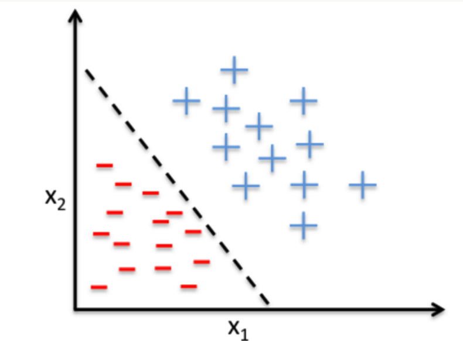

# 感知机原理

## 感知机的原理及预备知识
感知机是一个二分类的模型，它的输入是一个样本的特征向量，输出的是这个样本所属的类别，一般可以认为是一个二分类模型。
感知机有一个假设默认成立，即认为数据集是线性可分的，因为感知机学习的目标就是寻找一个能够将**训练集中正例和负例能够完全分开的超平面，注意这里只是找到一个能完全分离正负例的超平面，没有要求是最优的，所以感知机算法可以有多个解。这是由感知机算法的迭代过程决定的，在迭代中，只要找到一个将正负样本完全分开的超平面，感知机算法就停止执行了，所以不同的初始状态，最后得到的感知机模型大概率是不一样的**，如果数据是线性不可分的，那么最后就无法获取超平面。

### 预备的数学知识
- 点到线的距离：直线方程为$Ax+By+C=0$,点P的坐标为$(x_0,y_0)$，那么点到直线的距离为：
  $$ d = \frac{Ax_0+By_0 + C}{\sqrt[2]{A^2 +B^2}} $$
- 样本到超平面的距离： 假设超平面是$h=w \cdot x + b$,其中$w=(w_0, w_1,...,w_m), x=(x_0,x_1,...,x_m)$，样本点$x'$到超平面的距离为：
  $$ d = \frac{w \cdot x' + b}{||w||} $$
  其中$||w||$是w的L2正则项，即$||w|| = \sqrt[2]{w_0^2 + w_1^2 + ...+w_m^2}$
- 超平面：超平面是在空间$R^d$中的一个子空间$R^{d-1}$，在2维空间中的超平面就是一条直线，在3维空间中的超平面就是一个平面。

## 感知机模型
假如我们有m个样本数据，每个样本对应有n维特征和一个标签值y，如下：
$$(x^0_1,x^0_2,...,x^0_n,y_0), (x^1_1,x^1_2,...,x^1_n,y_1),...,(x^m_1,x^m_2,...,x^m_n,y_m) $$
我们的目标是找到这样的一个超平面，即：
$$w_0 + w_1x_1 + ... + w_nx_n = 0 $$
该超平面能使一种类别的样本满足 $w_0 + w_1x_1 + ... + w_nx_n >= 0$,让另一种类别的样本$w_0 + w_1x_1 + ... + w_nx_n < 0$,我们可以将该超平面简写为$\sum_{i=0}^nw_ix_i = 0$,其中$x_0=1$，进一步用向量表示:$w \cdot x =0$，其中$w$是$(n+1)\times 1$维的向量，x是$(n+1)\times1$的向量，$\cdot$为向量内积。
感知机的模型可以定义为：$y=sign(w \cdot x)$，其中$sign(x)$函数的定义如下：
$$ sign(x) 
\begin{cases}
    -1 & x<0 \\
    1  & x\geq0
\end{cases}$$

## 感知机的损失函数
在定义数据时，我们可以把满足$w\cdot x >0$的样本标记为1，满足$w\cdot x <0$的样本标记为-1，这样标记的话，对于感知机模型判定正确的样本（正例判定为正例，负例判定为负例），都满足$yw \cdot x>0$，而错误分类的样本(正例判定为负例，负例判定为正例)，都满足$yw \cdot x<0$。那么，我们应该定义的损失函数就是希望错误分类的样本到超平面的距离之和越小越好，所以损失函数定义如下：
$$Loss(w,b) = - \frac{1}{||w||} \sum_{x_i \in M} y_i(w\cdot x_i +b) $$
其中M是所有误分类点的集合，也就是说正确分类的点，是不参与到损失函数的计算中的，在不考虑$\frac{1}{||w||}$后，感知机的损失函数就是：
$$ Loss(w,b) = - \sum_{x_i \in M}y_i(w \cdot x_i +b)$$

### 为什么不考虑$\frac{1}{||w||}$
这是由感知机算法的训练特性和损失函数的定义方式决定的，感知机模型最后结束训练的状态是，将所有样本正确分类，那么此时$M$中的样本数为0，那么Loss(w,b)也就是0，那么对应于$Loss(w,b) = - \frac{1}{||w||} \sum_{x_i \in M} y_i(w\cdot x_i +b)$，也就是分子为0，可以看出$\frac{1}{||w||}$对最终的结果没有影响。
综上所述，忽略了$\frac{1}{||w||}$，不会对感知机算法的执行过程产生影响，反而能够简化运算，提高算法的执行效率。

## 感知机学习算法
感知机学习算法是对上诉损失函数进行最小化，来确定w和b。常用的更新参数的算法是批量梯度下降法(BGD)，也就是通过计算一个batch的样本的梯度的均值来进行更新参数，但是感知机算法是每遇到一个错误分类的样本就会更新一次参数，所以这里只能采用随机梯度下降算法(SGD)，目标函数如下：
$$ Loss(w,b) = \mathop{\arg \min}\limits_{w,b} (- \sum_{x_i \in M}y_i(w\cdot x_i +b))$$

### 原始形式的算法
输入：训练数据集$T=(x_1,y_1),(x_2,y_2),(x_N,y_N), y_i \in {-1,+1},$学习率$\eta(0< \eta <1)$
输出：w,b；感知机模型$f(x) = sign(w\cdot x +b)$
1. 赋初值$w_0,b_0$
2. 选取数据点$(x_i, y_i)$
3. 判断该数据点是否为当前模型的误分类点，即如果$y_i(w\cdot x_i+b)<=0$，就更新：
   $$w = w + \eta y_ix_i $$
   $$b = b + \eta y_i $$
4. 转到2，直到训练集中没有误分类的点

### 对偶形式的算法
假设样本点$(x_i,y_i)$在更新过程中被使用了$n_i$次【也就是共有n次，该样本点被模型错误分类】，因此，从原始形式的学习过程中可以得到【假设最初的w和b均为0】，最后学习的到的$w和b$可以表示为：
$$ w = \sum_{i=1}^{N}n_i\eta y_ix_i $$
$$ b = \sum_{i=1}^{N} n_i \eta y_i $$
如果$n_i$的值越大，表明这个样本点经常被误分，将上式代入感知机模型中，即可得到：
$$ f(x) = sign(w\cdot x+b) = sign(\sum_{j=1}^{N}n_j\eta y_jx_j\cdot x + \sum_{j=1}^{N}n_j\eta y_j) $$
此时，学习的目标也就不再是w和b，而是$n_i, i=1,2...N$
相应的，输入输出与原始形式的算法相同，只是训练过程如下：
1. 初始时$n_i=0,i=1,2...N$
2. 在训练集中选取数据点$(x_i, y_i)$
3. 如果$y_i(\sum_{j=1}^Nn_j\eta y_jx_j\cdot x_i + \sum_{j=1}^{N}n_j\eta y_j)\leq 0$，就可以进行更新：$n_i \leftarrow n_i +1$
4. 转到2直至没有误分类数据

可以看到对偶形式和原始模式的差别不是很大，那么对偶形式的意义在于，样本点中的特征向量以内积的形式存在于感知机的对偶形式的训练算法中，因此如果我们事先计算好所有的内积，也就是Gram矩阵，那么计算速度就可以大大的加快，Gram矩阵如下：
$$G=[x_i,x_j]_{N \times N} $$

### 原始形式和对偶形式的选择
- 在向量维度(特征数)过高时，计算内积非常耗时，应该选择对偶形式算法加速
- 在向量个数(样本数)过多时，每次累计计算就比较耗时，应该选择原始算法

参考网址1：https://www.cnblogs.com/huangyc/p/9706575.html#_label3_1
参考网址2：https://www.zhihu.com/question/26526858
参考网址3：https://www.cnblogs.com/pinard/p/6042320.html
