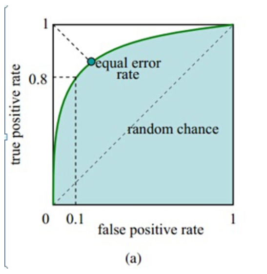

# AUC和ROC详解

AUC:一个正例，一个负例，预测为正的概率值比预测为负的概率值还要大的可能性。
根据定义，最直观的有两种计算AUC的方法：
- 1，绘制ROC曲线，ROC曲线下面的面积就是AUC的值
- 2，假设总共有(m+n)个样本，其中正样本有m个，负样本有n个，那么总共有m*n个样本对。统计其中正样本预测为正样本的概率值大于预测负样本为正样本的概率值的样本对数目，然后除以m*n就是AUC的值

# ROC曲线
ROC曲线：receiver operating charateristic, roc曲线上每一点反映着对同一信号刺激的感受性。

横轴：负正类率（FPR, False Postive rate），代表分类器预测为正例中实际却是负例的样本，占所有负实例的比例；
纵轴：真正类率（TPR, True Postive rate），代表分类器预测为正例中实际为正例的样本，占所有正例的比例；

下面介绍下，在ROC中常用到的四个指标TP, FN, FP, TN【也就是[T,F]和[P,N]的两两组合情况】。

- 1，TP:如果一个实例被预测为正例，并且实际就是正例，即为真正类(True Postive, TP)
- 2，TN:如果一个实例被预测为负例，并且实际就是负例，即为真负类(True Negative, TN)
- 3, FP:如果一个实例被预测为正例，而实际却是负例，即为假正类（False Postive, FP）
- 4, FN:如果一个实例被预测为负例，而实际却是正例，即为假负类（False Negative, FN）

所以FPR的计算方式为：FP/(FP+TN),

TPR的计算方式为：TP/(TP+FN)

那么，接下来我们可以针对模型对每个实例给与的为正类的分值，通过设定一个阈值，比如0.6，概率大于0.6的为正类，小于0.6的为负类，对应的就可以算出一组(FPR, TPR)值，在平面中得到对应的坐标点。

随着阈值的逐渐减小，越来越多的实例被划分为正类，但是这些正类中同样也参杂着真正的负实例，即TPR和FPR会同时增大。

阈值最大时，对应坐标点为(0,0)，阈值最小时，对应坐标点(1,1)

如上图所示，FPR越大，预测正类中实际负类越多。
TPR越大，预测为正类中实际正类越多。

所以我们的理想目标就是，TPR=1, FPR=0，即图中(0,1)点。因此，ROC曲线越靠拢(0,1)点，越偏离45度对角线越好。

那么AUC(Area under curve)就是ROC曲线下的面积，介于0.1到1之间,AUC其实就是一个概率值。
就是当前的分类算法根据计算得到的score值，把这个正样本排在负样本前面的概率就是AUC值，AUC值越大，那么当前分类算法越有可能将正样本排在负样本前面，从而能够更好地分类。

参考博客：
https://blog.csdn.net/u013385925/article/details/80385873
