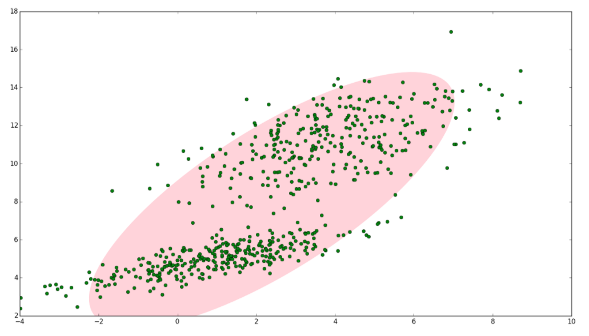
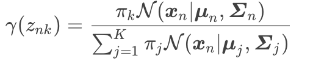
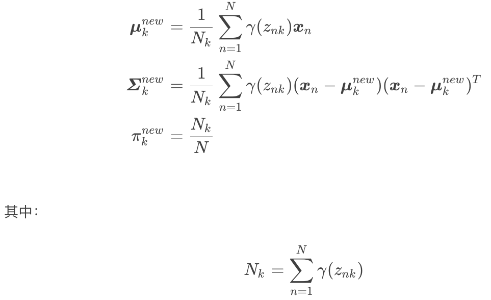
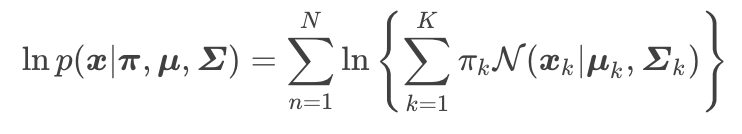

## 高斯模型
### 单高斯模型
当样本数据X是一维数据时，高斯分布遵从下方概率密度函数（Probability Density Function）:

$$P(x|\theta) = \frac{1}{\sqrt{2\pi \sigma^2}} exp(-\frac{(x-\mu)^2}{2\sigma^2})$$

其中$\mu$为数据均值（期望），$\sigma$为数据标准差。

当样本数据X是多维数据时，高斯分布遵从下方的概率密度函数：
$$P(x|\theta) = \frac{1}{(2\pi)^{\frac{D}{2}}|\sum|^{\frac{1}{2}}}exp(-\frac{(x-\mu)^T\sum^{-1}(x-\mu)}{2})$$

其中, $\mu$是数据均值（期望），$\sum$是协方差，D为数据维度。

## 一个例子
**高斯混合模型(Gaussian Mixed Model)指的是多个高斯分布函数的线性组合，理论上GMM可以拟合出任意类型的分布，通常用于解决同一集合下的数据包含多个不同的分布的情况（或者是同一类分布但是参数不一样，或者是不同类型的分布，比如正太分布和伯努利分布）。**

如图1，图中的点在我们看来明显分成两个聚类，这两个聚类中的点分别通过两个不同的正太分布随机生成而来。

但是如果没有GMM，那么只能用一个二维高斯分布来描述图1中的数据。图1中的椭圆即为二倍标准差的正太分布椭圆。这显然不太合理，毕竟肉眼一看就觉得应该把他们分成两类。

这时候就可以使用GMM了，如下图2，数据在平面上的空间分布和图1一样，这时使用两个二维高斯分布来描述图2中的数据，分别记为$N(\mu_1, \sum_1)和N(\mu_2, \sum_2)$【这里用$\sum$来表示标准差】。

图中的两个椭圆分别是这两个高斯分布的二倍标准差椭圆。

可以看到使用两个二维高斯分布来描述图中的数据显然更合理。实际上图中的两个聚类的中的点是通过两个不同的正态分布随机生成而来。如果将两个二维高斯分布$N(\mu_1, \sum_1)和N(\mu_2, \sum_2)$合成一个二维的分布，那么就可以用合成后的分布来描述图2中的所有点。

最直观的方法就是对这两个二维高斯分布做线性组合，用线性组合后的分布来描述整个集合中的数据。这就是高斯混合模型（GMM）。

## 高斯混合模型(GMM)
设有随机变量X，则混合高斯模型可以用下式表示：
$$p(x) = \sum_{k=1}^{K}\pi_{k}N(x|\mu_k, \sum_k)$$

其中$N(x|\mu_k, \sum_k)$称为混合模型中的第k个分量（component）。如前面图2中的例子，有两个聚类，可以用两个二维高斯分布来表示，那么分量数K=2, $\pi_k$是混合系数，且满足：
$$\begin{aligned}
   \sum_{k=1}^K \pi_k = 1 \qquad 其中0\leq\pi_k \leq 1
\end{aligned}$$

实际上，可以认为$\pi_k$就是每个分量$N(x|\mu_k, \sum_k)$

## GMM的应用
GMM常用于聚类，如果要从GMM的分布中随机的选取一个点的话，实际上可以分为两步：
- 首先随机地在这K个component之中选一个，每个component被选中的概率实际上就是它的系数$\pi_k$
- 选中component之后，再单独地考虑从这个component的分布中选取一个点就可以了，这里就已经回到了普通的Gussian分布，转换为了已知的问题

将GMM用于聚类时，**假设数据服从混合高斯分布，那么只要根据数据推出GMM的概率分布就可以了；**然后GMM的K个component实际上对应K个cluster。根据数据来推算概率密度通常叫做density estimation。
特别的，当我已知概率密度函数的形式，而要估计其中的参数的过程被称作【参数估计】。

例如上图2的例子，很明显有两个聚类，可以定义K=2，那么对应的GMM形式如下：
$$p(x)=\pi_1N(\mu_1, \sum_1) + \pi_2N(x|\mu_2, \sum_2)$$

上式中未知的参数有6个：$\pi_1, \mu_1, \sum_1; \pi_2, \mu_2, \sum_2$。

之前提到GMM聚类时分为两步，第一步是**随机的在这K个分量中选择一个，每个分量被选中的概率即为混合系数\pi_k**。可以设定$\pi_1=\pi_2=0.5$，表示每个分量被选中的概率是0.5，即从中抽取一个点，这个点属于第一类的概率和第二类的概率各占一半。

但在实际应用中，事先指定$\pi_k$的值是很笨的做法，当问题一般化后，会出现一个问题：当从图2中的集合随机选取一个点时，怎么知道这个点是来自$N(x|\mu_1,\sum_1)还是N(x|\mu_2, \sum_2)$呢？换言之怎么根据数据自动确定$\pi_1和\pi_2$的值。这就是GMM参数估计问题了。要解决这个问题，可以使用EM算法，通过EM算法，我们可以迭代计算出GMM中的参数:$\pi_k, x_k, \sum_k$。

## GMM参数估计过程
### GMM的贝叶斯理解
在介绍GMM参数估计之前，先改写GMM的形式，改写之后的GMM模型可以方便地使用EM参数估计。GMM的原始形式如下：
$$p(x)=\sum_{k=1}^K \pi_k N(x|\mu_k, \sum_k) \tag{1}$$

前面提到$\pi_k$可以看成是第k类被选中的概率，我们引入一个新的K维随机变量z。$z_k(1\leq k \leq K)$，只能选取0或者1两个值； $z_k=1$表示第k类被选中的概率，即:$p(z_k=1)=\pi_k$;如果用$z_k=0$表示第k类没有被选中的概率，那么更数学化的表达方式如下，$z_k$要满足下面两个条件：
$$\begin{aligned}
    &z_k \in {0,1} \\
    &\sum_K z_k=1
\end{aligned}$$

例如上图2中的例子，有两类，则$z$的维数是2.如果从第一类中选出一个点，则$z=(1,0)$；如果是从第二类中选出一个点，则$z=(0,1)$。

$z_k=1$的概率就是$\pi_k$，假设$z_k$之间是独立同分布的(iid)，我们可以写出z的联合概率分布形式，就是连乘：
$$p(z)=p(z_1)p(z_2)...p(z_K)=\prod_{k=1}^{K}\pi_{k}^{z_k} \tag{2}$$

因为$z_k$只能取0或者取1，且z中只能有一个$z_k$为1，而其他$z_j(j \ne k)$全为0，所以上式是成立的。

图2中的数据可以分为两类，显然，每一类中的数据都是服从正太分布的，这个叙述可以使用条件概率来表示：
$$p(x|z_k=1)=N(x|\mu_k, \sum_k)$$

即第k类中的数据服从正太分布，进而上式又可以写成如下形式：
$$p(x|z) = \prod_{k=1}^K N(x|\mu_k,\sum_k)^{z_k} \tag{3}$$

上面分别给出了p(z)和p(x|z)的形式，根据条件概率公式，可以求出p(x)的形式：
$$\begin{aligned}
    p(x) = &\sum_z p(z)p(x|z) \\
         = &\sum_z (\prod_{k=1}^{K}\pi_{k}^{z_k}N(x|\mu_k, \sum_k)^{z_k}) \\
         = &\sum_{k=1}^K \pi_k N(x|\mu_k, \sum_k) \tag{4}
\end{aligned}$$

上式的第一个等式是对z的所有可能取值进行遍历，然后得出p(x)的总概率值。
第二个等式就是对第一个等式的展开，将p(z)和p(x|z)代入替换。

其实我们已经知道这里$z_k$的取值只会是0或者1，所以对z的所有情况进行遍历，也就是z的k位值，每一位取1，其他位取0的情况进行代入计算。按这种理解方式代入后，代入即可得到第三个等式【对于某一个k,只要$i\ne k$，则有$z_i=0$，所以$z_k=0$的项为1，可以省略，最终得到第三个等式】。

可以看到GMM模型的(1)式和(4)式有一样的形式，且(4)式中引入了一个新的变量z，通常称作隐含变量。对于图2中的数据，隐含的含义是：我们知道数据可以分为两类，但是随机的抽取一个数据点，我们不知道这个数据点是属于第一类还是第二类，它的归属我们观察不到，因此引入一个隐含变量z来描述这个现象。

注意到在贝叶斯的思想下，$p(z)$是先验概率， $p(x|z)$是似然概率，很自然的我们会想到求出后验概率$p(z|x)$，这里用$\gamma(z_k)$表示$p(z_k=1|x)$:
$$\begin{aligned}
    \gamma(z_k) =& p(z_k=1|x) \\
                =& \frac{p(z_k=1)p(x|z_k=1)}{p(x)} \\
                =& \frac{p(z_k=1)p(x|z_k=1)}{\sum_{j=1}^K p(z_j=1)p(x|z_j=1)} (全概率公式)\\
                =& \frac{\pi_k N(x|\mu_k, \sum_k)}{\sum_{j=1}^K \pi_jN(x|\mu_j, \sum_j)}  (结合公式3，4) \tag{5}
\end{aligned}$$

上式中，我们定义符号$\gamma(z_k)$来表示第k个分量的后验概率，在贝叶斯的观点下，$\pi_k$可以视为$z_k=1$的先验概率。

上诉内容改写了GMM的形式，并引入了隐含变量z和已知x后的后验概率$\gamma(z_k)$，这样做是为了方便实用EM算法来估计GMM的参数。

## EM算法估计GMM参数

**EM算法分两步，第一步先求出要估计参数的粗略值，第二步使用第一步的值最大化似然函数。因此要先求出GMM的似然函数。**

假设$x={x_1, x_2,...,x_N}$，对于图2而言，$x$是图中所有的点（每个点在二维平面上有两个坐标，是二维向量，因此$x_1, x_2$等都用粗体表示）。GMM的概率模型如上面式（1）所示。GMM模型中有三个参数需要估计，分别是$\pi, \mu和\sum$。将(1)式稍微改写一下可得：
$$p(x|\pi,\mu,\sum) = \sum_{k=1}^K \pi_k N(x|\mu_k, \sum_k) \tag{6}$$

为了估计这三个参数，需要分别求解出这三个参数的最大似然函数，先求解$\mu_k$的最大似然函数。**样本符合独立同分布, (6)式所有样本连乘得到最大似然函数，对(6)式取对数得到对数似然函数。然后再对$\mu_k$求导并令导数为0即得到最大似然函数。**

后续的$\pi_k和\sum_k$的计算如上所示，求出对数似然函数后，求导令其导数为0.然后求得$\pi_k, \mu_k, \sum_k$的值。

具体的推导过程参考
https://blog.csdn.net/jinping_shi/article/details/59613054

## EM（Expectation-Maximum）算法推导GMM参数的具体过程
1, 定义分量数目K, 对每个分量k设置$\pi_k，\mu_k和\sum_k$的初始值，然后计算(6)式的对数似然函数。
2， **E step**

根据当前的$\pi_k, \mu_k, \sum_k$计算后验概率$\gamma(z_{nk})$:

之所以要计算$\gamma(z_{nk})$，是因为后面的M步计算新的$\pi_k, \mu_k, \sum_k$需要用到这个值。

3， **M step**

根据对数似然函数对$\pi_k, \mu_k, \sum_k$进行求导令导数为0，最大似然函数，可以计算得到新的$\pi_k, \mu_k, \sum_k$。

4， 计算(6)式的对数似然函数

5, 检查参数是否收敛或者对数似然函数是否收敛，如不收敛，则返回第二步。

