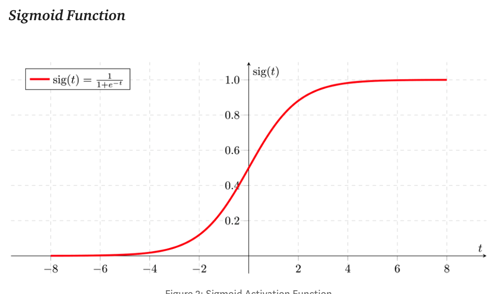
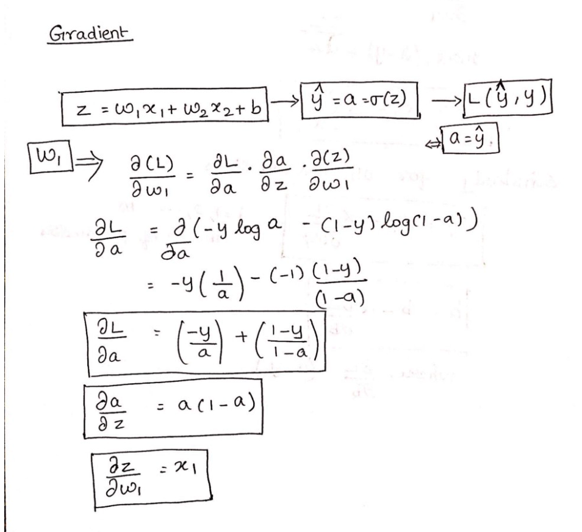
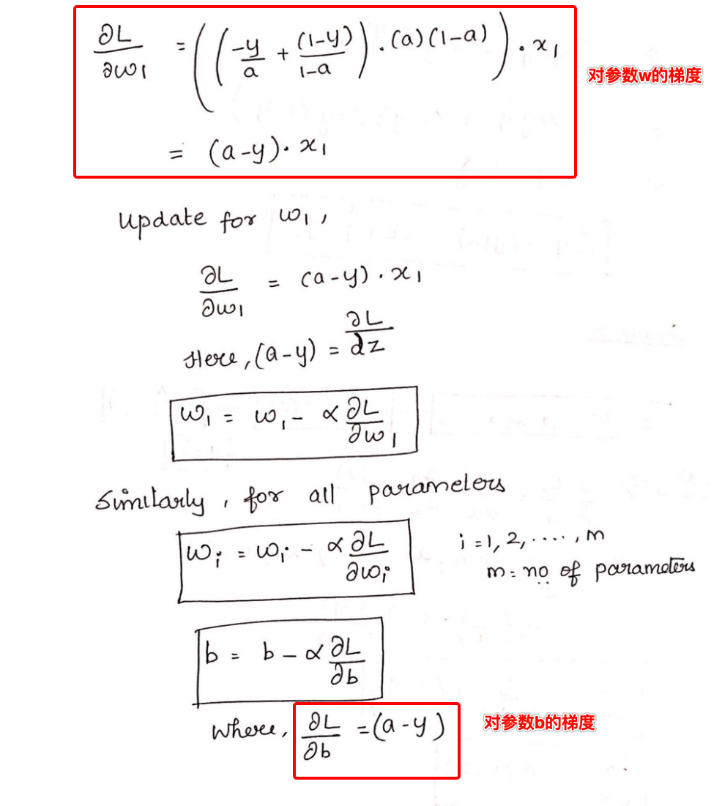
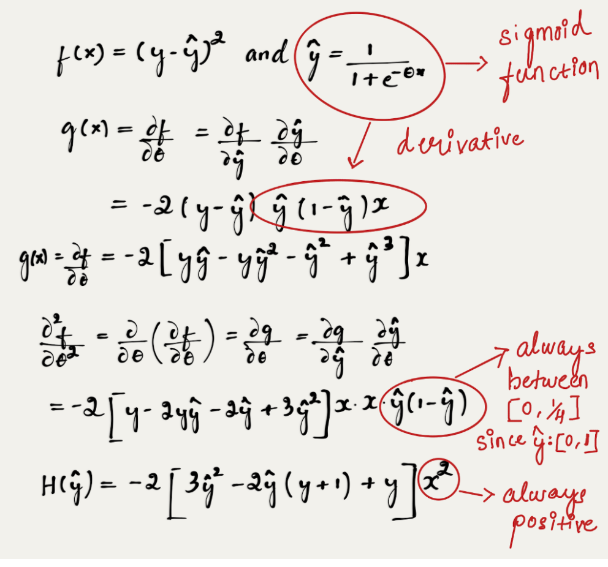
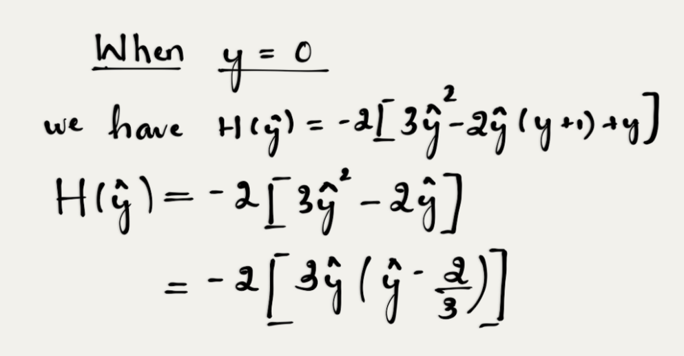
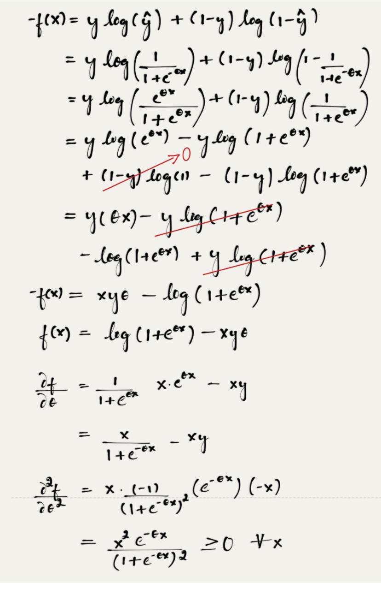

#! https://zhuanlan.zhihu.com/p/166391029
当目标变量时分类变量时，常常使用Logistic Regression(LR）算法。

例如：
- 预测邮件是否为垃圾邮件（是垃圾邮件标记为1，否则为0）
- 预测肿瘤是否为恶性的（是恶性的为1，否则为0）

## 模型
LR算法主要利用sigmoid函数，其图像如下：

模型的输入是$x_i=(x^1_i,x^2_i,...,x^m_i)$，$x_i$是一个向量，其具体的计算方法如下：
$$h(x) = \frac{1}{1+e^{-z}}, \quad z = \theta x +b$$
其中$\theta = (\theta_1,\theta_2,...,\theta_m), h(x)$就是模型的输出结果。

LR算法的损失函数是：
$$Cost(h(x),Y) = \begin{cases}
    &-log(h(x)), \quad &if \quad y=1 \\
    &-log(1-h(x)),\quad &if \quad y=0 
\end{cases}$$
写在一起就是：
$$Cost(h(x),y) = -ylog(h(x))- (1-y)log(1-h(x))$$

那么为什么是这个损失函数呢？

假设，模型预测为1的概率如下（其实也就是将模型的输出概率值作为为1的概率值）：
$$p(y=1|x) = \hat{y}$$
那么，预测为0的概率也就是：
$$p(y=0|x) = 1-\hat{y}$$

那么可以将他们二者结合写起来就是：
$$p(y|x) = \hat{y}^y \cdot (1-\hat{y})^{1-y}$$
也就是在输入x的情况下，y（y一直指的是真实值）出现的概率。

根据极大似然概率，我们希望他们出现的概率最大。对于有n个样本，那么一般的想法就是把这n个概率连乘，显然连乘容易导致下溢出，所以我们可以对其取对数：
$$\begin{aligned}
    L=&\sum_{i=1}^n \log(\hat{y}^y \cdot (1-\hat{y})^{1-y}) \\
    =&\sum_{i=1}^n (y\log \hat{y} +(1-y)\log(1-\hat{y})
\end{aligned}$$

最大化上面的L,也就是最小化$-L$，把负号带进去，就是我们上面的$Cost(h(x),y)$.

## 梯度下降
一般采用梯度下降进行优化，那么需要求损失值对于参数$\theta$，也可以说是参数$w和b$的梯度，具体的计算如下（主要就是利用链式法则和$\sigma'(x)=\sigma(x)(1-\sigma(x))$）：

## 为什么不使用平方差作为LR的损失函数
我们学习的第一个算法，以及我们潜意识里计算损失函数都是平方差(MSE)损失函数，那么LR为什么不使用MSE作为损失函数呢？

**在讨论这个之前，我们需要知道，我们在使用梯度下降算法进行更新参数时，找到的都是局部极小值，那么如果我们希望找到的这个局部极小值就是全局最小值，那么我们需要保证损失函数是凸函数（凸函数可以保证局部极小值就是全局最小值）。**

我们在线性回归中使用MSE最为损失函数，它是凸函数。而在LR中使用MSE就不是凸函数了。（要想证明一个函数是凸函数，可以对其进行二阶求导，只要二阶导数在定义域内一直大于等于0，那么他就是凸函数。）

下面是使用MSE作为LR的损失函数，然后对参数$\theta$求二阶导的具体过程：

显然，如果二阶导结果中的$H(\hat{y})$再定义域内一直大于等于0，那么函数就是凸函数【因为$\hat{y}(1-\hat{y}) \in [0,1/4]$】，但这显然不成立。举一个反例就可以，假设y=0，那么上式可以写成：

当$\hat{y}位于[2/3,1]$区间内时，$H(\hat{y}) \leq 1$，所以$f(x)$的二阶导不是一直大于等于0的，所以他不是凸函数。
同理，可以假设y=1时，代入计算。

而当我们使用交叉熵作为损失函数时，再求损失函数的二阶导，可以保证在定义域内二阶导用于大于等于0：

所以，我们采用交叉熵作为损失函数（因为他是凸函数），而不是平方差损失函数。

## LR与线性回归的区别

- 线性回归是回归模型，逻辑回归是分类模型。
- 线性回归要求输入特征x与输出y有联系，如果没有关系效果会很差，而逻辑回归引入了非线性函数sigma函数，增加了模型的表达能力。
- 两者的损失函数不同，线性回归使用MSE，逻辑回归使用交叉熵（或者更本质的说，线性回归使用最小二乘法进行模型的求解，而逻辑回归使用最大似然的方法进行求解。）

参考地址：

[Logistic Regression — Detailed Overview](https://towardsdatascience.com/logistic-regression-detailed-overview-46c4da4303bc)

[Why not Mean Squared Error(MSE) as a loss function for Logistic Regression?](https://towardsdatascience.com/why-not-mse-as-a-loss-function-for-logistic-regression-589816b5e03c)