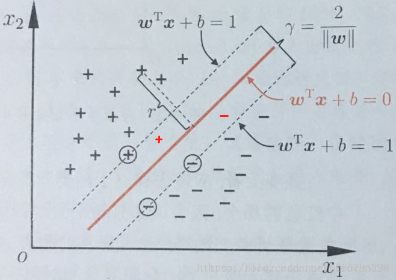

# SVM算法总结
本文是看了几个博客后，写的总结笔记。

## SVM由线性分类开始
给定一个训练样本集$D=\{(x_1,y_1),(x_2,y_2),...,(x_n,y_m)\}, y \in \{-1,1\}$.
线性分类器基于训练样本$D$在二维空间中找到一个超平面来分开二类样本，显然这样的超平面会有很多。

我们可以直观的看到，这更红色线代表的超平面抗扰动性最好。这个超平面离直线两边的数据的间隔最大，对训练集的数据的局限性或噪声有最大的容忍能力。

在这里，这个超平面可以用函数$f(x)=w^Tx+b$来表示。当$f(x)$等于0的时候，$x$便是位于超平面上的点，而$f(x)$大于0的点对应$y=1$的类别点，$f(x)$小于0的点对应$y=-1$的类别点。

为了计算的方便，我们不妨令:
$$\begin{cases}
    w^Tx_i + b \geq 1, \qquad &y_i =+1; \\
    w^Tx_i + b \leq -1, \qquad &y_i =-1;  
\end{cases}$$

接下来，我们可以计算平面外的一个点到平面的距离，假设$x'$是平面$w^Tx+b=0$上的一个点，$x$是平面外的一个点，$w$是平面的法向量，那么点$x$到平面的距离就是点$x$与平面上的任意一点的连线，在法向量$w$上的投影的长度：
$$ d = |(x-x')\cos(\theta)| = | ||x-x'||\cdot \frac{(x-x')w}{||x-x'||\cdot ||w||}| = \frac{1}{||w||}|w^Tx - w^Tx'| $$

其中，点$x'$在平面上，所以可以得到$w^Tx' +b =0$，点$x$是正类中距离平面最近的点，即满足$w^Tx+b=1$,代入上式可得：
$$d=\frac{1}{||w||}1-b-(-b) = \frac{1}{||w||}$$
这只是正类中距离超平面的最短距离，在负类中，同样存在着一个最短距离，所以最后的间隔就是：
$$d=\frac{2}{||w||}$$

至此，我们求到了间隔，SVM的思想就是使得间隔最大化，也就是：
$$\begin{aligned}
&max_{w,b} \frac{2}{||w||} \\
&s.t.y \quad y_i(w^Tx_i +b) \geq 1 \quad(i=1,2,...,m)
\end{aligned}
$$
显然最大化$\frac{2}{||w||}$，也就是最小化$||w||$，为了计算方便，可以将上式转换我：
$$\begin{aligned}
&min_{w,b} \frac{1}{2}||w||^2,\\
&s.t.y \quad y_i(w^Tx_i +b) \geq 1 \quad (i=1,2,...,m)  
\end{aligned}$$
这也就是支持向量机的基本型。

## 对偶问题
我们已经得到了支持向量机的基本形式了：
$$\begin{aligned}
&min_{w,b} \frac{1}{2}||w||^2,\\
&s.t.y \quad y_i(w^Tx_i +b) \geq 1 \quad (i=1,2,...,m)  
\end{aligned}$$
这个公式其实就是一个凸二次规划问题.
 - 目标函数和约束条件都是变量的线性函数，叫做线性规划问题。
 - 目标函数为变量的二次函数，约束条件为变量的线性函数，叫做二次规划问题。
 - 目标函数和约束条件都为非线性函数，叫做非线性规划问题。
 - 凸优化：$x \in R^n$为一凸集，$f:X \rightarrow R$为一凸函数，凸优化就是要找出一点$x^* \in X$，使得任意$x \in X$，都满足$f(x^*) \leq f(x)$。可以想象成给我一个凸函数，我要去找到最低点。

我们可以对上式使用拉格朗日乘子法，得到它的对偶问题。
- 这就是拉格朗日对偶性，也就是通过使用拉格朗日乘子法，把约束条件写入目标函数中。

具体的拉格朗日函数为：
$$L(w,b,\alpha) = \frac{1}{2}||w||^2 + \sum_{i=1}^m \alpha_i(1-y_i(w^Tx_i + b))$$

其中$\alpha_i \geq 0$，这样设置$\alpha_i$的原因是因为我们的目标函数是不等式约束，那么要想解这样的二次规划问题，我们选用KKT条件，而KKT条件的一个约束之一就是$\alpha_i \geq 0$，最终我们希望能够通过KKT条件产生原问题的对偶问题。
那么我们现在的目标就是最小化$L(w,b,\alpha)$。

在这之前，我们先介绍以下拉格朗日对偶以及KKT条件。
### 拉格朗日对偶以及KKT
拉格朗日等式约束：
$$\begin{aligned}
    max \quad &f(x) \\
    s.t.\quad &g(x) = 0 \\
    \dArr \\
    L(x,\lambda) &= f(x) + \lambda g(x) \\
    \dArr \\
    求导：& \begin{cases}
        \frac{\partial L}{\partial x} = 0\\
        g(x) = 0
        \end{cases}
\end{aligned}$$

所以对于等式约束$g(x)=0$的具体处理方法就是：给约束乘以一个系数加到原命题上，然后求导求出结果。

拉格朗日不等式约束：
$$\begin{aligned}
    max \quad &f(x) \\
    s.t. \quad &g(x) \geq 0 \\
    \dArr \\
    L(x,\lambda) &=f(x) + \lambda g(x) \\
    \dArr \\
    分两种情况：\begin{cases}
        \frac{\partial L}{\partial x} = 0\\
        g(x) = 0\\
        \lambda > 0 \\
    \end{cases} 
    和\begin{cases}
        \frac{\partial L}{\partial x} = 0 \\
        g(x) > 0\\
        \lambda = 0 \\
    \end{cases}
    ,&合并两种情况\rArr \begin{cases}
        \frac{\partial L}{\partial x} = 0\\
        g(x) \geq 0 \\
        \lambda \geq 0 \\
        \lambda g(x) = 0 \\
    \end{cases}
\end{aligned}$$
这个就是不等式约束的情况。

拉格朗日同时出现等式和不等式约束：
$$\begin{aligned}
    max \quad &f(x) \\
    s.t. \quad &\begin{cases}
        h_i(x)=0\\
        g_j(x) \geq 0 \\
    \end{cases} \\
    \dArr \\
    L(x,\lambda) &= f(x) + \sum_i \lambda_ih_i(x) + \sum_j \mu_j g(x) \\
    需要满足的条件为（也就是KKT条件）：&\begin{cases}
        \frac{\partial L}{\partial x} = 0\\
        h_i(x) = 0 \\
        g_j(x) \geq 0 \\
        \mu_j \geq 0 \\
        \mu_j g_j(x) = 0\\
    \end{cases}
\end{aligned}$$

### 对偶性问题转换过程
原始问题：
$$\begin{aligned}
    \min_{w} \quad &f(w) \\
    s.t. \quad &g_i(w) \leq 0, i=1,...,k \\
    &h_j(w) = 0, j=1,...,l \\
\end{aligned}$$
生成拉格朗日函数：
$$L(w, \alpha , \beta) = f(w) + \sum_{i=1}^k \alpha_ig_i(w) + \sum_{j=1}^l \beta_j h_j(w)$$

min-max形式的拉格朗日函数：
$$\begin{aligned}
    \max_{\alpha,\beta; \alpha_i \geq 0} L(w,\alpha, \beta) = & \max_{\alpha,\beta; \alpha_i \geq 0}(f(w) + \sum_{i=1}^k \alpha_i g_i(w) + \sum_{i=1}^l \beta_j h_j(w) ) \\
    =& \begin{cases}
        f(w), \quad if g_i(w) \leq 0, h_j(w) = 0 （也就是满足约束条件）\\
        \infty \quad otherwise
    \end{cases} \\
    \dArr \\
\end{aligned}$$

$$\begin{aligned}
       \min_{w} \max_{\alpha,\beta; \alpha_i \geq 0}L(w,\alpha,\beta) =& \min_{w} \max_{\alpha,\beta; \alpha_i \geq 0}L(w,\alpha,\beta) = & \min f(w) \\
    s.t. \quad &g_i(w) \leq 0  &s.t.\quad g_i(w) \leq 0 \\
    &h_j(w) = 0  &h_j(w) = 0\\
\end{aligned}$$

可以看到在满足约束条件时$max L(w,\alpha,\beta)==f(w)$，
所以问题$\min_{w}f(w)$变成了$\min_{w}\max_{w,\alpha,\beta}L(w,\alpha,\beta)$。

那么，如果我们仍然先求$max L$再求min的话，问题又还原了。所以我们需要想办法，更改$min max L$的求值顺序，这也就是要转换为对偶问题。

原问题是：
$$\min_{w}\max_{\alpha,\beta; \alpha_i \geq 0} L(w,\alpha, \beta)$$
对偶问题是：
$$\max_{\alpha,\beta; \alpha_i \geq 0}\min_{w} L(w,\alpha, \beta)$$

显然存在如下不等式关系：
$$\max_{\alpha,\beta; \alpha_i \geq 0}\min_{w} L(w,\alpha, \beta) \leq \min_{w}\max_{\alpha,\beta; \alpha_i \geq 0} L(w,\alpha, \beta)$$
可以理解为从一群瘦子中挑选出最胖的，仍然要比一群胖子中挑选出最瘦的轻。

那么原问题与对偶问题何时相等呢？这就引出了KKT条件。
### KKT条件
满足KKT条件就可以实现从min max L()到max min L()。
其中L()函数是：
$$L(w,\alpha, \beta) = f(w) + \sum_{i=1}^k \alpha_i g_i(w) + \sum_{i=1}^l \beta_j h_j(w)$$
在满足KKT条件之前需要满足：
- f和$g_i$函数是凸函数【也就是目标函数与不等式约束是凸函数】。
- $h_j$是仿射变换，仿射变换就是线性变换加一个平移【$h_j$是等式约束】。具体参考：https://www.zhihu.com/question/20666664
  
那么具体的KKT条件就是：
$$\begin{cases}
    \frac{\partial }{\partial w_i}L(w,\alpha,\beta) = 0, &i=1,2,...,n \\
    \frac{\partial}{\partial \beta_j}L(w,\alpha,\beta)=0,&j=1,...,l \\
    g_i(w) \leq 0, &i=1,...,k \\
    \alpha_i \geq 0, &i=1,...,k \\
    \alpha_i g_i(w) = 0, &i=1,...,k
\end{cases}$$
其中第3、4、5个条件其实可以写成如下两种情况：
$$情况1：\begin{cases}
    g_i(w) < 0 \\
    \alpha_i = 0 \\
\end{cases}; \qquad
情况2：\begin{cases}
    g_i(w)=0 \\
    \alpha_i = 0 \\
\end{cases}
$$
也就是说$g_i(w)与\alpha_i$不会同时为0.

好了，终于总结完了拉格朗日与KKT条件，那么对于我们的SVM的目标函数，如何应用拉格朗日和KKT呢。SVM的目标函数是：
$$\begin{aligned}
    \min_{w,b} \quad &\frac{1}{2}||w||^2 \\
    s.t.\quad &y^i(w^Tx^i + b) \geq 1, i=1,...,n \\
    \dArr \\
    其中g_i(w) =& 1-y^i(w^Tx^i + b) \leq 0, i=1,...,m\\
    \dArr \\
    那么对应的拉格朗日函数为：
    L(w,b,\alpha) =& \frac{1}{2}||w||^2 - \sum_{i=1}^m \alpha_i (y^i(w^Tx^i + b)-1) \\
\end{aligned}$$
其中$\alpha_i \geq 0; g_i(w) \leq 0$。

那么此时我们的问题就转化为了：
$$\begin{aligned}
    \min_{w,b} \quad &f(w)= &\min_{w,b} \max_{\alpha,\alpha_i \geq 0} L(w,b,\alpha) =  &\max_{\alpha,\alpha_i \geq 0} \min_{w,b}L(w,b,\alpha) \\
    s.t. \quad &g_i(w) \leq 0 &\quad& \\
    &原问题 &拉格朗日去掉约束\qquad &对偶问题
\end{aligned}$$

显然，我们要想让原问题与对偶问题等价，就需要满足KKT条件，这里的原来变量有两个，也就是$w,b$，以及不等式约束$g_i(w)$，所以这里的KKT条件与上面所说的KKT条件没有等式约束时要满足的条件，多了一个自变量，具体的条件如下：
$$\begin{cases}
    \frac{\partial L}{\partial w} = 0 \\
    \frac{\partial L}{\partial b} = 0 \\
    g_i(w) \leq 0 , \quad &i=1,...,k \\
    \alpha_i \geq 0 . \quad &i=1,...,k \\
    \alpha_i g_i(w) = 0, &i=1,...,k
\end{cases}$$

下面我们分两步来求上面的目标函数，其中会用到上面的KKT条件：
- 第一步：求$\min_{w,b}L(w,b,\alpha)$
- 第二步：求$\max_{\alpha,\alpha_i \geq 0}L(w,b,\alpha)$

第一步，求$\min_{w,b}L(w,b,\alpha)$：
- 此时的目标函数如下:
$$\min_{w,b} L(w,b) = \frac{1}{2}||w||^2 - \sum_{i=1}^m \alpha_i (y^i(w^Tx^i + b)-1)$$
- **注意这里，我写的目标函数是$L(w,b)，不是L(w,b,\alpha)$,这是因为此时$\alpha$可以认为是一个常量，其他很多书籍都写作$L(w,b,\alpha)$**
- 可以看出，$L(w,b)$是关于w的二次凸函数，是关于b的一次凸函数，$g_i(w)$是关于w的一次凸函数，b的一次凸函数。所以有最小值，可以直接求导：
$$\begin{aligned}
    \frac{\partial L(w,b)}{\partial w} =& w - \sum_{i=1}^m\alpha_i y^ix^i = 0 \quad \rArr w = \sum_{i=1}^m\alpha_i y^ix^i \\
    \frac{\partial  L(w,b)}{\partial b} =& \sum_{i=1}^m \alpha_i y^i = 0 \quad (等式约束)
\end{aligned}$$
- 把上面求得的结果代入拉格朗日函数得：
$$\begin{aligned}
    L(w,b) =&\sum_{i=1}^m \alpha_i - \frac{1}{2}\sum_{i=1}^m\sum_{j=1}^m y^iy^j\alpha_i\alpha_j {x^i}^Tx^j - b \sum_{i=1}^m \alpha_i y^i \\
    =& \sum_{i=1}^m \alpha_i  - \frac{1}{2}\sum_{i=1}^m\sum_{j=1}^m y^iy^j\alpha_i\alpha_j {x^i}^Tx^j
\end{aligned}$$
- **这个时候第一步就解决了，最小值的问题也解决了。**

第二步，求$\max_{\alpha;\alpha_i \geq 0}L(w,b,\alpha)$：
- 此时的目标函数变成了：
$$\begin{aligned}
    \max_{\alpha;\alpha_i\geq 0} L(\alpha) =&\sum_{i=1}^m \alpha_i  - \frac{1}{2}\sum_{i=1}^m\sum_{j=1}^m y^iy^j\alpha_i\alpha_j {x^i}^Tx^j \\
    s.t. \quad & \alpha_i \geq 0 , i=1,...,m \\
    &\sum_{i=1}^m \alpha_iy^i = 0【这里把第一步计算出的等式约束，保留下来了】
\end{aligned} $$

最初的分类函数f(x)：
$$\begin{aligned}
    f(x)= x\sum_{i=1}^m\alpha_i y^ix^i + b \\
\end{aligned}$$
到此，我们的目标函数最终就得到了，具体的参数更新方式，其实我们可以看到w和b都可以用$\alpha$ 来表示，所以其实更新参数时，主要是更新$\alpha$，具体的方法我们在后面在介绍。

下面这个图,介绍了满足KKT条件时，点具体落在哪一部分。

### 为什么要采用对偶函数来求解
- 对偶问题将原始问题中的不等式约束转换为了对偶问题中的等式约束【这个其实也可以理解为是拉格朗日函数的功劳】。
- 方便核函数的引入，变换后目标函数里存在${x^i}^Tx^j$的乘积，这个计算其实就是引入核函数的地方。
- 改变了问题的复杂度，由原来的求特征向量$w$转化为了求系数$\alpha$。在原始问题中，求解的复杂度与样本的维度有关，即w的维度，而在对偶问题中，只与样本的数量有关。

## 非线性支持向量机和核函数
对于非线性的问题，线性可分支持向量机并不能有效的解决。 因此对于非线性的数据，可以使用非线性变换，将非线性问题变换为线性问题。

也就是将训练样本从原始空间映射到一个更高维的空间中，使得样本在这个空间中线性可分。如果原始空间维度是有限的，即特征维度是有限的，那么一定存在一个高维特征空间是线性可分的。令$\phi(x)$表示将x映射后的特征向量，于是在特征空间中，划分超平面所对应的模型可表示为：
$$f(x) = w \phi(x) + b $$
于是此时对应的最小化函数为：
$$\begin{aligned}
    \min_{w,b}\quad &\frac{1}{2}||w||^2 \\
    s.t. \quad & 1-y^i(w\phi(x)+b) \leq 0 ,\quad i=1,..,m
\end{aligned}$$
其对偶问题是：
$$\begin{aligned}
    & \max_{\alpha} \sum_{i=1}^m - \frac{1}{2}\sum_{i=1}^m\sum_{j=1}^{m}\alpha_i\alpha_j y^iy^j\phi(x^i)^T\phi(x^j) \\
    &s.t. \quad \sum_{i=1}^m\alpha_iy^i = 0, \alpha_i \geq 0, \quad i=1,...m
\end{aligned}$$
可以看到，最后的对偶问题中存在$\phi(x^i)^T\phi(x^j)$，也就是$x^i和x^j$映射到特征空间后的内积，所以我们可以定义各种操作，不止是简简单单的向量之间的内积，这也就是核函数：
$$K(x^i,x^j)=<\phi(x^i),\phi(x^j)>=\phi(x^i)^T\phi(x^j)$$
这里的核函数是最简单的线性核，即计算向量的内积。那么此时上面的对偶问题也就转换为了：
$$\begin{aligned}
    & \max_{\alpha} \sum_{i=1}^m - \frac{1}{2}\sum_{i=1}^m\sum_{j=1}^{m}\alpha_i\alpha_j y^iy^jK(x^i,x^j) \\
    &s.t. \quad \sum_{i=1}^m\alpha_iy^i = 0, \alpha_i \geq 0, \quad i=1,...m
\end{aligned}$$

最后求出的分类函数f(x)，也就是：
$$\begin{aligned}
    f(x)= \sum_{i=1}^m\alpha_i y^i\phi(x^i)\phi(x)+ b \\
    = \sum_{i=1}^m\alpha_i y^iK(x^i,x)+ b
\end{aligned}$$

核函数主要有以下几种：
- 线性核：$K(x_i,x_j) = x_i^Tx_j$
- 多项式核（d是多项式次数，d=1也就是线性核）：$K(x_i,x_j) = (x_i^Tx_j)^d$
- 高斯核($\sigma >0$)：$K(x_i,x_j) =exp(-\frac{||x_i-x_j||^2}{2\sigma^2})$
- 拉普拉斯核（$\sigma >0$）:$K(x_i,x_j) =exp(-\frac{||x_i-x_j||}{\sigma})$
- sigmoid核（$\beta>0，\theta >0$）：$K(x_i,x_j) =tanh(\beta x_i^Tx_j + \theta)$

## 线性支持向量机-软间隔与松弛变量
在前面的讨论中，我们假设训练数据在特征空间或者高维空间是线性可分的，但是在现实世界中往往存在一些噪声，使得样本点不能满足间隔大于等于1或者落在了另一个类的空间中。

为了解决这个问题，可以对每一个样本点引入一个松弛变量$\xi \geq0$，使得加上松弛变量$\xi$后大于等于1，这样约束条件也就变成了：
$$y_i(w^Tx_i+b) \geq 1-\xi$$
同时，对于每一个松弛变量，支付一个代价，目标函数为：
$$\min \quad f(x)=\frac{1}{2}||w||^2 + C\sum_{i=1}^m\xi_i$$
其中$C>0$为惩罚参数，C值增大时对误分类的惩罚增大，C值小时对误分类的惩罚减小。

那么，我们的优化目标就变成了：
$$\begin{aligned}
    &\min_{w,b} \frac{1}{2}||w||^2 + C\sum_{i=1}^m \xi_i, \\
    & s.t. \quad y_i(w^Tx_i+b) \geq 1-\xi, \quad i=1,...,m \\
    &s.t. \quad \xi \geq 0
\end{aligned}$$

它的对偶问题就是：
$$L(w,b,\xi,\alpha,\mu) = \frac{1}{2}||w||^2 + C\sum_{i=1}^m \xi_i + \sum_{i=1}^{m}\alpha_i (1-\xi_i -y_i(w^Tx_i +b)) - \sum_{i=1}^m \mu_i\xi_i$$
其中$w,b,\xi$可以看做是自变量，$\alpha_i \geq 0， \mu_i \geq 0$是拉格朗日乘子，所以它与原来的对偶问题相比就是多了一个自变量$\xi_i$，并且这个自变量还有个取值范围，即$\xi_i \geq 0$。

同样的按照上面先求min L()函数，在求max L()函数的步骤，对其进行求解。
求min L()时，显然是凸函数，所以可以求导为0，就可以得到局部最小值，根据凸函数的特点，此时的局部最小值也是全局最小值，这里要对自变量进行求导，即对$w,b,\xi_i$进行求偏导，求导后同样可得：
$$\begin{cases}
    w = \sum_{i=1}^m \alpha_i y_i x_i \\
    \sum_{i=1}^m \alpha_i y_i = 0 \\
    C =  \alpha_i + \mu_i 
\end{cases}$$

将上式的结果代入拉格朗日函数以及求max L()函数为：
$$\begin{aligned}
    \max_{\alpha_i ,\mu_i; \alpha_i \geq 0, \mu_i \geq 0}& \sum_{i=1}^m \alpha_i -\frac{1}{2}\sum_{i=1}^m\sum_{j=1}^m\alpha_i\alpha_jy_iy_jx_i^Tx_j \\
    s.t. \quad&  \sum_{i=1}^m\alpha_iy_i = 0 \\
    &\alpha_i \geq 0 ,\quad i=1,...,m \\
    & \mu_i \geq 0 ,\quad i=1,...,m\\
    &C=\alpha_i + \mu_i, \quad i=1,...,m
\end{aligned}$$

此时的KKT条件为[对自变量求导为0，对不等式约束加拉格朗日乘子的控制，这里的不等式约束指的是最初的不等式约束$y_i(w^Tx_i+b) \geq 1-\xi和\xi \geq 0$]：
$$\begin{cases}
    w = \sum_{i=1}^m \alpha_i y_i x_i \\
    \sum_{i=1}^m \alpha_i y_i = 0 \\
    C =  \alpha_i + \mu_i \\
    \alpha_i \geq 0 \\
    1-\xi_i -y_i(w^Tx_i +b) \leq 0 \\
    \alpha_i(1-\xi_i -y_i(w^Tx_i +b)) = 0 \\
    \mu_i \geq 0 \\
    \xi_i \geq 0 \\
    (注意这里的\xi_i是大于等于0，不像上面一样是小于等于0，\\
    因为在对偶问题中，我们在\mu_i\xi_i前面用的是负号)\\
    \mu_i\xi_i = 0
\end{cases}$$

根据SMO等算法，计算出$\alpha$后，代入求得w，然后我们的分类函数f(x)也就是：
$$f(x) = w^Tx+b = \sum_{i=1}^m\alpha_i y_ix_i^T + b$$

**下面我们分析一下，具体的$\alpha_i和\xi_i$的取值意味着什么。**

对于任意的样本点$(x_i,y_i)$，我们总有$a_i=0或者y_if(x_i)-1+\xi_i=0$：
- 若$\alpha_i=0$，则该样本点的参数$x_i,y_i$不会出现在公式 $f(x) = w^Tx+b = \sum_{i=1}^m\alpha_i y_ix_i^T + b$中，不影响模型。
- 若$\alpha_i > 0$，则必有$y_if(x_i)-1+\xi_i=0$，即：$y_if(x_i)=1-\xi_i$,**此时的样本点就是支持向量！**

由于$C=\alpha_i + \mu_i, \alpha \geq 0, \mu_i \geq 0$，所以我们可以得出$0 \leq \alpha_i \leq C$:
- 若 $\alpha_i < C$，则必有$\mu_i >0$，根据上面的KKT条件可以知道，此时$\xi_i=0，$则该样本点落在最大间隔外或刚好落在最大间隔界面上；
- 若$\alpha_i = C$,则必有$\mu_i=0$，则此时$\xi_i >0$：
  - 若$0< \xi_i \leq 1$，则该样本点在两个最大间隔内部；
  - 若$\xi_i > 1$，则该样本点是分类错误点。

参考博客1：https://blog.csdn.net/sinat_20177327/article/details/79729551?utm_medium=distribute.pc_relevant.none-task-blog-BlogCommendFromMachineLearnPai2-1.compare&depth_1-utm_source=distribute.pc_relevant.none-task-blog-BlogCommendFromMachineLearnPai2-1.compare

参考博客2：https://blog.csdn.net/lch614730/article/details/17069053
