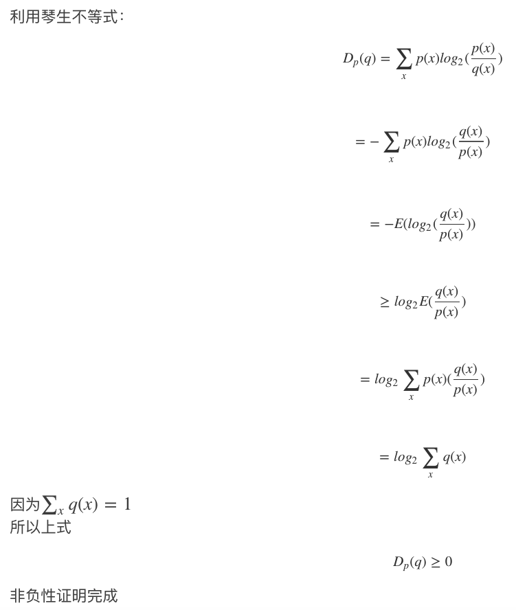
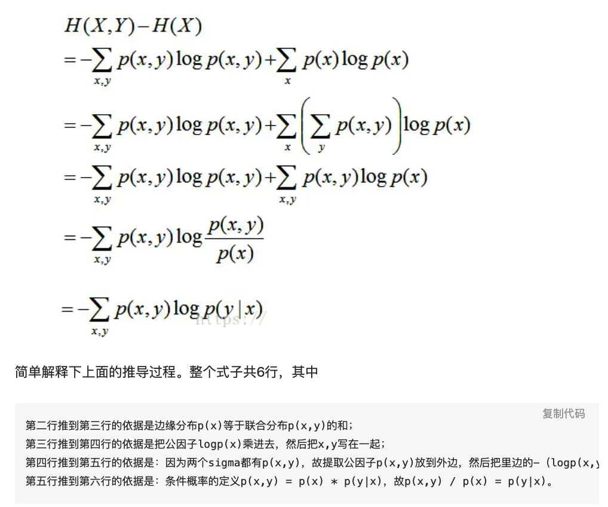

# 熵和信息量
熵是混乱度的一个度量单位，一个系统的混乱度越高，那么它的熵也就越高。

信息量是和事件发生的概率相关的，事件发生的概率越低，传递的信息量也就越大。

信息量应该是非负的（大于等于0），必然发生的事件的信息量为0.

两个事件的信息量可以相加，并且两个独立事件的联合信息量应该是它们各自信息量的和。

信息量用数学表达如下,
如果已知事件$X_i$发生的概率为$p(i)$，那么事件$X_i$所包含的信息量为:
$$H(X_i) = -log_a p_i$$

# 理解信息熵
那么如何量化信息呢，答案就是信息熵。

比如吴军书中的一个例子，假设世界杯决赛圈的32强已经产生了，那么随机变量"2018年俄罗斯世界杯足球赛32强中，谁是世界冠军"的信息量是多少呢？

对于香农提出的信息熵公式，对于任意一个随机变量$X$，它的信息熵定义如下，单位为比特(bit):
$$H(X) = -\sum_x p(x)logp(x)$$

把最前面的负号放在最后，便成为了：
$$H(X)=\sum_x p(x)log\frac{1}{p(x)}$$

那么对于上述随机变量$X$(谁获得冠军)的信息量就是：
$$H(X)=-(p_1logp_1 + p_2logp_2 + p_3logp_3 + ... + p_{32}logp_{32})$$

其中,$p_1,p_2,...,p_{32}$分别是这32支球队夺冠的概率。

然后吴军给出了结论，当32支球队夺冠概率相同时，$H=5$；当夺冠概率不相同时，$H<5$；$H$不可能大于5.

这里隐含一个结论：**系统中的各种随机性的概率越相等，信息熵越大，反之越小。**

**其实从香农给出的数学公式可以看出，信息熵其实就是随机变量信息量的数学期望。**

# 交叉熵
交叉熵本质上是用一个猜测的分布去预测真实的分布。

交叉熵是指，在给定的真是分布p下，使用非真实分布q所指定的策略来消除系统的不确定性所需要付出的努力大小。
交叉熵越低，这个策略就越好，最低的交叉熵也就是使用了真实分布所计算出来的信息熵，因此此时，交叉熵=信息熵。

因此在机器学习的算法中，我们总是会最小化交叉熵，因为交叉熵越低，就证明由算法所产生的策略越接近最优策略，也就间接证明我们算法所算出的非真实分布越接近真实分布。

交叉熵的计算公式：
$$H_p(q) = -\sum_x p(x)log_2 q(x)$$
也可以写成：
$$H_p(q) = \sum_x p(x)log_2 \frac{1}{q(x)}$$

# 相对熵（KL散度）

相对熵(KL散度)其实就是拿交叉熵减去信息熵，即：
$$KL(p,qq)=D_p() =H_p(q) - H(p) = \sum_x p(x)log_2\frac{p(x)}{q(x)}$$

相对熵的非负性证明：

## 联合信息熵和条件信息熵

下面我们要说的是联合分布中（即一个分布中）的两个变量相互影响的关系，上面说的KL和cross-entropy是两个不同分布之间的距离度。

变量X和变量Y的联合信息熵，和两个随机变量X和Y的联合分布有关，用$H(X,Y)$表示，可以用下面的公式来计算
$$H(X,Y) = -\sum_{x,y}p(x,y)log_2p(x,y)$$

条件信息熵：就是指在随机变量X发生的前提下，随机变量Y发生所带来的熵，叫做Y的条件熵，用$H(Y|X)$来表示。
用来衡量在已知随机变量X的条件下随机变量Y的不确定性。
具体计算方法如下：
