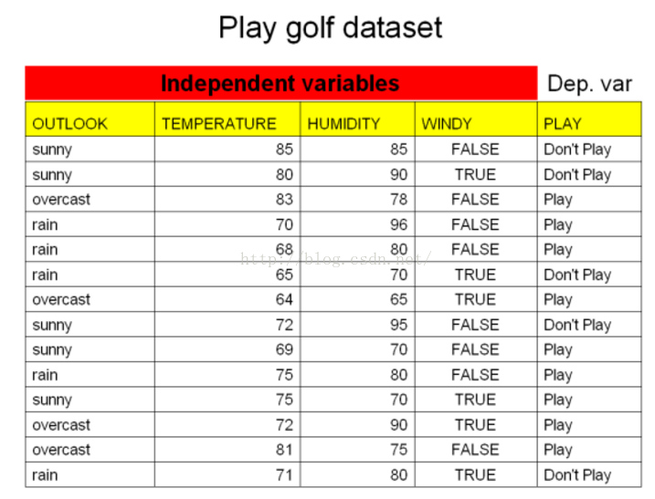
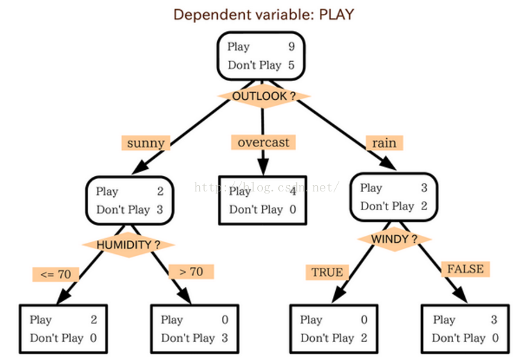
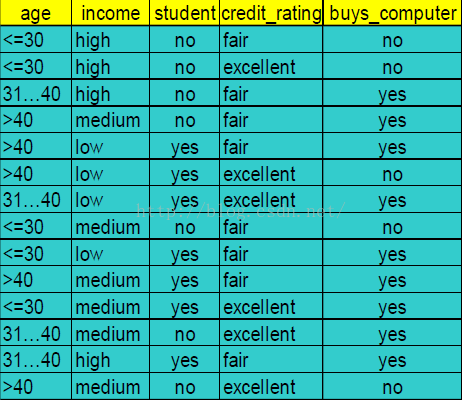
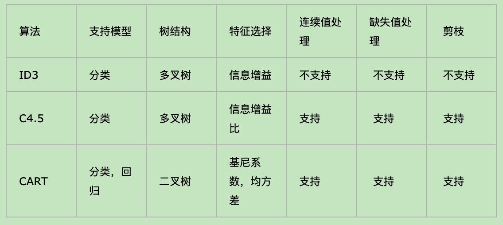
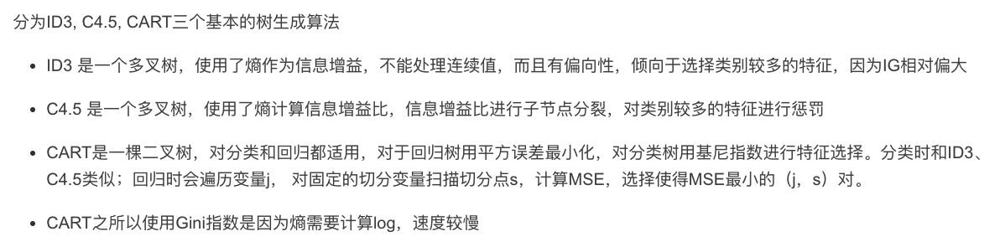

本文主要介绍决策树的相关算法。**首先，决策树是一个有监督的分类模型，其本质是选择一个能带来最大信息增益的特征值进行树的分割，直到达到结束条件或者叶子节点纯度达到一定的阈值。**

一个决策树的例子如下：

假设，我们有以下数据，表示当天是否回去玩高尔夫。

那么用决策树建立起来后，能得到这样的模型：

决策树中每一个节点都表示某一个对象，而每个分叉路径则代表某个可能的属性值。

按照分割指标和分割方法，决策树的经典模型可以分为ID3、C4.5以及CART.

在介绍这几种算法之前，先介绍下信息熵（Entropy）
## 信息熵
那么，在算法中如何确定选择哪一个属性作为根节点或者节点呢。这就引入了信息熵。

1948年，香农提出了"信息熵"的概念，一条信息的信息量大小和它的不确定性有着直接的关系，我们对一样东西越是一无所知，那么想要了解它就需要越多的信息。信息熵的公式是：
$$H(X) = -\sum P(x_i)\log_{b}P(x_i)$$

那么，当一个变量的不确定性越大，它的熵值也会越大。

## ID3：以信息增益为准则来选择最优划分属性
ID3算法主要根据选择该属性作为节点后，信息增益是否为最大来判定是否选择该节点作为根节点或者节点。

那么信息增益怎么计算呢？

信息增益的计算，其实就是按照某个属性值对样本进行划分后，划分前后的信息熵的差值（注意使用划分前的信息熵减去划分后的信息熵，因为划分后数据集的不确定性肯定是要减小的，也就是熵变小了。）

先计算数据集D的经验熵$H(D)$：
$$H(D)= -\sum_{k=1}^K \frac{|C_k|}{D}\log_{2}\frac{|C_k|}{D}$$
在计算特征A对数据集D的经验条件熵$H(D|A)$：
$$H(D|A) = \sum_{i=1}^n \frac{|D_i|}{D}H(D_i) = -\sum_{i=1}^n \frac{|D_i|}{|D|}\sum_{k=1}^K\frac{|D_{ik}|}{D_i}\log_{2}\frac{|D_{ik}|}{D_i}$$
最后就是计算信息增益：
$$g(D,A)=H(D)-H(D|A)$$

也就是：
$$信息增益=经验熵-条件熵$$

针对每个叶子节点选取的数据集$D$是只属于当前分支下的所有节点。

简单理解就是：没有属性A时候的信息量减去有属性A时候的信息量。

举个例子，假设我们有以下数据，买电脑的人和不买电脑的人：

可以看到，在此数据中，总数据量为14个，买电脑的人为9个，不买电脑的人为5个，因此，Info(D)计算方式如下：
$$Info(D)=-\frac{9}{14}\log_{2}\frac{9}{14} -\frac{5}{14}\log_{2}\frac{5}{14}=0.940$$

然后，我们想计算下age属性的信息量，发现小于30的5人中，有2人买电脑，3人不买；其余的31~40，>40的方法同理，因此计算的方式如下：
$$\begin{aligned}
   Info_{age}(D)=& \frac{5}{14}\times (-\frac{2}{5}\log_{2}\frac{2}{5}-\frac{3}{5}\log_{2}\frac{3}{4}) \\
   & +\frac{4}{14}\times(-\frac{4}{4}\log_{2}\frac{4}{4}-\frac{0}{4}\log_{2}\frac{0}{4}) \\
   & +\frac{5}{14}\times(-\frac{3}{5}\log_{2}\frac{3}{5}-\frac{2}{5}\log_{2}\frac{2}{5}) \\
   =& 0.694
\end{aligned}$$

因此$Gain(age)=0.940-0.694=0.246$.

在对比下其余属性值$Gain(income)=0.029, Gain(Student)=0.151$，因此可以看出，age的属性信息量最大，因此选取age属性作为根节点。

### ID3算法的缺点
- ID3算法只能用于处理离散分布的特征并且只能处理分类问题
- UD3算法对于缺失值的情况没有考虑
- ID3不能增量的接受训练集，每增加一次实例就要抛弃原有的决策树，重新构造新的决策树，开销很大。
- ID3算法在选择根节点和内部节点的时候，采取信息增益作为评价标准，而信息增益的缺点就是倾向于选择分类类别较多的属性。
- ID3算法没有剪枝策略，容易过拟合

为什么信息增益会倾向于选择特征选项较多的特征：**主要是因为，信息增益反映的是给定一个条件以后不确定性减少的程度，那么必然是分的越细的数据集确定性更高，也就是条件熵越小，信息增益越大。这是因为特征选项多，也就意味着树要分裂成非常非常多的叶子节点，并且每个叶子节点上的样本很少，那么越小的数据集其“纯度”显然越容易更高，这也就导致了条件熵会趋近于0，信息增益会很大。**

## C4.5：基于信息增益率准则来选取最优分割属性的算法
C4.5是基于ID3的缺点（偏好特征选项多的特征）而提出来的，之所以不叫ID4，是因为ID3提出来后，人们对其兴趣很大，很快就有相应的ID4、ID5等提出来，所以这个算法为了与它们进行区分，就叫了C4.5。

信息增益比率是通过引入一个叫做分裂信息的项（Split information）来惩罚取值较多的属性。

$$\begin{aligned}
    GainRatio(D,A) =& \frac{Gain(D,A)}{IV(A)} \\
    IV(A) =& -\sum_{v=1}^V \frac{|D^v|}{|D|}\log_{2}\frac{|D^v|}{|D|}
\end{aligned}$$

上式，分子的计算与ID3一样。而分母是由属性A的特征值个数决定的，个数越多，IV值越大，信息增益率越小，这样就可以避免模型偏好特征值多的模型。

但是如果简单的按照这个规则来进行分割，模型又会偏好特征数少的特征。

因此C4.5决策树先从候选划分属性中找出**信息增益**高于平均水平的属性，然后再从中选择增益率最高的。

对于连续属性来说，可取值数目不再有限，因此可以采用离散化技术（如二分法）进行处理。（将属性值从小到大进行排序，选取中间值作为分割点。）

### 处理缺失值
前面说了ID3没有考虑缺失值的情况【就是有的样本在特征A下没有具体的特征值】，而C4.5考虑了这种情况（其实后面的CART处理缺失值的情况，也是采取这种方法的。）

对于缺失值的问题，主要分为两个问题：
1. 在样本某些特征缺失的情况下选择划分的属性。
2. 选定了划分属性后，对于在该属性上缺失特征的样本的处理。

对于第一个子问题，对于某一个有缺失特征值的特征A,C4.5（和CART）算法的思路是将数据分为两部分，一部分是有特征值A的数据$D_1$，另一部分是没有特征值A的数据$D_2$，然后对于没有缺失特征A的数据集$D_1$来和对应的A特征的各个特征值一起计算加权后的信息增益比，最后乘上一个系数，这个系数是D1在整个数据集的比例。

对于第二个子问题，可以将缺失特征的样本同时划分到所有的子节点中，不过将该样本的权重按照各个子节点的样本的数量比例来进行分配。比如缺失特征A的样本a之前的权重为1，特征A有三个特征值$A_1,A_2,A_3$。三个特征值对应的无缺失特征A的样本个数分别为2，3，4，那么样本a同时划入$A_1,A_2,A_3$，对应的权重分别为$2/9, 3/9, 4/9$.

## CART
CART算法采取基尼系数来替代信息增益比，基尼系数代表了模型的不纯度，基尼系数越小，则不纯度越低，特征越好。（信息增益是越大越好，信息增益比也是越大越好。所以基尼系数是与前两个指标相反的。）

具体的，在分类问题中，假设有K个类别，第K个类别的概率为$p_k$，则基尼系数的表达式为：
$$Gini(p) = \sum_{k=1}^K p_k(1-p_k) = 1 - \sum_{k=1}^Kp_k^2$$

如果是二分类问题，计算就更加简单了，如果属于第一个样本输出的概率是p，则基尼系数的表达式为：
$$Gini(p) = 2p(1-p)$$

对于给定的样本数据集D，假设有K个类别，第k个类别的数量为$C_k$，则样本D的基尼系数表达式为：
$$Gini(D) = 1-\sum_{k=1}^K (\frac{|C_k|}{|D|})^2$$

特别的，对于样本D，如果根据特征A的某个值a，把D分成$D_1$和$D_2$两部分，则在特征A的条件下，D的基尼系数表达式为：
$$Gini(D,A) = \frac{|D_1|}{|D|}Gini(D_1) + \frac{|D_2|}{|D|}Gini(D_2)$$

可以比较下基尼系数的表达式和熵模型的表达式，二次运算要比对数运算简单很多。所以基尼系数是作为熵模型的一个近似替代(具体的可以查看有人分析的基尼系数与熵之半误差曲线非常接近)。CART分类树算法就是使用基尼系数来选择决策树的特征。

### CART分类树算法对于连续特征和离散特征的处理方法
对于CART分类树连续值的处理问题，其思想和C4.5是一致的，都是将连续的特征离散化。唯一的区别在于选择划分点时的度量方式不同，C4.5使用的是信息增益比，而CART使用的是基尼系数。

具体的思路如下，比如m个样本的连续特征A有m个值，从小打到排列为$a_1,..,a_m$。
则CART算法取相邻两样本值的平均数，一共取得m-1个划分点，其中第i个划分点$T_i$表示为：$T_i=\frac{a_i + a_{i+1}}{2}$。对于这m-1个点，分别计算以该点作为二元分类点时的基尼系数【CART是二叉树，ID3和C4.5都是多叉树】。

选择基尼系数最小的点作为该连续特征的二元离散分类点。比如取到的基尼系数最小的点为$a_t$，则小于$a_t$的值为类别1，大于$a_t$的值为类别2，这样我们就做到了连续特征的离散化。

**要注意的是，与ID3或者C4.5处理离散属性不同的是，如果当前节点为连续属性，则该属性后面还可以参与子节点的产生选择过程**。

对于CART分类树离散值的处理问题，采取的思路就是不停的二分离散特征。

回一下ID3或C4.5，如果某个特征A被选取建立决策树节点，如果他有$A_1,A_2,A_3$三种类别，我们会在决策树上建立一个三叉的节点，这样导致决策树是多叉树。但是CART分类树使用的方法不同，他采取的是不停的二分。
还是这个例子，CART分类树会考虑把A分成$\{ A_1\}$和$\{A_2,A_3\}$，$\{ A_2\}$和$\{A_1,A_3\}$，$\{ A_3\}$和$\{A_1,A_2\}$三种情况，找出基尼系数最小的组合。比如$\{ A_2\}$和$\{A_1,A_3\}$，然后建立二叉树节点，一个节点是$A_2$对应的样本，另一个节点是$\{A_1,A_3\}$对应的节点。同时，由于这次没有把特征A的取值完全分开，后面我们还有机会在子节点继续选择到特征$A$来划分$A_1$和$A_3$，这与ID3和C4.5是不同的，在ID3和$C4.5$的一颗子树中，离散特征只会参与一次节点的构建。

### CART分类树构建的具体流程

下面我们看下CART分类树算法构建的具体流程，在树建立后还有剪枝的流程，我们在后续再独立对剪枝进行总结。

算法输入是训练集D，基尼系数的阈值，样本个数阈值。

输出是决策树T。

我们的算法从根节点开始，用训练集递归的建立CART树。
1. 对于当前节点的数据集D, 如果样本个数小于阈值或者没有特征，则返回决策子树，当前节点停止递归。
2. 计算样本集D的基尼系数， 如果基尼系数小于阈值，则返回决策树子树，当前节点停止递归。
3. 计算当前节点现有的各个特征的各个特征值对数据集D的基尼系数，对于离散值和连续值的处理方法和基尼系数的计算见前面的描述。缺失值的处理方法与C4.5算法里的描述相同。
4. 在计算出来的各个特征的各个特征值对数据集D的基尼系数中，选择基尼系数最小的特征A和对应的特征值a。根据这个最优特征和最优特征值，把数据集划分为两部分$D_1$和$D_2$，同时建立当前节点的左右子节点，左节点的数据集为$D_1$，右节点的数据集为$D_2$。
5. 对左右的子节点递归的调用1~4步，生成决策树。

**对于生成的决策树做预测时，如果测试集里的样本A落在了某个叶子节点，而叶子节点里面包含多个训练样本。则对于A的类别预测采用的是这个叶子节点里概率最大的类别。**

### CART回归树的建立过程

CART回归树和CART分类树的建立算法大部分是类似的，所以这里我们只讨论CART回归树和CART分类树的建立算法的不同的地方。

回归树的样本输出是连续值，分类树的样本输出是一个离散值。

除了概念的不同，CART回归树和分类树的建立和预测的区别主要有下面两点：
1. 连续值的处理方法不同【一个采取基尼系数，一个采取方差和的方式】
2. 决策树建立后做预测的方式不同。

对于连续值的处理方式，我们知道CART分类树采用的是用基尼系数的大小来度量特征的各个划分点的优劣情况。而对于回归模型，我们使用了常见的和方差的度量方式。

CART回归树的度量目标是，对于任意的特征A，对应的任意的划分点s进行划分，假设两个数据集为$D_1$和$D_2$，求出使$D_1$和$D_2$各自集合的均方差最小，同时他们的均方差之和也是最小所对应的特征和特征值划分点，表达式为：
$$\min_{A,s} [\min_{c_1}\sum_{x_i \in D_1(A,s)} (y_i -c_1)^2 + \min_{c_2}\sum_{x_i \in D_2(A,s)} (y_i -c_2)^2]$$

其中,$c_1$为$D_1$数据集的样本输出均值，$c_2$为$D_2$数据集的样本输出均值。

**对于决策树建立后做预测的方式，上面讲到了CART分类树采用叶子节点里概率最大的类别作为当前节点的预测类别。而回归树输出的不是类别，它采用的是用最终叶子的均值或者中位数来预测输出结果。**

## 剪枝
现在我们需要在原生的过拟合的决策树的基础上，生成简化版的决策树。我们可以通过剪枝的方法来简化过拟合的决策树。

剪枝可以分为两种：预剪枝和后剪枝
- 预剪枝：及早的停止树增长；比如当前节点包含的数据都属于同一个类别，基尼指标等达到一个阈值
- 后剪枝：在已生成的过拟合决策树上进行剪枝 ，可以得到简化版的剪枝决策树

下面主要介绍几种后剪枝算法。

### 错误率降低剪枝（REP, reduced error pruning）
该剪枝算法考虑将树上的每个节点作为修剪的候选对象，决定是否修剪这个节点由以下方式组成：
- 删除以此节点为根的子树，使其成为叶子节点，把该节点中类别做多的数据的类别作为其类别。
- 然后在验证集上验证修剪后的树的性能，只有当其性能不比原来的树差时，才真正删除该节点。

反复进行上面的操作，从底向上。REP是最简单的后剪枝方法之一。由于验证集没有参与决策树的构建，所以REP剪枝后的决策树能在一定程度上解决过拟合问题。

C4.5算法采取的是悲观剪枝（PEP,Pessimistic Error Pruning）

参考地址：https://wizardforcel.gitbooks.io/dm-algo-top10/content/cart.html

CART采取的是代价复杂度剪枝（CCP, Cost-complexity pruning）

参考地址：https://www.cnblogs.com/pinard/p/6053344.html

## 决策树算法总结
下面是对决策树算法的一个总结：

