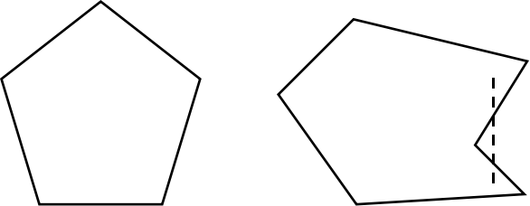
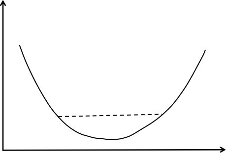
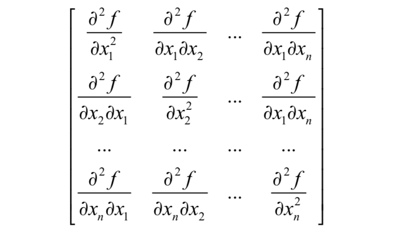
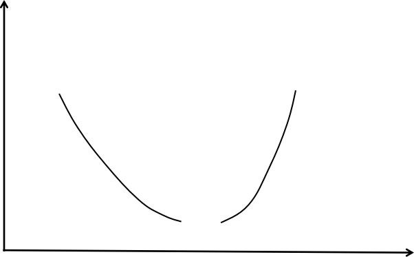

# 凸集、凸函数、凸优化简介
求解一个一般性的最优化问题的全局极小值是很困难的，至少要面临的一个问题是：函数可能有多个局部极小值点，另外还有鞍点的问题。

梯度下降法和牛顿法等是基于导数作为判据的优化算法，找到的都是导数/梯度为0的点，而梯度等于0只是取得极值的必要条件而不是充要条件，但是如果我们把这个必要条件转换为充分条件，即：
$$x点出的梯度等于0  \rightarrow x是问题的最优解$$
问题将会得到简化。

如果对问题加以限定，是可以保证上面这个条件成立的。其中一种限制方案是：

**对于目标函数，我们限定它是凸函数；对于优化变量的可行域（还要包括目标函数定义域的约束），我们限定它是凸集。**

同时满足这两个限制条件的最优化问题就是凸优化问题，这类问题有一个非常好的性质，**那就是局部最优解一定是全局最优解。**
接下来，我们先介绍凸集和凸函数的概念。

## 凸集
在介绍凸集之前，先介绍一下空间中的向量表示，假设已知二维平面上的两个定点$A(5,1), B(2,3)$，那么线段$AB$上的任意一点的方程表示如下：
$$\vec{x} = \theta \vec{a} +(1-\theta)\vec{b},\theta \in [0,1]$$
其中$\vec{a}和\vec{b}$可以看成是$A、B$的向量表示。
- 推导过程如下，AB线段的向量表示为$\vec{AB}=\vec{b} - \vec{a}$，那么线段AB上的任意一点$\vec{x}$的表示为：
- $$\vec{x} = \vec{a} + \theta \vec{AB} = \vec{a} + \theta(\vec{b} - \vec{a}) = \theta\vec{b}+(1-\theta)\vec{a}, \theta \in [0,1]$$
- 也可以写成$\vec{x} = \theta \vec{a} +(1-\theta)\vec{b},\theta \in [0,1]$

对于$n$维空间中点的集合$C$，如果对于集合中的任意两点$x$和$y$，以及实数$0 \leq \theta \leq 1$，都有：
$$\theta x+ (1-\theta)y \in C$$
则称该集合为凸集。

具体到上面介绍的线段表示，也就是说如果点$x和y$在集合C内，则线段$x_1x_2$上所有点都在集合C内。
相应的，点$\theta x+(1-\theta)y$称为点$x和y$的凸组合，下图是凸集和非凸集的示意图，左边是一个凸集，右边是一个非凸集：

下面是一些凸集的结论，记住他们对理解后续的算法有很大的帮助。

n维实向量空间$R^n$，显然如果$x,y \in R^n$，则有：
$$\theta x + (1-\theta) y \in R^n$$
**这一结论的意义在于如果一个优化问题是不带约束的优化，那么其优化变量的可行域是一个凸集。**

仿射子空间：

给定m行n列的矩阵A和m维向量b，仿射子空间定义为如下向量的集合：
$$\{x\in R^n:Ax=b \}$$
假设$x,y \in R^n$，并且：
$$Ax=b, Ay=b$$
对于任意的$0 \leq \theta \leq 1$，我们都有：
$$\begin{aligned}
    A(\theta x +(1-\theta)y) =& \theta Ax +(1-\theta)Ay \\
        =& \theta b +(1-\theta)b \\
        =&b 
\end{aligned}$$
这一结论的意义在于，**如果一组约束是线性等式约束，则它确定的可行域就是一个凸集。**

多面体：

多面体定义为如下向量的集合：
$$x\in R^n：Ax \leq b$$
它就是线性不等式围成的区域。

对于多面体内部的任意两点$x,y\in R^n，并且Ax \leq b，Ay \leq b$，如果$0 \leq \theta \leq 1$，则有：
$$A(\theta x +(1-\theta)y) = \theta Ax +(1-\theta)Ay \leq \theta b +(1-\theta)b = b$$
这一结论的意义在于，**如果一组约束是线性不等式约束，则它定义的可行域是凸集。**
在实际应用中，我们遇到的等式和不等式约束一般都是线性的，而他们定义的可行域都是凸集。

**一个重要的结论：多个凸集的交集还是凸集。**证明如下：

假设$C_1,...,C_k$是凸集，他们的交集为$\cap_{i=1}^{k}C_i$.那么对于任意的点$x,y \in \cap_{i=1}^{k}C_i,并且0\leq \theta \leq 1$，由于$C_1,...,C_k$为凸集，所以有：
$$\theta x +(1-\theta)y \in C_i,\qquad \forall i=1,...,k $$

属于任意的一个$C_i$，也就是为他们的交集，即：
$$\theta x +(1-\theta)y \in \cap_{i=1}^{k}C_i$$
**这个结论的实际意义在于，如果每个等式或者不等式约束条件定义的集合都是凸集，那么这些条件联合起来定义的集合还是凸集。**

**而我们遇到的优化问题中，可能有多个等式和不等式约束，只要每个约束条件定义的可行域是凸集，则同时满足这些约束条件的可行域还是凸集。需要注意的是，凸集的并集并不是凸集。**

## 凸函数
在微积分中我们学习过凸函数的定义，下面来回忆一下。在函数的定义域内，如果对于任意的x和y,以及实数$0\leq \theta \leq 1$，都满足如下条件：
$$f(\theta x +(1-\theta y)) \leq \theta f(x) +(1-\theta)f(y)$$
则函数为凸函数。这个不等式和凸集的定义类似。
从图像上看，一个函数如果是凸函数，那么它是向下凸出去的（向上凹的）。
用直线连接函数上的任意两点A和B，线段AB上的点都在函数的上方，如下所示：

如果把上面不等式中的等号去掉，即：
$$f(\theta x +(1-\theta)y) \le \theta f(x) +(1-\theta)f(y)$$

则称函数是严格的凸函数。

凸函数的一阶判定规则为：
$$f(y)\geq f(x) + \nabla f(x)^T(y-x)$$
其几何解释为函数在任何点处的切线都位于函数的下方。

对于一元函数，凸函数的判定规则为其二阶导数大于等于0，即：
$$f''(x) \geq 0$$
如果去掉上面的等号，则函数是严格凸的。

对于多元函数，如果它是凸函数，则其Hessian矩阵为半正定矩阵（特征值大于等于0）。如果Hessian矩阵是正定的，则函数是严格凸函数。

Hessian矩阵是由多元函数的二阶偏导数组成的矩阵，如果函数$f(x_1,...,x_n)$二阶可导，Hessian矩阵定义为：

这是一个n阶矩阵，一般情况下，多元函数的混合二阶偏导数与求导次序无关，即：
$$\frac{\alpha^2f}{\alpha x_i \alpha x_j} = \frac{\alpha^2f}{\alpha x_j \alpha x_i}$$
因此Hessian矩阵可以看成是一个对称矩阵，Hessian矩阵也可以简写为$\nabla^2f(x)$。

根据多元函数极值判别法，假设多元函数在点M的梯度为0，即M是函数的驻点，则有：
1. 如果Hessian矩阵正定，函数在该点有极小值；
2. 如果Hessian矩阵负定，函数在该点有极大值；
3. 如果Hessian矩阵不定，则不是极值点（鞍点）；

这可以看做是一元函数极值判别法对多元函数的推广，Hessian矩阵正定类似于二阶导数大于0，其他的以此类推。

对于n阶矩阵A，对于任意的非0的n维向量x都有：
$$x^TAx > 0$$
则对称矩阵A为正定矩阵。判定矩阵正定的常用方法有以下几种：
1. 矩阵的特征值全大于0；
2. 矩阵的所有顺序主子式都大于0；
3. 矩阵合同于单位阵I

类似的，如果一个n阶矩阵A,对于任何非0的n维向量x，都有：
$$x^Tx < 0$$
则称矩阵A为负定矩阵。

如果满足：
$$x^TAx \geq 0$$
则对称矩阵A为半正定矩阵。

**一个重要结论是，凸函数的非线性组合还是凸函数，假设f_i是凸函数，并且$W_i \geq 0$，则：**
$$f(x)=\sum_{i=1}^k w_if_i(x)$$
是凸函数。可以按照凸函数的定义来进行证明，很简单就可以证出来。

下水平集：

给定一个凸函数以及一个实数$\alpha$，函数$\alpha$的下水平集定义为函数值小于等于$\alpha$的点构成的集合：
$$\{x\in D(f): f(x) \leq \alpha \}$$
根据凸函数的定义，很容易证明该集合是一个凸集。
**这个概念的用途在于，我们需要确保优化问题中的一些不等式约束条件定义的可行域是凸集，如果是凸函数构成的不等式，则是凸集。**

## 凸优化
有了凸集和凸函数的定义之后，我们就可以给出凸优化的定义。
**如果一个最优化问题的可行域是凸集，并且目标函数是凸函数，则该问题为凸优化问题。**
凸优化问题可以形式化的写成：
$$\begin{aligned}
    &min  \quad f(x) \\
    &x \in C
\end{aligned}$$
其中$x$为优化变量，f为凸目标函数，C是优化变量的可行域，是一个凸集。

**这个定义给了我们一个证明问题是凸优化问题的思路，即证明目标函数是凸函数（一般证明他的Hessian矩阵是半正定的），可行域是凸集。**
凸优化的另一种通用写法是：
$$\begin{aligned}
    &min \quad f(x) \\
    &g_i(x) \leq 0, i=1,...,m\\
    &h_i(x) =0, i=1,...,p
\end{aligned}$$

其中$g_i(x)$是不等式约束，为凸函数；$h_i(x)$是等式约束，为仿射函数。

上面的定义中不等式的方向非常重要，因为一个凸函数的0-下水平集是凸集。

因此这些不等式共同定义的可行域是一些凸集的交集，仍然为凸集。
通过将不等式两边同时乘以-1，可以保证把不等式写成小于号的形式。
前面已经证明仿射空间是凸集，因此加上这些等式约束后可行域还是凸集。

### 局部最优解和全局最优解
对于一个可行点x，如果在其领域内没有其他点的函数值比该点小，则称该点位局部最优，下面给出这个概念的严格定义：
对于一个可行点，如果存在一个大于0的实数$\delta$，对于所有满足：
$$||x-z|| \leq \delta$$
即x的$\delta$领域内的点z，都有：
$$f(x) \leq f(z)$$
则称x为局部最优点。

对于一个可行点x，如果可行域内所有点z出的函数值都比这点处大，即：
$$f(x) \leq f(z)$$

则称x为全局最优点，全局最优解可能不止一个。

**凸优化问题有一个重要的特性：所有局部最优解都是全局最优解。**
这个特性可以保证我们在求解时不会陷入局部最优解，即如果找到了问题的一个局部最优解，则它一定是全局最优解。
这就极大地简化了我们的问题求解的过程。

具体的证明过程，采用反证法，如下：
- 假设$x^*$是局部极小，不是全局极小，则一定存在$x'$使得：
$$f(x') < f(x^*)$$
- 则凸组合点$x = \theta_1 x' + \theta_2 x^*, \sum\theta_i=1$，有：
$$f(x) \leq \theta_1 f(x') + \theta_2 f(x^*) < f(x^*) $$
那么当$\theta_2 \rightarrow 1$时，则x点无限趋近于$x^*$，即x是$x^*$领域中的一点，但是却存在$f(x)<f(x^*)$，这与$x^*$是局部极小值矛盾。

因此：凸优化问题的局部极小值就是全局极小值

之所以凸优化问题的定义要求目标函数是凸函数，并且优化变量的可行域是凸集想，是因为缺少其中的任何一个条件都不能保证局部最优解是全局最优解，下面来看两个反例。

情况1：可行域是凸集，函数不是凸函数，这样的例子如下图所示：

上图中，优化变量的可行域是整个实数集，显然是凸集，目标函数不是凸函数，有两个局部最小值，这不能保证局部最小值就是全局最小值。

情况2：可行域不是凸集，函数是凸函数，这样的例子如下图所示：

在上图中可行域不是凸集，中间有断裂，目标函数还是凸函数。
在曲线的左边和右边各有一个最小值，不能保证局部最小值就是全局最小值。
那么由于凸优化的目标函数时凸函数，Hessian矩阵半正定，因此不会出现鞍点，所以找到的梯度为0的点一定是极值点。

### 求解算法
对于凸优化问题，可以使用的求解算法很多，包括常用的梯度下降法，牛顿法，拟牛顿法等，他们都能保证收敛到全局最小值点。

## 机器学习中的凸优化问题
下面我们来列举一些机器学习中的经典的凸优化问题。
### 线性回归
线性回归是最简单的有监督学习算法，它拟合的目标函数是一个线性函数。假设有I个训练样本$(x_1,y_i)$，其中$x_i$为特征向量，$y_i$为实数标签值，线性回归的预测函数定义为：
$$f(x) = W^Tx+b$$
其中权重向量$w$和偏置项b都是训练要确定的参数。定义损失函数为误差平方和的均值：
$$L = \frac{1}{2l}\sum_{i=1}^l (f(x_i)-y_i)^2$$

将回归函数代入，可以得到如下的损失函数：
$$L=\frac{1}{2l}\sum_{i=1}^l (W^Tx_i+b-y_i)^2$$
将b也看成是一个权重向量，可以简化为：
$$L=\frac{1}{2l}\sum_{i=1}^l (W^Tx_i-y_i)^2$$

下面我们来证明这个函数是凸函数。目标函数展开之后为：
$$L=\frac{1}{2l}\sum_{i=1}^l ((W^Tx_i)^2 +y_i^2 -2y_iW^Tx_i)$$

它的二阶偏导数为：
$$\frac{\alpha^2L}{\alpha w_i \alpha w_j}=\frac{1}{l}\sum_{k=1}^l x_{k,i}x_{k,j}$$
因此，它的
后续相关机器学习中的凸优化推导见
https://zhuanlan.zhihu.com/p/37108430