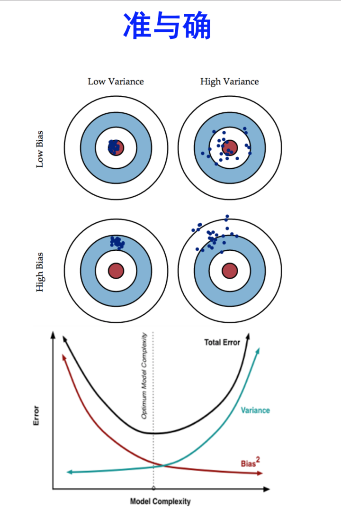

我们常常见到这句话：bagging是减少variance（方差），而boosting是减少bias（偏差）的。这句话具体应该如何理解呢？

## variance 和 bias
先看一下什么是variance和bias, 具体的情况如下：

High variance 是模型过于复杂，导致overfit，记住了太多的noise，所以数据分布较散；

High bias是模型欠拟合，模型过于简单，预测点与真实分布相差较多。

## bagging为何会减小variance
bagging对样本有重放回操作（重采样），对每一次重采样得到的子样本集训练一个模型，最后再取平均。
由于子样本集的相似性以及使用的是相同的模型，因此各个子模型**有近似相等的bias和variance**.事实上，各个模型的分布近似相同，但是并不独立。

为了方便进行推导，我们不妨假设各个子模型的bias和variance都完全相等，因此：
$$E(\frac{\sum X_i}{n}) = E(X_i)$$
推导过程，我们可以先假设$n=2$，即只有两个随机变量$X_1和X_2$：
$$E(\frac{\sum X_i}{n}) = E(\frac{X_1+X_2}{2}) = \frac{1}{2}E(X_1+X_2) = \frac{1}{2}E(2X_1)=E(X_1)=E(X_i)$$

所以采用bagging的方法（多个模型有放回采样，等权重投票法）后的bias与单个子模型的bias接近，也就是说bagging的方法不能降低bias。

另一方面，若各个子模型相互独立，则有$Var(\frac{\sum X_i}{n}) = \frac{Var(X_i)}{n}$，此时可以显著的降低variance。

若各个子模型完全相同，则$Var(\frac{\sum X_i}{n}) =Var(X_i)$, 此时不会降低variance。

**而bagging方法得到的各个子模型是有一定的相关性的（重采样的过程可能会采样到相同元素），属于上面两个极端情况的中间态，那么可以在一定程度上降低variance。**

关于variance的推导过程如下，同样假设只有两个随机变量$X_1和X_2$。

当$X_1和X_2$完全独立时：
$$\begin{aligned}
    Var(\frac{\sum X_i}{n}) =& Var(\frac{X_1+X_2}{2}) \\
    =& \frac{1}{4}Var(X_1+X_2)  \\
    =& \frac{1}{4}(Var(X_1)+Var(X_2)) \\
    =& \frac{1}{4}(2Var(X_1)) \\
    =& \frac{Var(X_i)}{2} \\
    =& \frac{Var(X_i)}{n}
\end{aligned}$$

当$X_1$和$X_2$完全相关时，如下：
$$\begin{aligned}
    Var(\frac{\sum X_i}{n}) =& Var(\frac{X_1+X_2}{2}) \\
    =& \frac{1}{4}Var(X_1+X_2)  \\
    =& \frac{1}{4}(Var(X_1)+Var(X_2)+ 2Var(X_1) ) \\
    =& Var(X_1) \\
    =& Var(X_i) 
\end{aligned}$$

## boosting为何会减小bias

bossting从优化角度来思考，是用forward-stagewise这种贪心算法来最小化损失函数$L(y, \sum_{i}a_if_i(x))$。

例如，常见的AdaBoost算法，即用这种方法来最小化exponential loss: $L(y, f(x))=exp(-yf(x))$。

所谓的forward-stagewise，就是在迭代的第n步，求解新的子模型f(x)以及步长a（或者叫做组合系数），来最小化$L(y, f_{n-1}(x)+af(x))$,
这里的$f_{n-1}(x)$是前n-1步得到的子模型之和。

因此, boosting是在sequential地最小化损失函数，其bias自然逐步下降。但是由于采取这种序列降低损失函数的策略，所以各个子模型之间是强相关的，于是子模型之和并不能显著地降低variance。所以说boosting主要是依靠降低bias来提升预测准确精度。

