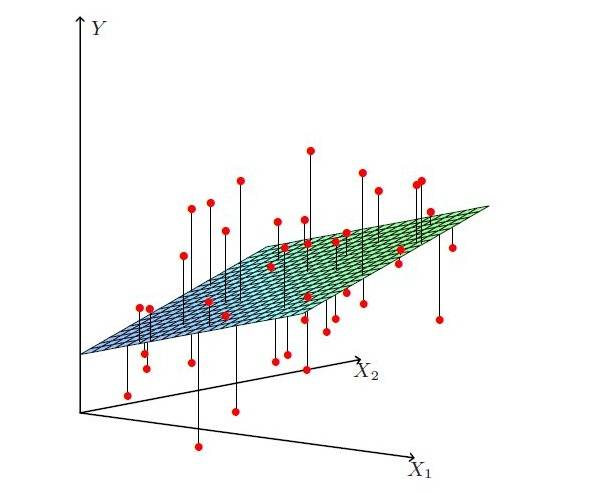

我们先来了解下最小二乘的思想。**简单的来说，最小二乘的思想就是要使得观测点和估计点的距离的平方和达到最小。**这里的二乘指的是用平方来度量观测点与估计点之间的远近，最小则指的是参数的估计值要保证各个观测点与估计点之间的距离的平方和达到最小。

## 一元线性回归
假设我们的模型只有一维数据时，模型就是一条直线$f(x)=ax+b$，我们有$m$条训练数据，训练损失函数为误差平方和的平均数：
$$L(a,b) = \frac{1}{m}\sum_{i=1}^{m}[(ax_i + b)-y_i]^2$$

可以对a和b分别求导，导数为0时，损失函数最小。

$$\begin{aligned}
    \frac{\partial}{\partial a}L(a,b) =&\frac{2}{m}\sum_{i=1}^m x_i(ax_i + b -y_i) \\
    =& \frac{2}{m}(a\sum_{i=1}^m x_i^2 - \sum_{i=1}^m(y_i-b)x_i)
\end{aligned}$$

$$\begin{aligned}
    \frac{\partial}{\partial b} L(a,b) =& \frac{2}{m}\sum_{i=1}^m ax_i + b - y_i \\
    =& \frac{2}{m}(mb - \sum_{i=1}^m(y_i - ax_i))
\end{aligned}$$

上面两个公式是损失函数$L$对$a$和$b$进行求偏导。当导数为0时，可以求得损失函数的最小值，即：
$$\begin{cases}
    &\frac{\partial}{\partial a}L(a,b) = 0 \rArr \frac{2}{m}(a\sum_{i=1}^m x_i^2 - \sum_{i=1}^m(y_i-b)x_i) = 0 \\
    &\frac{\partial}{\partial b}L(a,b)=0 \rArr \frac{2}{m}(mb - \sum_{i=1}^m(y_i - ax_i)) = 0
\end{cases}$$

这个求解过程，有一些trick会用到：
$$m\overline{x} = \sum_{i=1}^m x_i; \qquad m\overline{y} = \sum_{i=1}^m y_i$$

于是上式$\frac{\partial}{\partial b}L(a,b)$可以简化为：
$$mb = m\overline{y} - am \overline{x} \rArr b = \overline{y} - a\overline{x}$$
再把上式代入到$\frac{\partial}{\partial a}L(a,b)$的结果中，可以得到：
$$\begin{aligned}
    &a\sum_{i=1}^m x_i^2 - \sum_{i=1}^mx_iy_i + \sum_{i=1}^m(\overline{y}-a\overline{x})x_i = 0 \\
\rArr &a = \frac{\sum_{i=1}^m x_iy_i - \overline{y}\sum_{i=1}^m x_i}{\sum_{i=1}^mx_i^2 - \overline{x}\sum_{i=1}^mx_i} \\
\rArr &a = \frac{\sum_{i=1}^m(x_i - \overline{x})(y_i - \overline{y})}{\sum_{i=1}^m(x_i - \overline{x})^2} \qquad (运用了求和性质)
\end{aligned}$$

求和性质证明如下：

所以对于$y=ax+b$得到的普通最小二乘解为：
$$\begin{cases}
    a &= \frac{\sum_{i=1}^m(x_i - \overline{x})(y_i - \overline{y})}{\sum_{i=1}^m(x_i - \overline{x})^2} \\
    b &= \overline{y} - a\overline{x}
\end{cases}$$

## 多元线性回归
更为一般的情况下，特征是多维的：
$$f(x_i) = w^Tx_i$$

上面的公式中，我们其实是使用$b=w_0$来表示参数中的$b$，将$b$添加到特征向量中，将$n$维特征扩展为$n+1$维，也就是在每个$x_i$中添加一个值为1的项。各个向量和矩阵形状如下面公式所示：
$$w=\left [ \begin{matrix}
    w_0 \\
    w_1 \\
    \vdots \\
    w_n
\end{matrix}\right ] \qquad X = \left [ \begin{matrix}
    x_1 \\
    x_2 \\
    \vdots \\
    x_m
\end{matrix} \right ]=\left ( \begin{matrix}
    &1 \quad &x_{11} \quad &x_{12} \quad &\cdots \quad &x_{1n} \\
    &1 \quad &x_{21} \quad &x_{22} \quad &\cdots \quad &x_{2n} \\
    &\vdots \quad &\vdots \quad &\ddots \quad &\vdots \quad &\vdots \\
    &1 \quad &x_{m1} \quad &x_{m2} \quad &\cdots \quad &x_{mn}
\end{matrix} \right ) y=\left [\begin{matrix}
    y_1 \\
    y_2 \\
    \vdots \\
    y_m
\end{matrix}\right ]$$
矩阵$X$的每一行是一个样本，每个样本有$n+1$个特征值。

用矩阵乘法的形式表示则为：
$$y=Xw$$
其中：
$$y_i = \sum_{j=0}^n w_j x_{ij}$$

一般机器学习领域都常用矩阵乘法的形式来表示一个模型。

与一元线性回归相比，多元线性回归的最优解不是一条直线，是一个多维空间中的超平面，训练数据散落在超平面的两侧。

多元线性回归，一般寻求找到最优超平面，使得点到超平面的距离最小，也是用平方差来衡量，具体超平面如下：

具体的损失函数则是：
$$L(w) = (Xw - y)^T(Xw-y) = ||Xw-y||^2_2$$
多元线性回归的损失函数仍然使用"预测值-真实值"的平方来计算，上面公式为整个模型损失函数的向量表示。

对线性回归损失函数公式中的向量$w$求导，令导数为0：
$$\begin{aligned}
    \frac{\partial}{\partial w}L(w) &= 2X^T(Xw-y) = 0 \\
    &\dArr \\
    X^TXw &= X^Ty \\
    &\dArr \\
    w &=(X^TX)^{-1}X^Ty
\end{aligned}$$

上面的公式就是$w$的解，这是一个矩阵方程，使用这种方法求最优解，其实就是在解这个矩阵方程。

**但是这个方式有两个问题，这种方法只有在$X^TX$是满秩或正定时，才能解方程组。还有一个问题是，公式中的矩阵求逆的计算量比较大，复杂度在$O(n^3)$级别。当特征维度达到百万及以上的时候，计算时间就会非常长，单台计算机内存甚至都存不下这些参数。**

## 梯度下降法
在求解损失函数时，或者说在求解损失函数最小的优化问题时，经常使用搜索的方法，具体而言，就是选取一个点作为起始点，然后不断搜索，损失函数逐渐变小，最后找到使得L(w)最小的w。

公式为：
$$w_j := w_j - \alpha \frac{\partial}{\partial w_j}L(w)$$

如果我们只考虑一个样本$(x_i,y_i)$的情况，由$L(w)=\frac{1}{2}(f(x_i)-y_i)^2$可以得到：
$$\begin{aligned}
    \frac{\partial}{\partial w_j}L(w) &= \frac{\partial}{\partial w_j}\frac{1}{2}(f(w_i)-y_i)^2 \\
    &= (f(x_i)-y_i)\cdot \frac{\partial}{\partial w_j}(\sum_{j=0}^{n}w_jx_{i,j}-u_i) \\
    &= (f(x_i)-y_i)x_{i,j}
\end{aligned}$$

所以，对于每个样本的更新规则为：
$$w_j := w_j - \alpha (f(x_i)-y_i)x_{i,j}$$

### 批梯度下降
对于批梯度下降，就是再求梯度时，不是只考虑一个样本，而是考虑所有的m个样本：
$$\begin{aligned}
    \frac{\partial}{\partial w_j}L(w) &=\frac{\partial}{\partial w_j}\frac{1}{2}\{(f(x_1)-y_1)^2 + ... + (f(x_m)-y_m)^2\} \\
    &= (f(x_1)-y_1)x_{1j} + ... +(f(x_m)-y_m)x_{mj} \\
    &= \sum_{i=1}^m (f(x_i)-y_i)x_{ij}
\end{aligned}$$

所以，可以得到对每一个$w_j$的导数：
$$w_j := w_j - \alpha \sum_{i=1}^m (f(x_i)-y_i)x_{ij}$$

### 随机梯度下降
批梯度下降在更新时，考虑了所有的样本，但是当数据量很大时，每次迭代都用全部的数据，不现实。

所以一种方法就是随机梯度下降法，每次随机选取一定的样本数，参与梯度更新。最后的公式的区别就是求和符号的上限不再是$m$，而是一个随机值。

参考资料:

[线性回归的求解](https://juejin.im/post/6844904166955941902)

[普通最小二乘法的推导证明](https://blog.csdn.net/u011026329/article/details/79183114)