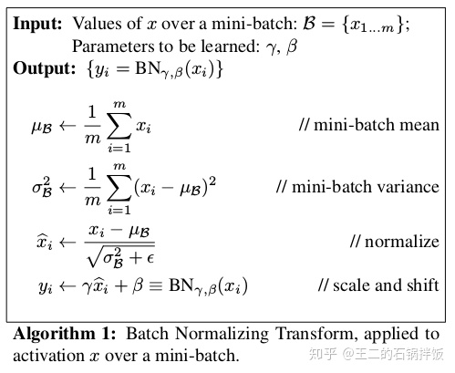
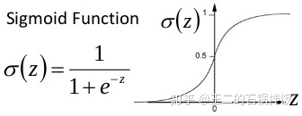

神经网络中BN层的具体计算方式如下：

BN层的具体作用主要有三个：
- 1，加快网络的训练和收敛的速度
- 2，控制梯度爆炸防止梯度消失
- 3，防止过拟合

分析：
- 1，加快收敛速度：在深度神经网络中，如果每层的数据分布都不一样的话，将会导致网络非常难以训练和收敛。而如果把每层的数据都转换到均值为0，方差为1的状态下，这样每层的数据的分布都是一样的训练就会比较容易收敛。
- 2，防止梯度爆炸和梯度消失：
 

- 以sigmoid函数为例, sigmoid函数使得输出在[0,1]之间
  
- 梯度消失：
  - 在深度神经网络中，如果网络的激活输出很大，其对应的梯度就会很小【可以理解为数值越大，变化相应梯度数值变化也会越大，这句话不一定正确】。 但是如果梯度很小，就会导致网络的学习速率很慢。
  - 假设网络中每层的学习梯度值都小于0.25，那么根据链式法则，往回传连乘后，梯度会越来越小。这就导致在一个很深的网络中，浅层几乎不学习，权值变化小，而后面几层网络一直在学习，后面的网络基本就可以表征整个网络，这样就失去了深度的意义。**使用BN层进行归一化以后，网络的输出就不会很大，梯度就不会很小。**

- 梯度爆炸：
  - 第一层偏移量的梯度 = 激活层斜率1 * 权值1 * 激活层斜率2 * ... * 权值(n-1) * 激活层斜率n。假设激活层斜率都是0.25, 如果所有层的权值都是100，这样梯度就会指数增加。（**使用bn层后权值的更新也不会很大。**）

- BN层防止过拟合：
  - 在网络的训练中，BN层的作用是使得一个batch里的所有样本都被关联在一起了，因此网络不会从某一个训练样本中生成确定的结果，即同样一个样本的输出不再仅仅取决于样本的本身，也取决于跟这个样本同属同一个batch的其他样本。**并且每次网络都是随机的选取batch，这样就会使得整个网络不会朝着一个方向使劲学习，在一定程度上可以避免了过拟合。**

## 为什么BN层一般都是放在线性层和卷积层后面，而不是放在非线性单元后面

**因为非线性单元的输出分布形状会在训练过程中发生变化，归一化无法消除它的方差偏移，相反的，全连接和卷积层的输出一般是一个对称的，非稀疏的一个分布，更加类似高斯分布，对他进行归一化会产生一个更加稳定的分布。**

其实仔细想想，像relu这样的激活函数，如果你输入的数据是一个高斯分布，经过他变化出来的数据能是一个什么形状呢？小于0的被抑制了，也就是小于0的部分直接就变成0了，这样的分布显然离高斯分布差很远。

