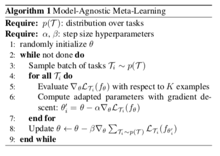

MAML即论文 Model-Agnostic Meta-Learning for Fast Adaptation of Deep Networks论文中提出的模型。

MAML可以用于supervised regression 和 classification以及Reinforcement Learning。

# 一，一些相关概念的介绍

在原论文中，作者直接引用了很多元学习的相关的概念，例如：**meta-learning, model-agnostic, N-way K-shot, tasks**等等，其中有些概念在MAML中还有特殊的含义。下面对这些概念进行一一介绍。

## 1, meta-learning
meta-learning 即元学习，也可以称为**learning to learn**。是常见的深度学习模型，目的是学习一个用于预测的数学模型。而元学习面向的不是学习的结果，而是学习的过程。其学习的不是一个直接用于预测的数学模型，而是学习"如何更快更好地学习一个数学模型"。

举一个现实生活中的例子。我们教小朋友读英语时，可以直接让他们模仿apple, banana的发音。 但是他们很快又会遇到新的单词，比如strawberry, 这时小朋友就需要重听你的发音，才能正确的读出这个新单词。我们换一种方式，这一次我们不教每个单词的发音，而是教音标的发音。从此小朋友在遇见新的单词，他们只要根据音标，就可以正确的读出这个单词。学习音标的过程，就是一个元学习的过程。

在深度学习中，已经被提出的元学习模型由很多，大致上可以分成
- learning good weight initializations
- meta-models that generate the parameters of other models
- learning transferable optimizers

其中MAML属于第一类。

MAML学习一个好的初始化权重，从而在新任务上实现fast adaptation，即在小规模的训练样本上迅速收敛并完成finetune.

## 2, model-agnostic
model-agnostic 即模型无关的. MAML与其说是一个深度学习模型，倒不如说一个框架，提供一个meta-learner用于训练base-learner。

这里的meta-learner即MAML的精髓所在，用于learning to learn。

而base-learner则是在目标数据集上被训练，并实际用于预测任务的真正的数学模型。绝大多数的深度学习模型都可以作为base-learner无缝嵌入到MAML中，而MAML甚至可以用于强化学习中，这就是MAML中model-agnostic的含义。

## 3, N-way K-shot
N-way K-shot是few-shot learning中常见的实验设置。few-shot learning指利用很少的被标记数据训练数学模型的过程。这也正是MAML擅长解决的问题之一。

N-way是指训练数据中有N个类别，K-shot是指每个类别下有K个被标记的数据。

## 4, task
MAML任务中多次出现task,模型的训练过程都是围绕着task展开的，而作者并没有给它下一个明确的定义。要正确的理解task，我们需要了解的相关概念包括：$D_{meta-train}, D_{meta-test}, support set, query set, meta-train classes, meta-test classes$等等。

我们先假设这样一个场景：我们需要利用MAML训练一个数学模型$M_{fine-tune}$，目的是对未知标签的图片做分类，类别包括$P_{1}~P_{5}$(每类5个已标注样本用于训练。另外每类有15个已标注样本用于测试)。

我们的训练数据除了$P_1~P_5$中已标注的样本外，还包括另外10个类别的图片$C_1~C_{10}$（每类30个已经标注样本），用于帮助训练元学习模型$M_{meta}$。

我们的实验设置为**5-way 5-shot**.

关于具体的训练过程，会在下一节MAML算法详解中进行介绍。这里我们只需要有一个大概的了解：MAML首先利用$C_1~C_{10}$的数据集训练元模型$M_{meta}$，再在$P_1~P_5$的数据集上精调(finetune)得到的最终的模型$M_{fine-tune}$。

此时，$C_1~C_{10}$即**meta-train classes**，$C_1~C_{10}$包含的共计300个样本，即$D_{meta-train}$，是用于训练$M_{meta}$的数据集。与之相对的,$P_1~P_5$即**meta-test classes**，$P_1~P_5$包含的共计100个样本，即$D_{meta-test}$，是用于训练和测试$M_{fine-tune}$的数据集。

根据5-way 5-shot的实验设置，我们在训练$M_{meta}$阶段，从$C_1~C_{10}$中随机取5个类别，每个类别再随机取20个已标注样本，组成一个task T.

其中5个已标注样本被称为T的support set，另外15个样本被称为T的query set。

这个task T, 就相当于普通深度学习模型训练过程中的一条训练数据。
那我们肯定要组成一个batch，才能做随机梯度下降SGD对不对。所以我们反复在训练数据分布抽取若干个这样的task T，组成一个batch。在训练$M_{fine-tune}$阶段，task, support set, query set的含义与训练$M_{meta}$阶段均相同。

# 二， MAML算法详解

该算法本质上是MAML预训练阶段的算法，目的是得到模型$M_{meta}$。

接下来我们一步一步的解析这个算法。

首先来看两个Require.

第一个Require指的是在$D_{meta-train}$中task的分布。结合我们在上一个小结举得例子，这里即反复随机抽取task T, 形成一个由若干个（比如1000）个T组成的task池，作为MAML的训练集。

那么显然，训练样本的数量就那么多，要组合形成那么多的task，岂不是不同task之间会存在样本的重复？或者某些task的query set会成为其他task的support set?

是的，是会存在这样的情况，但是我们要记住，MAML的目的，在于fast adaptation，即通过对大量task的学习，获得足够强的泛化能力，从而面对新的，从未见过的task时，通过finetune就可以快速拟合。

task之间，只要存在一定的差异就可以。再强调一下，MAML的训练时基于task的，而这里的每个task就相当于普通深度学习模型训练过程中的一条训练数据。

这里再强调一下，MAML的训练是基于task的，而这里的每个task就相当于普通深度学习模型训练过程中的一条训练数据。

第二个Require就很好理解了。step size其实就是学习率，MAML论文中有个很重要的词就是**gradient by gradient**。

MAML是基于二重梯度的，每次迭代包括两次参数更新的过程，所以有两个学习率可以进行调整。

下面是对算法流程的详细介绍。

**步骤1**，随机初始化模型的参数

**步骤2**，是一个循环，可以理解为一轮迭代过程或者一个epoch，当然了预训练的过程是可以有很多个epoch的。

**步骤3**，相当于pytorch中的DataLoader，即随机对若干个(比如4个)task进行采样，形成一个batch。

**步骤4~7**, 是第一次进行梯度更新的过程。注意这里我们其实可以理解为copy了一个原模型，计算出新的参数，用在第二轮梯度的计算过程中。

我们说过，MAML是gradient by gradient的，有两次梯度更新的过程。步骤4~7中，利用batch中的每一个task, 我们分别对模型的参数进行更新(4个task即更新4次)。注意这个过程在算法中是可以反复执行多次的，伪代码没有体现这一层循环【也就是对同一个训练数据，多次迭代计算拟合逼近】。

步骤5，即对利用batch中的某一个task中的support set，计算每个参数的梯度。在N-way K-shot的设置下，这里的support set应该有NK个。作者在算法中写with respect to K examples，默认对每一个class下的K个样本做计算。实际上参与计算的总计有NK个样本。这里的loss计算方法，在回归问题中，就是MSE；在分类问题中，就是cross-entropy。

步骤6， 即第一次梯度的更新。

步骤4～步骤7，结束后，MAML完成了第一次梯度更新。

接下来我们要做的，是根据第一次梯度更新得到的参数，通过gradient by gradient，计算第二次梯度更新。第二次梯度更新时计算出的梯度，直接通过SGD作用于原模型上，也就是我们的模型真正用于更新其参数的梯度。

步骤8即对应第二次梯度更新的过程。这里的loss计算方法，大致与步骤5相同，但是不同点有两处。一处是我们不再是分别利用每个task的loss更新梯度，而是像常见的模型训练过程一样，计算一个batch的loss总和，对梯度进行随机梯度下降SGD。另一处是这里参与计算的样本，是task中的query set，在我们的例子中，即5-way*15=75个样本，目的是增强模型在task上的泛化能力，避免过拟合support set。步骤8结束后，模型结束在该batch中的训练，开始回到步骤3，继续采样下一个batch。

上面就是MAML预训练得到$M_{meta}$的全部过程。

其中要注意的点是：
- 1，只使用了$Q_1~Q_{10}$的数据，没使用$P_1~P_5$的数据
- 2，两次梯度更新，第一次梯度更新就相当于只使用单个task的训练集进行梯度更新，第二次梯度更新就是用第一个梯度更新的模型计算对query set的损失，然后更新原始模型参数。第一次梯度更新只计算一个task的损失然后进行更新，第二次梯度更新是只计算一个batch 的损失，然后更新原函数。

fine-tune的过程与预训练的过程大致相同，不同的地方主要在于以下几点：
- 步骤1中，fine-tune不用再随机初始化参数，而是利用训练好的 [公式] 初始化参数。
- 步骤3中，fine-tune只需要抽取一个task进行学习，自然也不用形成batch。fine-tune利用这个task的support set训练模型，利用query set测试模型。实际操作中，我们会在$D_{meta-test}$ 上随机抽取许多个task（e.g., 500个），分别微调模型$M_{meta}$，并对最后的测试结果进行平均，从而避免极端情况。
- fine-tune没有步骤8，因为task的query set是用来测试模型的，标签对模型是未知的。**因此fine-tune过程没有第二次梯度更新，而是直接利用第一次梯度计算的结果更新参数。**

