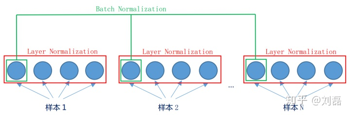

Batch Normalization和Layer Normalization都是对数据进行归一化。

Batch Normalization的处理对象是对一批样本，Layer Normalization的处理对象是单个样本。

比如由两个样本$x_1,x_2$，假设组成的向量是:$[[1,2,3],[4,5,6]]$, 

那么batch normalization是对这批样本的同一维度特征做归一化，而Layer Normalization是对这个样本的所有维度特征做归一化。

具体来说就是batch normalization计算均值时，是计算(1+4)/2=2.5, (2+5)/2=3.5, (3+6)/2=4.5，然后在计算对应的方差，继而在进行减去均值除以方差，最后在进行与$\alpha$相乘，加上$\beta$进行特征转换。

而Layer Normalization则是对这个样本的所有特征维度进行归一化，

具体来说layer normalization计算均值时，是计算(1+2+3)/2=2, (4+5+6)/2=5，然后在计算对应的方差，
继而在进行减去均值除以方差，最后在进行与$\alpha$相乘，加上$\beta$进行特征转换。

具体的计算方式的对比如下：

Batch Normalization的缺点如下：
- 1，BN特别依赖batch size；当batch size很小的时候，BN的效果就不理想了。而在很多情况下，你的batch size大不了，因为你的GPU显存是不够的。
- 2，BN对处理序列化的数据的网络，比如RNN是不太适用的。我觉得主要是因为序列化数据之间在batch上做归一化是不合理的。
- 3, BN只在训练的时候用到，inference的时候用不到，因为inference的时候输入不是批量输入的

而LN只对单个样本进行归一化，可以避免上面BN的缺陷。

LayerNorm层的参数是一个weight和一个bias，就是前面说的那个$\alpha$和$\beta$。比如数据的维度是[2,10,768]，那么weight和bias的维度就都是[768]。 对于所有的样本都是同一个weight和bias

总结如下：
- batch normalization是"竖着"来计算的，对各个维度进行归一化，所以与batch size有关
- layer normalization是"横着"来计算的，对同一个样本的不同维度进行归一化，只和单个样本的向量表示有关。
- layer norm这类归一化技术，目的是让每一层的分布稳定下来，让后面的层可以在前面层的基础上安心学习知识。所以bert里面在加入残差后，会有一个Layer Norm层进行归一化。
- batch norm是通过batch size这个维度归一化来让分布稳定下来。Layer Norm是通过对hidden size这个维度进行归一。

