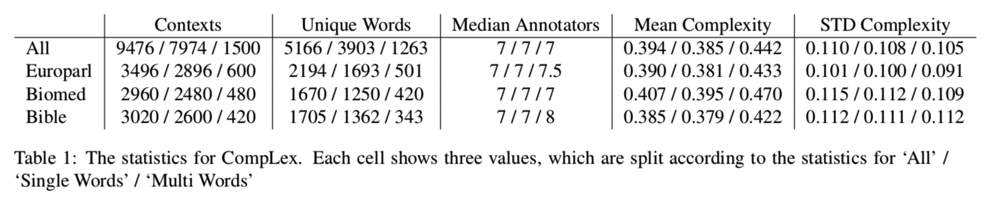
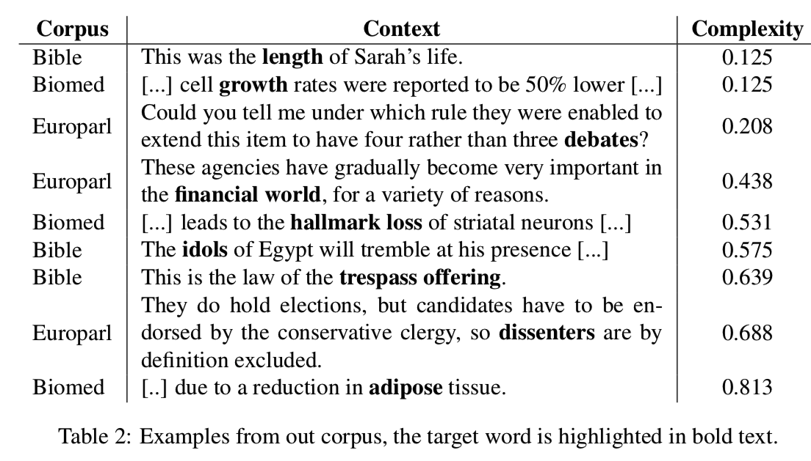
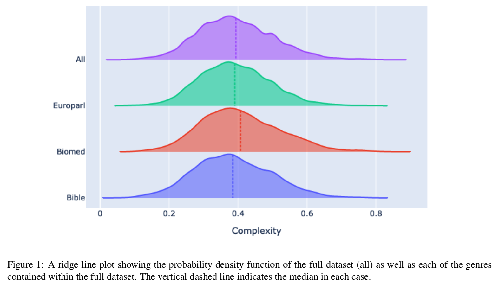
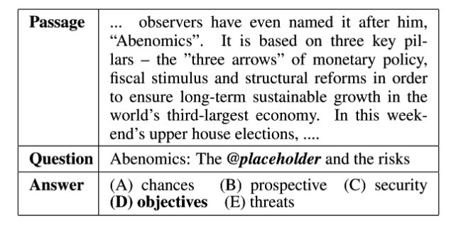
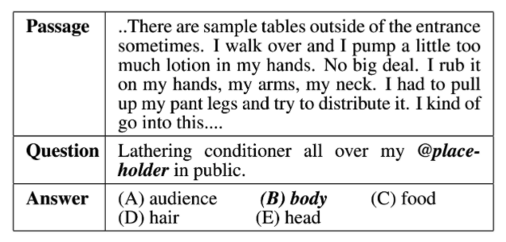
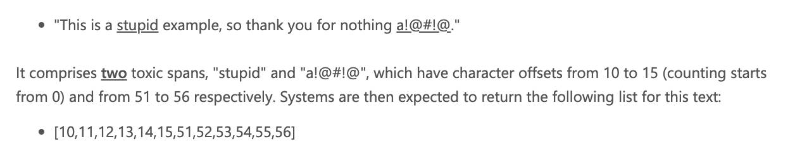
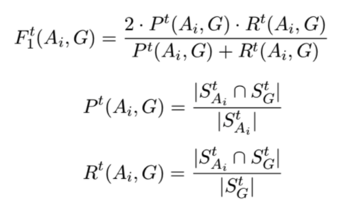

时间线
Important dates - updated July 21, 2020

- Task proposals due: April 3, 2020
- Task selection notification: May 25, 2020
- 2021 tasks announced: June 19, 2020
- Trial data ready: July 31, 2020
- Task website ready: August 14, 2020
- Training data ready: October 1, 2020
- Test data ready: December 3, 2020
- Evaluation start: January 10, 2021
- Evaluation end: January 31, 2021
- Paper submission due: February 23, 2021
- Notification to authors: March 29, 2021
- Camera ready due: April 5, 2021
- SemEval workshop: Summer 2021

# Lexical semantics(词汇语义)
## Task1: Lexical Complexity Prediction (LCP) 

词汇复杂度在阅读理解中扮演着很重要的角色，预测词汇的复杂度可以更好地辅助系统去指导人们修改他们的文章。

NLP系统也可以帮助将文本进行简化，可以更好地帮助那些L2语言学习者

### Task and data
数据来源于多个domain的English Dataset，句子标注用1~5个分值进行标注。
数据集标注论文：https://arxiv.org/pdf/2003.07008.pdf

这个任务就是去预测在context中的word的复杂度。

LCP任务会被划分成为两个子任务：
- sub-task1：预测单个词（single word）的复杂度
- sub-task2：预测多个词组成的表达（multi-word expressions）的复杂度

1~5的评判标准：
- 1: Very Easy: Very familiar words.

- 2: Easy: An annotator was aware of the meaning.

- 3: Neutral: Neither difficult nor easy.

- 4: Difficult: Words for which an annotator was unclear of the meaning, but may have been able to infer the meaning from the sentence.

- 5: Very Difficult: Words that an annotator had never seen before, or were very unclear. 

### 数据论文CompLex：A new corpus for lexical complexity prediction from Likert Scale Data
以前的复杂词识别，都是针对单个词，并且都是二分类，作者提出的这个数据集是第一个提出来识别连续词表示复杂度的。

数据集来源于三个domain：
- the Bible(圣经)
- Europarl（欧洲议会程序部分，与欧洲的一些政策有关的部分）
- biomedical text（生物医学文本）

以前举办的复杂词识别任务- Complex Word Identification （CWI） **SemEval-2016 Task11**，只包含了英语，并且训练集的数量远小于测试集的数据量
以及CWI 2018【也叫做BEA2018】,包含多种语言

作者采取了三种特征：glove embedding, infersent embedding, hand crafted features进行了线性回归实验,
并给出了他们的均方误差损失值0.0853

整个数据集的数据统计：

作者是按照频率选取单词，因为频率往往就和复杂度相关，然后每个实例都有20个标准人员去标注，然后使用标注平台内部的控制标准去删除一些标注。

其中1~5，作者会分别标注为0,0.25,0.5,0.75,1.0，然后求复杂度的均值。

然后多个词的标注，作者只采取了两个词，组合为noun-noun和adj-noun的。

具体的标注例子：

最后词的复杂度分布：

## Task2 Multilingual and Cross-lingual Word-in-Context Disambiguation(多语言和跨语言上的消歧)
这个任务主要是做判定一个单词在两个句子中是否表示同一个意思，还包括了跨语言，
这个跨语言就是在L1语言中的单词w1和其对应的在L2中的翻译w2，是否表示同一个意思。

标签主要分为三种：
- T: 两个单词表示的意思完全一致
- R: 两个单词表示的意思相关，比如自动同名的（drink in the meaning of drink alcohol and in the meaning of drink a beverage）; 比如自动反义词的（citation in the meaning of award and its opposite meaning of penalty.奖励和惩罚的含义相反）
- F: 使用的是两个完全不同的意思。（比如race在competition中表示赛跑，参加比赛等，而在breed相关的文本中表示种族）

本工作是延续2018年的Pilhevar的工作。2018年的WSD任务都是英语句子，并且只有T和F，没有R这个分类

MCL_WIC的特点：
- 他包含多个语言和跨语言的句子对
- 他涵盖了所有的词性
- 它来源于大量的领域

，等待通过
这个还没有发布数据，后续可以再看
### 论文Wic: the word-in-context dataset for evaluation context-sensitive meaning representations

## task 3 Span-and Dependency based Multilingual and cross lingual semantic role labeling
被删除了

## task4 Reading Comprehension of Abstract Meaning
阅读理解关于抽象的概念
给与了一篇文章，然后人对他写了一个summary，然后再从中去掉一个词，最后让模型去选择这个词。

具体词指的是我们可以直接用感官感知的事务和事件，比如树木，红色等，相比之下抽象词就是指那些与立即感知不同的思想和概念。
比如目标、文化和经济等。

CNN/DailyMail这个数据集都是预测concrete concepts(具体词)。

作者将抽象词的概念分为了两种：
- imperceptibility：不可感知的, 不可察觉的
- nonspecificility：非特异性

### subtask-1  ReCAM: Imperceptibility
给与一篇文章，和一个问题，问题中有一个词空着，从候选中选择正确的答案
在子任务1中，要求填的词都是一些抽象词。

### subtask-2 ReCAM: Nonspecificity
这个更关注于nonspecificity（非特异性），在这个定义中，与土拨鼠、鲸鱼等具体概念相比，脊椎动物等词被认为是更为抽象的。
In this definition, compared with concrete concepts like groundhog and whale, words such as vertebrate are regarded as more abstract. 

### subtask-3 ReCAM-Interaction
在这个子任务中，主要测试关于抽象的两个方面之间的联系，我们将会让模型在一个定义上训练，在另一个定义上进行评估

评估标注：使用Acc

baseline： GA Reader，也就是这篇论文：Gated-Attention Readers for Text Comprehension

项目开源baseline代码：
https://github.com/boyuanzheng010/SemEval2021-Reading-Comprehension-of-Abstract-Meaning

# Social factors & opinion

## Task 5: Toxic Spans Detection

对于一些不好的评论，目前基本都是判定整句话是否不好，而不是直接识别出其中具有攻击性的词或短语。

这个task主要是识别其中的不好的片段。
返回一个表示toxic span的下标list，或者空list(表示没有恶毒评论)

评估标注使用F1,
其中A表示模型生成的结果，G表示ground truth

## Task6: Detection of Persuasive Techniques in Texts and Images - website coming soon!
这个没有官网地址

## Task 7: Hahackathon: Incorporating Demographic Factors into Shared Humor Tasks
将人口统计学因素纳入共享幽默任务？

作者认为不同的年龄层的人可能对幽默有着不同的理解，所以作者通过对不同年龄层的人询问，你觉得这个幽默吗来进行标注，
并最后对这句话是否幽默，采取标注的平均值。

作者还认为同一句话，对于某个年龄段的人来说是幽默，但是对于其他人来说可能就是冒犯，
所以作者将这个判定这句话是否幽默和判定这句话是否具有攻击性结合了起来

根据一个人的人口统计特征检测文本是幽默还是令人反感，可能会有助于下游任务，例如个性化内容审核或推荐系统。

具体的任务：

Task 1:
- task 1a：判定一句话是humor还是offensive
- task 1b：如果一句话被判定为humorHuozhe1offensive，那么他们humor和offensive的程度

Task 2:
使用标注数据时提供的关于人的年龄和性别
- task 2a：因为幽默可能对不同年龄的人是不同的结果，所以这里需要判断，对于给与的一个句子，判断它对不同的年龄和性别的分组是否具有offensive，或者都没有offensive。
- task 2b：如果一句话被判断为humors/offensive，那么判断对不同的年龄和性别，他们的幽默和冒犯的程度

评估标准：
分类任务的评估标准是f值，回归任务的评估标准是均方根误差

