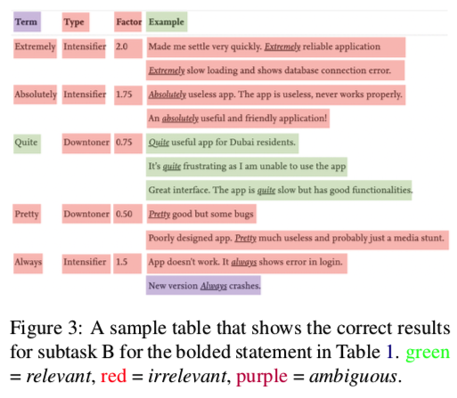

时间线
Important dates - updated July 21, 2020

- Task proposals due: April 3, 2020
- Task selection notification: May 25, 2020
- 2021 tasks announced: June 19, 2020
- Trial data ready: July 31, 2020
- Task website ready: August 14, 2020
- Training data ready: October 1, 2020
- Test data ready: December 3, 2020
- Evaluation start: January 10, 2021
- Evaluation end: January 31, 2021
- Paper submission due: February 23, 2021
- Notification to authors: March 29, 2021
- Camera ready due: April 5, 2021
- SemEval workshop: Summer 2021

# Lexical semantics(词汇语义)
## Task1: Lexical Complexity Prediction (LCP) 

词汇复杂度在阅读理解中扮演着很重要的角色，预测词汇的复杂度可以更好地辅助系统去指导人们修改他们的文章。

NLP系统也可以帮助将文本进行简化，可以更好地帮助那些L2语言学习者

### Task and data
数据来源于多个domain的English Dataset，句子标注用1~5个分值进行标注。
数据集标注论文：https://arxiv.org/pdf/2003.07008.pdf

这个任务就是去预测在context中的word的复杂度。

LCP任务会被划分成为两个子任务：
- sub-task1：预测单个词（single word）的复杂度
- sub-task2：预测多个词组成的表达（multi-word expressions）的复杂度

1~5的评判标准：
- 1: Very Easy: Very familiar words.

- 2: Easy: An annotator was aware of the meaning.

- 3: Neutral: Neither difficult nor easy.

- 4: Difficult: Words for which an annotator was unclear of the meaning, but may have been able to infer the meaning from the sentence.

- 5: Very Difficult: Words that an annotator had never seen before, or were very unclear. 

### 数据论文CompLex：A new corpus for lexical complexity prediction from Likert Scale Data
以前的复杂词识别，都是针对单个词，并且都是二分类，作者提出的这个数据集是第一个提出来识别连续词表示复杂度的。

数据集来源于三个domain：
- the Bible(圣经)
- Europarl（欧洲议会程序部分，与欧洲的一些政策有关的部分）
- biomedical text（生物医学文本）

以前举办的复杂词识别任务- Complex Word Identification （CWI） **SemEval-2016 Task11**，只包含了英语，并且训练集的数量远小于测试集的数据量
以及CWI 2018【也叫做BEA2018】,包含多种语言

作者采取了三种特征：glove embedding, infersent embedding, hand crafted features进行了线性回归实验,
并给出了他们的均方误差损失值0.0853

整个数据集的数据统计：

作者是按照频率选取单词，因为频率往往就和复杂度相关，然后每个实例都有20个标准人员去标注，然后使用标注平台内部的控制标准去删除一些标注。

其中1~5，作者会分别标注为0,0.25,0.5,0.75,1.0，然后求复杂度的均值。

然后多个词的标注，作者只采取了两个词，组合为noun-noun和adj-noun的。

具体的标注例子：

最后词的复杂度分布：

 

## Task2 Multilingual and Cross-lingual Word-in-Context Disambiguation(多语言和跨语言上的消歧)
这个任务主要是做判定一个单词在两个句子中是否表示同一个意思，还包括了跨语言，
这个跨语言就是在L1语言中的单词w1和其对应的在L2中的翻译w2，是否表示同一个意思。

标签主要分为三种：
- T: 两个单词表示的意思完全一致
- R: 两个单词表示的意思相关，比如一个词的一词多义现象还有互为反义词等，; 比如自动反义词的（citation in the meaning of award and its opposite meaning of penalty.奖励和惩罚的含义相反）这里要在多找几个例子。
- F: 使用的是两个完全不同的意思。（比如race在competition中表示赛跑，参加比赛等，而在breed相关的文本中表示种族）

本工作是延续2018年的Pilhevar的工作。2018年的WSD任务都是英语句子，并且只有T和F，没有R这个分类

MCL_WIC的特点：
- 他包含多个语言和跨语言的句子对
- 他涵盖了所有的词性
- 它来源于大量的领域

，等待通过
这个还没有发布数据，后续可以再看

数据集分类两种，单语言的和混合语言的。

.data结尾的文件中存储的数据格式如下：

.gold结尾的文件存储的数据如下：

### Evaluation
对于每一个数据要输出一个标签,T/F/R。评估标准就是P/R/F1
目前提供的数据都很少，每个文件下都只有20行数据

### 论文Wic: the word-in-context dataset for evaluation context-sensitive meaning representations

提供的baseline参考论文中包括:
- 2019,  Language Modelling Makes Sense: Propagating Representations throughWordNet for Full-Coverage Word Sense Disambiguation.
- 2020, SensEmBERT: Context-Enhanced SenseEmbeddings for Multilingual Word Sense Disambiguation

## 论文SensEmBert
这里主要分三步走：
- 1，context retrieval: 首先对于一个单词的一个词义，去BabelNet里面检索它的同义词，主要包括三个边, 上义词边、下义词边、语义相关边，然后对于每一个同义词集合，用一个Weighted Overlap方法确定每个集合的topk，然后将每个词对应的wikipage里的句子保留下来。
- 2，word embedding：对于当前的词，它还有一个NASARI数据集，里面包含一些离散的词Ws，是对当前这个词的一些描述，然后对于context retrieval检索得到的句子，其中包含这些词Ws的句子就通过bert模型，然后对每一个包含这个词Ws的句子求均值，就得到了词Ws的最后表示，注意这里最后得到的是NASARI里面的词Ws的向量表示
- 3, Sense Embedding：根据Ws在NASARI里面的排序，然后将每个Ws赋予一个权重，最后求得一个最终的向量表示，就是context embedding. 然后对于BabelNet里面的每个词的每个含义，把检索到的同义词放在他的前面，然后把这个新的句子输入到bert，最后取所有词的embedding的均值最为最后的Sense Gloss表示。那么最后的词的表示就是context embedding和Sense Gloss拼接在一起。

整个的流程：

WSD Model：作者是将包含这个词的句子输入到bert模型中，然后取这个词的bert模型的后四层的表示的均值，作为这个词的最终的context embedding，然后将这个context embedding（维度重复一遍）和我们前面训练得到的SensEmBert embedding计算相似度，其中相似度最高的就是这个词在当前句子的释义.所以这个模型就是判定在句子中的词是哪个释义

## task 3 Span-and Dependency based Multilingual and cross lingual semantic role labeling
被删除了

## task4 Reading Comprehension of Abstract Meaning
阅读理解关于抽象的概念
给与了一篇文章，然后人对他写了一个summary，然后再从中去掉一个词，最后让模型去选择这个词。

具体词指的是我们可以直接用感官感知的事务和事件，比如树木，红色等，相比之下抽象词就是指那些与立即感知不同的思想和概念。
比如目标、文化和经济等。

CNN/DailyMail这个数据集都是预测concrete concepts(具体词)。

作者将抽象词的概念分为了两种：
- imperceptibility：不可感知的, 不可察觉的
- nonspecificility：非特异性

### subtask-1  ReCAM: Imperceptibility
给与一篇文章，和一个问题，问题中有一个词空着，从候选中选择正确的答案
在子任务1中，要求填的词都是一些抽象词。

### subtask-2 ReCAM: Nonspecificity
这个更关注于nonspecificity（非特异性），在这个定义中，与土拨鼠、鲸鱼等具体概念相比，脊椎动物等词被认为是更为抽象的。
In this definition, compared with concrete concepts like groundhog and whale, words such as vertebrate are regarded as more abstract. 

### subtask-3 ReCAM-Interaction
在这个子任务中，主要测试关于抽象的两个方面之间的联系，我们将会让模型在一个定义上训练，在另一个定义上进行评估

评估标注：使用Acc

baseline： GA Reader，也就是这篇论文：Gated-Attention Readers for Text Comprehension

项目开源baseline代码：
https://github.com/boyuanzheng010/SemEval2021-Reading-Comprehension-of-Abstract-Meaning

# Social factors & opinion

## Task 5: Toxic Spans Detection

对于一些不好的评论，目前基本都是判定整句话是否不好，而不是直接识别出其中具有攻击性的词或短语。

这个task主要是识别其中的不好的片段。
返回一个表示toxic span的下标list，或者空list(表示没有恶毒评论)

评估标注使用F1,
其中A表示模型生成的结果，G表示ground truth

这个没有提供baseline模型，但是可以将阅读理解的一些模型迁移到这个数据集上。

这个数据集已经提供了

## Task6: Detection of Persuasive Techniques in Texts and Images - website coming soon!
这个没有官网地址

## Task 7: Hahackathon: Incorporating Demographic Factors into Shared Humor Tasks
将人口统计学因素纳入共享幽默任务？

作者认为不同的年龄层的人可能对幽默有着不同的理解，所以作者通过对不同年龄层的人询问，你觉得这个幽默吗来进行标注，
并最后对这句话是否幽默，采取标注的平均值。

作者还认为同一句话，对于某个年龄段的人来说是幽默，但是对于其他人来说可能就是冒犯，
所以作者将这个判定这句话是否幽默和判定这句话是否具有攻击性结合了起来

根据一个人的人口统计特征检测文本是幽默还是令人反感，可能会有助于下游任务，例如个性化内容审核或推荐系统。

具体的任务：

Task 1:
- task 1a：判定一句话是humor还是offensive
- task 1b：如果一句话被判定为humor或者offensive，那么他们humor和offensive的程度

Task 2:
使用标注数据时提供的关于人的年龄和性别
- task 2a：因为幽默可能对不同年龄的人是不同的结果，所以这里需要判断，对于给与的一个句子，判断它对不同的年龄和性别的分组是否具有offensive，或者都没有offensive。
- task 2b：如果一句话被判断为humors/offensive，那么判断对不同的年龄和性别，他们的幽默和冒犯的程度

评估标准：
分类任务的评估标准是f值，回归任务的评估标准是均方根误差

没有发布数据集论文，没有提供baseline，数据集目前只有60条数据

## Task-8: MeasEval - Counts and Measurements(计数和测量)

计数和测量是科学对话中的重要组成部分，从文中直接找到测量值是十分简单的，但是像"17 mg"这样单一的测量值并不能提供任何的信息。

需要找到它在文中对应的测量对象。由于不同科学家的写作方式是不同的，所以这些信息对于测量的位置也可能有很大的不同。

MeasEval是一个新的实体和语义提取关系任务，聚焦于找到count和measurement的属性(properties)、度量实体(measured entity)和度量上下文(measurement context)

### Task List
MeasEval由五个子任务组成。覆盖span extraction, classification, relation extraction等；
给予一个科学文章：
1. 识别文章中的所有Quantity(数量词)，特别是那些count和measurement，识别它们在text中的span
2. 对于measurement，需要先确定它的单位；对于count和measurement，需要对他们进行分类，是属于count(计数)，range(范围), approximate(近似值), mean(均值)。
3. 对于每一个count和measurement，识别他们的MeasuredEntity(测量的实体)【如果存在的话】；同样的识别他们的MeasuredProperty(测量的属性)【如果存在的话】
4. 识别"Qualifiers"的位置，也就是那些可以帮助理解count和measurement的text的位置
5. 在Quantity，MeasuredEntity, MeasuredProperty, Qualifier span之间建立关系链接，关系主要有：HasQuantity, HasProperty, Qualifies, 

一个数据的格式：

数据已经提供

### Evaluation
评估标准采取的是EM和F1，EM的计算方法就是如果生成的结果和gold完全一致就为1，否则为0.

对于分类任务[2,5]的评估标注是P,R和F1，对于span text的任务[1,2,3,4]采取EM和F1，

没有提供baseline模型，没有发布数据集论文

### Task-9 Statement Verification and evidence finding with tables[验证表述和在表格中找到证据]

对于一段statement，判断这个table是否支持这个statement，以及表格中的哪个cell支持这个statement.

数据集论文:
Statement Verification and Evidence Finding with Tables

整个的数据形式是：

 

整个任务有两个子任务：
- SubtaskA:Does the table support the statement
  - Fully support
  - Refuted
  - Unknown

- SubtaskB: Which cells in the table provide the evidence to the statement
  - Relevant
  - Irrelevant
  - Ambiguous

对于任务b是对Table中的每个cell进行判断，决定他们属于哪个类别。

数据中的table来源于开源的scientific articles,表格的数据格式是XML形式.

statement的来源包括：自动生成的，对文章中的一些句子的改编，众包人工编写的。 最后每个statement都由一个标注人员验证质量。

#### Evaluation
subtask-A: P/R值，
subtask-B: P/R值

## Task10:Source-Free Domain Adaptation for Semantic Processing(在语义处理上的领域迁移)
现实生活中很多数据存在着严格的共享标准，比如在临床医学中，患者的一些信息要求严格保密。
这个任务要求参与开发一个语义注释系统。

参与人员会给与一个在target domain（有注释的）训练过的模型，而不提供target domain的训练数据，然后给与一些没有label的target domain的数据。

整个任务分为两类：
- task A--negation detection(否定检测):需要参与者去鉴别一些临床医学事件，比如(disease, symptoms, procedures等)，判定它们在文中是否被否定。  比如句子:"Has no diarrhea and no new lumps or masses",其中由三个相关的医学词: diarrhea, lumps,masses,两个提示词:都是no， 然后三个实体都被否定。所以这个任务可以被认为是"span-in-context"分类任务，例如对于"diarrhea"这个事件，它的标准结果应该是"Has no <e> diarrhea </e> and no new lumps or masses."
- task B--time expression recognition(时间表达识别)：时间表达识别任务要求参与者在文本中找到时间表达式子，这是一个序列标注任务，它使用SemEval 2018的task 6的时间粒度的数据。
具体的case如下：

所以这个任务就是总结为提供了一个在target domain上训练的模型-roberta，但是没有提供target domain的数据。
然后作者提供了另一个domain的dev数据，在dev上验证domain adaptation的效果。

评估标注: P, R, F1

## Task11: NLPContributionGraph
Structuring Scholarly NLP Contributions in the Open Research Knowledge Graph
知识图谱的相关工作

因为越来越多的论文出现，所以目前的研究人员面临着论文泛滥的问题，所以Open Research Knowledge Graph希望通过图将论文之间联系起来。

通过将论文构建成如下的结构：
1. Contribution sentences: 在论文中的一些关于contribution的句子
2. Scientific terms and relations: 从contribution sentences中提取出的一些scientific terms和relation
3. Triples：三元组，按照主语-谓语-对象的形式构建的知识图谱的RDF结构，将scientific term之间用relation联系起来，这些联系包括，ResearchProblem, Approach, Model, Code, Dataset, ExperimentalSetup, Hyperparameters, Baselines, Results, Tasks, Experiments, and AblationAnalysis

下面是一个三阶段的例子：

训练数据：
- 提供从不同方向的论文，比如machine translation, named entity recongtion等中提取出的contribution sentences
- 对于contribution sentences提供带有标记的phrase
- 对于句中的实体，用那12个信息链接构建的三元组

dev数据：
- 其他的论文中选取的句子等，与训练数据一致

测试数据：
- 将会提供没有标注的contribution sentences

主要有两个任务需要进行评估：
- Phrase extraction test: 测试提取出的科学术语和谓词短语
- Triple extraction test: 测试生成的三元组

评估标注都是P,R,F1
提供了脚本

## Task12: Learning with Disagreements(分歧学习)

现在的人工智能方面的研究需要大量的由人类标注的数据，几乎所有的标注都认为对一个样本只有一个标注结果。

在很多的项目中，不同的人可能有不同的标注结果，比如指代消解、单词词义消歧、词性标注、情感分析、图像分类、自然语言推论等。

这个任务的目的是提供一个统一的测试框架，使用对于同一样本具有不同标注结果的数据集训练模型，从分歧中进行学习，然后测试模型效果。

包含6个子任务

评估指标：
- F1值：如果模型预测的结果和首选的gold result一致，那么就判定是对的。
- Cross entropy: 将模型预测的label概率和人类标注的标签分布算一个交叉熵

最后，最优的模型应该是有高的F1值，低的交叉熵
