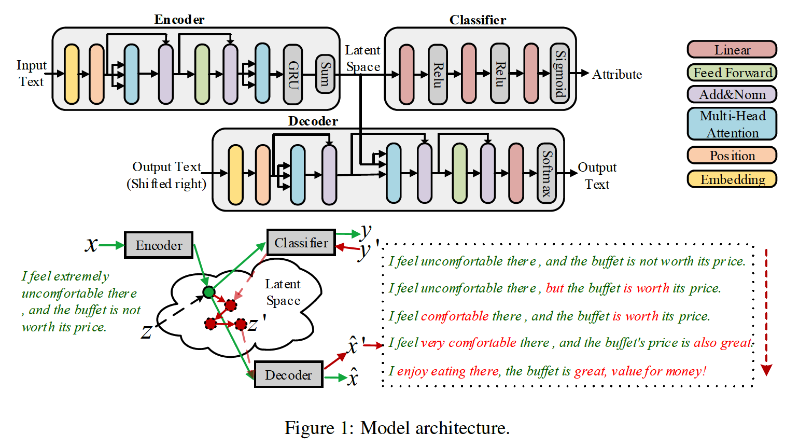
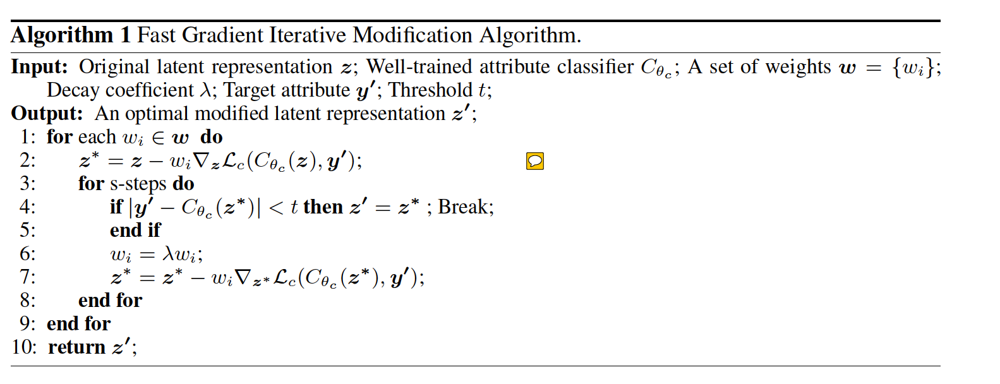
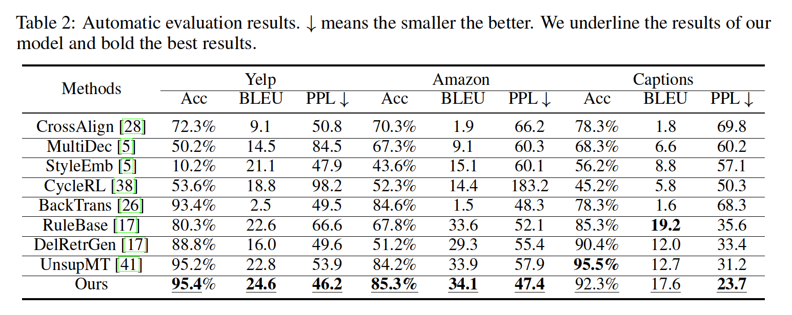

# 论文《Controllable Unsupervised Text Attribute Transfer via Editing Entangled Latent Representation》阅读笔记
论文来源：2019 NIPS
论文主要贡献：提出了一种非监督方式的文本属性转换框架，通过改变文本属性分类器的属性来对latent representation【就是原始风格文本经过encoder部分后得到的表示】进行一些修改。
论文代码：https://github.com/Nrgeup/controllable-text-attribute-transfer

##论文主要内容

作者说他们不同于传统的方法，将属性和内容表示分开进行建模，作者直接使用内容和属性缠绕在一起的表示。
文中的模型主要分为两部分，一个是基于transformer的AutoEncoder，一个是Attribute Classifier[属性分类器]。
    - 作者首先将AutoEncoder和Attribute Classifier分开来训练
    - 然后使用encoder部分去获得source sentence的隐层表示
    - 再用FGIM算法去不断编译这个隐层表示，直到这个表示能够被分类器判定为target属性
    - 最后在使用decoder从这个隐层表示获取target text.

文中提出的模型结构如下：

如图所示，作者对encoder在encoder部分是两层的transformer结构，并在其后接了一层GRU。经过encoder后得到一个latent representation，但是目前的这个latent representation是source风格的，我们希望这个latent representation是target风格的，那么作者是怎么将这个latent representation由source风格转为target风格的呢？**作者提出了一个FGIM算法来修改这个latent representation.**
FGIM算法的伪代码如下：

FGIM算法的流程如下：
- 输入包括：
  - 原始的latent representation - z; 
  - 一个训练好的Attribute Classifier - $C_{\theta_c}$;
  - 一个权重集合 - w = {$w_i$}，
  - 一个迭代衰减系数$\lambda$，取值为0~1，用来不断降低当前的权重$w_i$的值，每s步$w_i$就乘以一次$\lambda$；
  - 目标风格属性标签值y'
  - 阈值t，当Attribute Classifier对于当前的latent representation进行判断时，结果与y'的差值小于t就结束迭代；

- 具体步骤
  - 对于权重集合w中的每个权重$w_i$进行实验，这里的权重是从小到大进行实验的，作者说这样做可以避免我们的优化落入局部最优值；
  - **然后每次计算了损失函数后，都来更新隐层表示z,这里可以看做是本文的亮点，作者固定了Attribute Classifier的参数值，只改变输入z的值，使z来适应分类器**
  - 同时每一个权重$w_i$还会乘以一个系数$\lambda$，来不断降低其值
  - 直到Attriibuter Classifier将当前隐层向量z判定的风格值与y'的差值小于t

实验结果，作者在三个数据集上进行了实验：
 
