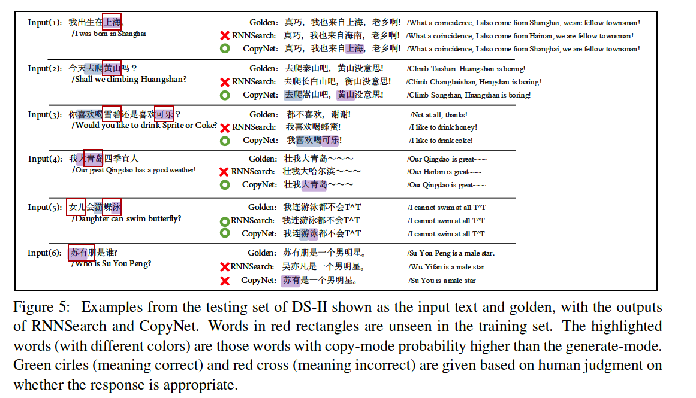

# 论文笔记《Incorporating Copying Mechanism in Sequence-to-Sequence Learning》
论文来源:2016 ACL
论文主要贡献：提出了copy net机制，从source sentence中直接copy到target sentence中的网络模型结构
## 论文主要内容

CopyNet依然是一个encoder-decoder的框架。
Encoder框架采用的是一个双向的LSTM结构，将每个单词$x_t$编码成隐层向量$h_t$，对于句子s获得所有词的隐层表示${H-1,...,h_{T_s}} $，记作M。
Decoder部分，传统的Decoder部分，比如采用RNN作为decoder部分，会读入M然后预测target sentence，而Copy Net在Decoder部分有一些不同：
- Prediction：CopyNet预测target word时是基于一个两种模式的混合概率，这两种模式是generate mode和copy mode。
- State Update：正常的RNN在预测t时刻的target word时，只使用在t-1时刻的预测词，使用它的word embedding，而CopyNet不仅使用它的word embedding，还使用它在M中的【M是encoder得到的所有source word的隐层表示的向量矩阵】相应位置的隐层表示。
- Reading M：除了上面state update使用到M中的隐层表示【文中对于这一步叫做attentive read to M】,CopyNet还对M有一个selective read to M.
  - 之所以对M会有这两种操作，是因为M中不仅包含**语义信息**，还有**位置信息**
  - Content-base： Attentive read from word-embedding
  - Location-base：Selective read from location-specific hidden units

## Prediction with copy and generation
CopyNet中可以把词看做三部分，一个是常用的高频词表$V={v_1,...,v_N}$，另一个就是UNK【所有不在高频词表中的词都属于UNK】,一个是所有在source sentence中出现的unique word(我理解就是去除停用词后的词？)集合$X={x_1,...,x_{T_s}}$,所以，可以用$V \bigcup UNK \bigcup X$。
在decoder部分，预测新词时，要考虑两部分，一个是generate mode，一个是copy node。
所以在预测词t时的概率由两部分组成：
$$ p(y_t|s_t,y_{t-1},c_t,M) = p(y_t,g|s_t,y_{t-1},c_t,M) + p(y_t,c|s_t,y_{t-1},c_t,M)  $$
其中g代表generate mode, c代表copy mode
它们的具体计算方法如下：

其中$\psi_g(\cdot)$代表generate mode的计算分数的函数，$\psi_c(\cdot)$代表copy mode计算分数的函数。**注意$\psi_g(\cdot)$可以用于计算V和UNK中的词， 而$\psi_c(\cdot)$只能计算X中的词。**
$Z$可以看做是两种模式的总得分，$Z=\sum_{v\in V\bigcup\{UNK\}} e^{\psi_g(v)} + \sum_{x \in X} e^{\psi_c(x)}$

### generate mode
generate mode的计算分数的函数如下：
$$ \psi_g(y_t=v_i) = v_{i}^{T}W_os_t, v_i \in V \bigcup UNK $$
其中$W_o \in R^{(N+1)\times d_s}$，$v_i$是对于单词vi的one-hot表示

### copy mode
$$ \psi_c(y_t=x_j) = \sigma (h_{j}^{T}W_c)s_t, x_j \in X $$
其中$h_{j}^{T}$是encoder部分的隐层表示【 $\{h_1,...h_{T_s}\}$是每个source word的隐层表示】，$W_c \in R^{d_h \times d_s}$

上述的generate mode和copy mode在三个词集合V,X,UNK上，有四种计算分数的方式，如下：

## State Updates
CopyNet在更新decode state $s_t$时，使用了前一个时刻的隐层向量$s_{t-1}$，前一个预测结果$y_{t-1}$，由encoder部分得到的attention表示$c_t$。

其中$y_{t-1}$其实由两部分组成$[e(y_{t-1});\zeta(y_{t-1})]^T $，其中$e(y_{t-1}$是$y_{t-1}$的word embedding，$\zeta(y_{t-1})$是词$y_{t-1}$在source sentence出现的所有地方词的隐层表示的权重求和表示，

K可以看做归一化项，也就是所有得分的求和，也就是$K=\sum_{T':x_{T' }= y_{t-1}} p(x_{T'},c|s_{t-1},M)$，实验中可以发现$\rho_{t_T}$的值主要集中在一个值上【所有的$\rho_{t_T}$的和为1】，这也表明尽管在source sentence中词$y_{t-1}$出现了很多次，但是CopyNet主要是从一处位置拷贝向量的。
其中$c_t$就是前面说的Attentive read，而$\zeta(y_{t-1})$ 就是Selective read from location-specific hidden units

整个模型的框架如下：

## 实验效果
下面是作者使用CopyNet的实验效果

