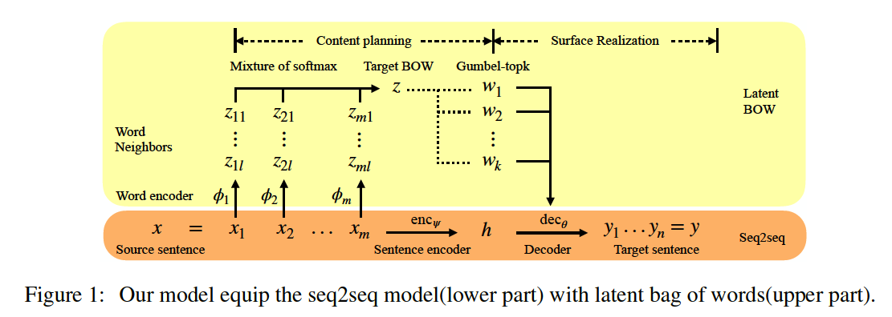

# 论文笔记《Paraphrase generation with latent bag of words》

论文来源：2019 NIPS
论文代码：https://github.com/FranxYao/dgm_latent_bow
## 论文主要内容
作者提出了一个a latent bag of words(BOW)模型来进行paraphrase生成。作者首先使用source word取预测他们自己的邻近词，然后用他们的softmax分布去预测target word，在从softmax分布中取词时，作者采用了Gumble top-k的重参化技巧。

首先，传统的使用词替换的方式来生成paraphrase，主要分为两步：plan stage和relization stage
- plan stage：从wordNet中找到source word的邻近词
- realization stage：把词替换掉，并且从组织新句子

作者使用来自source sentence中的词去预测他们的邻近词，把target sentence中的词作为target BOW，这一步可以看做是plan stage。从plan stage的所有词中,sample出一个词子集，然后去重新组织这些词，形成新的句子，这就是realization stage。在sample这一步中，作者使用了Gumble top-k 重参化的技巧。

## 模型
模型主要分为两部分： the sequence to sequence base model, bag of words for content planning

### the sequence to sequence base model
传统的seq2seq模型的框架，encoder和decoder，其中encoder和decoder采用的都是LSTM

### bag of words for content planning
作者有一个假设，就是说从target sentence构建的BOW，应该和source sentence的邻近词构建的BOW基本相似。
首先第一步，对于每一个source word获取他们的邻近词表示，对于$word x_i$，它的邻近词$z_{ij}$是一个V维的(V代表词表大小)one-hot向量，并且每一个词的邻近词数目固定为l个，source word 共有m个。
$$ p(z_{ij}|x_i) = Categorical(\phi_{ij}(x_i)) $$
其实在实现时，作者是在encoder时，对于LSTM的每一个隐层输出，作者采用了一个softmax层接在每个隐层输出的后面，然后由于固定了每个词的邻近词数目l个，所以可以从词表V中选出每个词的l个邻近词。
然后把这ml个邻近词混合在一起进行表示【每个source word的邻近词都是一个one-hot表示的V维向量】,得到一个向量 $\tilde{z}$,其实就是ml个向量相加在求平均值
$$ \tilde{z} \sim p_{\phi}(\tilde{z}|x) = \frac{1}{ml} \sum_{i,j} p(z_{ij}|x_i) $$                                                                                                                                                           
这时得到的$\tilde{z}$是一个V维的向量，其中每一维$i$上的值(i=1,2...V)，可以看做是在词表V中取第i个词的概率，作者这里采用Gumbel top-k的方法来获取k个概率最大的词，具体的方法就是：
 - $\tilde{z}$的第i维的值，设为$\pi_{i}$,常规的方法就是对$\pi_{i}$进行排序，取分值最高的k个
 - 作者在这里引入了Gumbel top-k的技巧，来引入随机性，具体就是用如下两个公式实现的，引入了随机变量$g_i$
   -  $$ a_i = log \pi_{i} + g_i$$
   -  $$ g_i \sim Gumbel(0,1) $$
 - 然后取分值最高的k个$a_i$作为邻近词，然后去词表中检索这k个词对应的词向量$w_1, w_2...w_k$，并和他们的权重$\pi_i$相乘再相加，最后求平均，得到一个最终的所有邻近词的一个融合的权重词向量表示。
 - 最后把这个融合的权重词向量表示和encoder得到的句子隐向量h作为decoder部分LSTM的初始状态

所以，上面的过程可以认为是选择k个邻近词的过程，可以用如下的一个公式代替：
$$ z \sim p_{\phi}(\tilde{z}|x) (sample k times without replacement) $$
$$ y \sim p_{\theta}(y|x,z) = dec_{\theta}(x,z) $$

最终的优化部分，可以看做由两部分组成，优化$p(y|x,z)$和$p_{\tilde{z}}(\tilde{z}|x)$这两个负对数似然函数。

其中，$P^*$是从target sentence中获得的BOW的分布，$z^*$是target BOW的一个k-hot的向量表示；

整个模型的结构如下：

## 实验
作者采用Quora和MSCOCO这两个数据集进行实验，作者使用一个seq2seq的LSTM，并有残差连接和attention机制的模型作为baseline，作者也使用了一个$\beta$-VAE模型作为baseline，通过调控$\beta$参数来平衡重建和识别网络。其中LBOW-Topk网络是没有采用Gumbel重参化的方法挑选top k的词，LBOW-Gumbel是使用了Gubmel技巧的网络，Cheating BOW模型是在生成的时候能够看到target sentence中的BOW，可以看做是LBOW模型的上限，实验结果如下：

生成一个句子的具体过程如下，主要分为了三个阶段：
- 生成source word的邻近词
- 从邻近词的组合中进行sample
- 利用sample得到的结果进行句子生成。
具体case过程如下：

