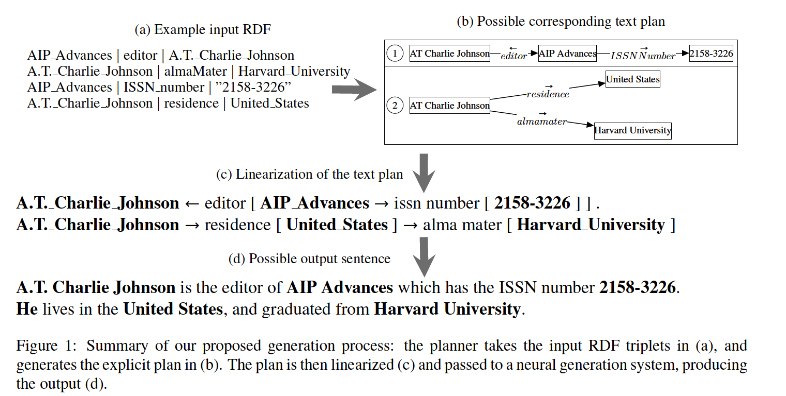

# 论文笔记Step-by-step: separating planning from realization in neural data-to-text generation

论文来源： 2019 NAACL

## 论文主要内容
data-to-text的生成过程可以分为两部分：
- planning阶段：排序和结构化信息
- realization阶段：运用上一个阶段给与的信息，进行文本生成

本文也是按照上诉的两个阶段进行实验，首先在planning阶段，获取文本信息，然后在realization阶段只用一个神经网络来进行句子生成。

data-to-text的一个例子，比如有下面的这几个元组：
- John, birthPlace, London,
- John, employer, IBM

然后可以生成输出包括：
- John, who was born in London, works for IBM.
- John, who works for IBM, was born in London.
- London is the birthplace of John, who works for IBM.
- IBM employs John, who was born in London.
- John works for IBM. John was born in London.

作者提出的整体框架如下：

输入是RDF三元组[Resource Description Framework],其中节点是实体，他们之间的关系作为边，比如一个三元组(s,r,o)，其中s,o为实体，r代表他们之间的关系；
比如上图中的1a中的每一行就是一个RDF，都是一个三元组.

