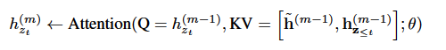

# XLNet相关知识记录

XLNet是一种类似于bert的模型，但又不完全相同，XLNet是一种广义的自回归预训练方法。

# AR与AE
AR（Auto Regressive）语言模型，就是自回归语言模型，就是指利用上下文的单词预测下一个单词的模型，但是这里限制只能有一个方向，要么向前，要么向后。GPT和GPT2都是AR语言模型，他们都是利用上文的单词预测下文的单词。
AE(Auto Encoder)语言模型，就是自编码语言模型，它可以从两个方向来预测单词。BERT就是AE语言模型。

# BERT的缺点
- BERT在预训练的时候使用了[MASK]，但是在finetune的时候这种符号是不存在的，所以也就导致了预训练和finetune的不一致。
- [MASK]的另一个缺点就是他假设所预测的token(被mask掉了)之间是相互独立的。比如"I come from New York ."，如果把"New"和"York"都mask掉，那么我们预测的时候只用了其他未mask掉的词来分别预测"New"和"York"，忽略了"New"和"York"之间的关系.**换句话说就是，bert假设预测的token之间是相互独立的，但是语言模型应该学习tokens之间的相关性来预测下一个token。**

所以XLNet的作者说，他们提出了一种新的方法，让AR语言模型从双向的上下文中学习。

# XLNet
XLNet专注于预训练阶段，在预训练阶段，他提出了一种新的方法，叫做重排列语言模型，如下图：

可以理解为将一个句子[x1,x2,x3,x4]，进行重排序，比如排成[x2,x4,x3,x1]，那么在预测x3时，用排在x3之前的词来进行预测，但这时排在x3之前的词为[x2,x4]，其实涉及到了原始句子x3左右两边的词了，间接地用了上下文信息，所以它实现了让AR语言模型从双向的上下文学习。**其实在代码实现中，它是通过对计算attention的矩阵进行mask实现的这种重排序。**

## 重排列带来的问题
重排列后，我们预测第t个token时，只能用前t-1个token，但是存在两个问题：
- 预测第t个token $x_t$时，模型需要看到$x_t$的位置，并且不能看到$x_t$的内容。
- 预测第t个token $x_t$时，模型应该只能看到$x_t$之前的所有token的内容信息，不能看到它们的位置信息。

## Bert存在这样的问题吗
**Bert是一个AE语言模型，他不向AR语言模型那样需要单独的位置信息。与XLNet需要位置信息来预测第t个token不同，Bert使用[MASK]来表示要预测哪个token，换句话说，比如一个句子时[x1,x2,MASK,x4]，那么BERT在预测[MASK]时，用到了x1,x2,x4的信息，这个信息其实就包括内容信息和位置信息，Bert把位置信息和内容信息融合在一起了**
**XLNet进行预测时，也需要用到位置信息和内容信息，但是此时位置信息和内容信息不能融合在一起，因为前面提到的重排列带来的问题。预测$x_t$时，对位置信息和内容信息有不同的要求。**

## XLNet的解决方法
XLNet提出了双流注意力(Two-stream self-attention)的方法来解决这个问题，其实就是把位置信息和内容信息分开计算。
注意力主要分为两种:content stream attention和query stream attention，计算后得到的表示也分为两种query representation和content representation。
其中query representation包含了从$x_1$到$x_{t-1}$的内容信息和只有$x_t$的位置信息；content representation中包含了从$x_1到x_t$的内容信息和从$x_1到x_t$的位置信息。

这主要与token在模型的训练过程中担当的角色有关，比如token $x_3$，当它被用作内容来预测其他标记时，我们可以使用它的content representation，当时当要预测$x_3$时，我们应该只知道它的位置而不知道它的内容，那么我们可以使用它的query representation。
具体的计算细节如下：

其在具体的代码实现时，还采用了transformer-XL的方法，将segment之间联系起来了，也就是将上一个segment的隐层信息和当前segment的信息合并，组成新的K,V矩阵。

